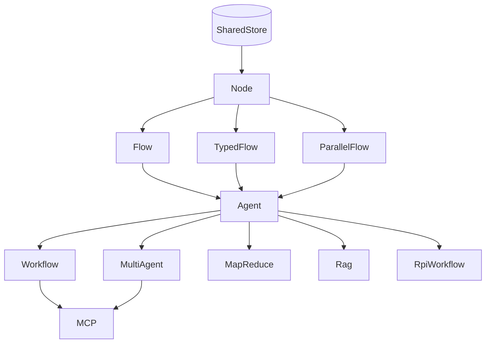

# AgentFlow — Architecture Reference

> **Version:** 0.2.0
> **Last updated:** 2026-03-13

---

## Table of Contents

1. [Design Philosophy](#design-philosophy)
2. [Crate Layout](#crate-layout)
3. [Core Primitives](#core-primitives)
4. [Patterns](#patterns)
5. [Utils](#utils)
6. [Skills](#skills)
7. [MCP](#mcp)
8. [Routing Model](#routing-model)
9. [Feature Flags](#feature-flags)
10. [Concurrency Rules](#concurrency-rules)
11. [Composability Diagram](#composability-diagram)
12. [Running Examples](#running-examples)

---

## Design Philosophy

1. **Bring your own LLM** — AgentFlow is provider-agnostic. Wire in `rig`, `async-openai`, or any async HTTP client.
2. **Store-centric** — All state lives in a `SharedStore` (`Arc<RwLock<HashMap<String, Value>>>`). Nodes read and write the same bus; no hidden channels.
3. **Nodes as functions** — A node is an async closure `|SharedStore| -> Future<Output = SharedStore>`. No trait impl required.
4. **Composable patterns** — `Flow`, `TypedFlow`, `ParallelFlow`, `Agent`, `Workflow`, `MapReduce`, etc. compose freely.
5. **Fail-safe by default** — `Flow` consumes the `"action"` routing key under a write lock on every transition, preventing state leaks and infinite routing loops.

---

## Crate Layout

```
src/
├── core/
│   ├── node.rs          SimpleNode, ResultNode, StateDiff, create_node,
│   │                    create_result_node, create_diff_node
│   ├── flow.rs          Flow — labeled-edge graph executor
│   ├── parallel.rs      ParallelFlow — fan-out / fan-in
│   ├── store.rs         Store — ergonomic typed wrapper
│   ├── typed_store.rs   TypedStore<T>
│   ├── typed_flow.rs    TypedFlow<T> — compile-time typed state machine
│   ├── batch.rs         Batch, ParallelBatch
│   └── error.rs         AgentFlowError
├── patterns/
│   ├── agent.rs         Agent — retry, decide, decide_result
│   ├── workflow.rs      Workflow
│   ├── multi_agent.rs   MultiAgent (Shared / Namespaced / Custom)
│   ├── rag.rs           Rag
│   ├── mapreduce.rs     MapReduce
│   ├── structured_output.rs
│   └── rpi.rs           RpiWorkflow
├── utils/
│   └── tool.rs          create_tool_node, ToolRegistry,
│                        create_corrective_retry_node
├── skills/              (feature: skills) YAML skill parser
└── mcp/                 (feature: mcp) MCP stdio server
```

---

## Core Primitives

### SharedStore

```rust
pub type SharedStore = Arc<RwLock<HashMap<String, serde_json::Value>>>;
```

- Single data bus shared across all nodes in a flow.
- Nodes hold the lock only as long as needed; never hold across `.await`.

### Node Types

```rust
// Infallible node
pub type SimpleNode = Arc<dyn Fn(SharedStore) -> BoxFuture<'static, SharedStore> + Send + Sync>;

// Fallible node
pub type ResultNode = Arc<dyn Fn(SharedStore) -> BoxFuture<'static, Result<SharedStore, AgentFlowError>> + Send + Sync>;
```

**Factory functions:**

| Function | Returns | Use when |
|----------|---------|----------|
| `create_node(f)` | `SimpleNode` | Node should never fail |
| `create_result_node(f)` | `ResultNode` | Node may return an error |
| `create_diff_node(f)` | `SimpleNode` | Node reads a snapshot, returns a `StateDiff`; framework applies under one write lock — structurally deadlock-free |

### StateDiff

```rust
pub struct StateDiff {
    pub inserts: HashMap<String, Value>,
    pub removals: HashSet<String>,
}
```

`create_diff_node` passes a **read-only snapshot** (`HashMap<String, Value>`) to the closure, with **no lock held** while the async work runs. The framework applies the returned diff in a single brief write lock after the future resolves.

```rust
let node = create_diff_node(|snapshot| async move {
    let prompt = snapshot.get("prompt").and_then(|v| v.as_str()).unwrap_or("").to_string();
    let reply  = call_llm(&prompt).await;
    let mut diff = StateDiff::new();
    diff.insert("response", serde_json::json!(reply));
    diff
});
```

### Flow

`Flow` is a labeled-edge directed graph of `SimpleNode`s.

```rust
let mut flow = Flow::new();
flow.add_node("a", node_a);
flow.add_node("b", node_b);
flow.add_edge("a", "go_b", "b");   // routes when store["action"] == "go_b"
flow.add_edge("a", "default", "b"); // fallback edge

let result = flow.run(store).await;
```

**Routing:** After every node executes, `Flow` removes `store["action"]` under a write lock and finds the matching outgoing edge. No matching edge → flow stops naturally. Consuming the key prevents state leaks across transitions.

**Cycle prevention:** `.with_max_steps(n)` aborts after `n` node executions.

### TypedFlow\<T\>

Compile-time typed alternative to `Flow`. State is a plain Rust struct — no `HashMap` key lookups.

```rust
let mut flow: TypedFlow<MyState> = TypedFlow::new("draft");
flow.add_node("draft",   create_typed_node(|mut s: MyState| async move { ... s }));
flow.add_transition("draft", |s| if s.approved { None } else { Some("revise".into()) });
flow.add_node("revise",  create_typed_node(|mut s: MyState| async move { ... s }));
flow.add_transition("revise", |_| Some("draft".into()));
flow.with_max_steps(20);

let final_state = flow.run(initial_state).await;
```

### ParallelFlow

Fan-out N independent `Flow`s concurrently, fan-in with a configurable merge function.

```rust
let pf = ParallelFlow::new(vec![branch_a, branch_b])
    .with_merge(|_initial, results| Box::pin(async move {
        // merge branch stores into one
    }));

let result = pf.run(initial_store).await;
```

- Each branch receives a **snapshot clone** of the initial store — full isolation.
- Default merge: last-writer-wins union across branches (in order).
- Branches run via `futures::future::join_all` — no Tokio task spawning overhead.

### Batch / ParallelBatch

```rust
// Sequential — one item at a time
let batch = Batch::new(node, items);
let result = batch.run(store).await;

// Concurrent — all items at once
let par = ParallelBatch::new(node, items);
let result = par.run(store).await;
```

### AgentFlowError

```rust
pub enum AgentFlowError {
    NotFound(String),
    NodeFailure(String),
    Timeout(String),
    IoError(String),
    SerdeError(String),
    TypeMismatch(String),
    Custom(String),
}
```

Implements `std::error::Error`, `Display`, `From<std::io::Error>`, `From<serde_json::Error>`.

---

## Patterns

### Agent

Retry-aware wrapper around any `SimpleNode` or `ResultNode`.

```rust
let agent = Agent::with_retry(node, 3, 500); // 3 attempts, 500 ms delay

// HashMap ergonomic API
let result: HashMap<String, Value> = agent.decide(input_map).await?;

// SharedStore API
let store_out = agent.decide_shared(store).await;

// Fallible — distinguishes Timeout (retryable) from fatal errors
let result = agent.decide_result(store).await?;
```

### Workflow

Linear sequence of named steps sharing a `SharedStore`.

```rust
let mut wf = Workflow::new();
wf.add_step("step1", node_a);
wf.add_step("step2", node_b);
let result = wf.execute(store).await;
```

### MultiAgent

Runs multiple agents concurrently against the same store.

```rust
let mut ma = MultiAgent::new();
ma.add_agent(agent1);
ma.add_agent(agent2);
let result = ma.run(store).await;
```

Merge strategies: `Shared` (one store), `Namespaced` (prefixed keys), `Custom(fn)`.

### MapReduce

```rust
let mr = MapReduce::new(mapper_agent, reducer_agent);
let result = mr.run(items).await;
```

### Rag

```rust
let rag = Rag::new(retriever_node, generator_node);
let result = rag.call(store).await;
```

### RpiWorkflow

Research → Plan → Implement → Verify, with loopback on failure.

```rust
let rpi = RpiWorkflow::new(research, plan, implement, verify);
let result = rpi.run(store).await;
```

---

## Utils

### create_tool_node

Run a shell command as a `SimpleNode`.

```rust
let node = create_tool_node("sysinfo", "uname", vec!["-a".into()]);
```

Writes `{name}_output`, `{name}_exit_code`, and on timeout `{name}_error` into the store.

### ToolRegistry

Explicit allowlist that prevents LLM-generated tool names from invoking arbitrary binaries.

```rust
let mut registry = ToolRegistry::new();
registry.register("sysinfo",  "uname",    vec!["-a".into()], None);
registry.register("hostname", "hostname", vec![],            None);

let node = registry.create_node("sysinfo").unwrap();
// registry.create_node("rm") → Err(NotFound) — not in the list
```

`registry.into_arc()` for cheap sharing across tasks.

### create_corrective_retry_node

Self-correction loop: on each failure the error message is written into the store under a configurable key so the next LLM call can read it and adjust.

```rust
let node = create_corrective_retry_node(
    |store| async move {
        let hint = store.read().await
            .get("last_error")
            .and_then(|v| v.as_str())
            .unwrap_or("")
            .to_string();
        // ... build prompt incorporating `hint`, call LLM, validate ...
        Err(AgentFlowError::NodeFailure("invalid JSON".into()))
    },
    3,            // max attempts
    500,          // ms between retries
    "last_error", // store key for error feedback
);
```

---

## Skills

*(Requires `--features skills`)*

Define agents declaratively in YAML — persona, instructions, and tools — without recompiling Rust.

```yaml
---
name: document_processor
version: 1.0.0
description: "Process and convert documents"
tools:
  - name: "convert_text"
    description: "Convert text documents using pandoc"
    command: "pandoc"
    args: ["{{input_file}}", "-o", "{{output_file}}"]
```

```rust
let skill = Skill::from_file("examples/SKILL_DOC_PROCESS.md")?;
let tool_node = create_tool_node(&skill.tools[0].name, &skill.tools[0].command, skill.tools[0].args.clone());
```

---

## MCP

*(Requires `--features mcp`)*

Exposes AgentFlow pipelines as an MCP (Model Context Protocol) server over `stdio`. Allows IDEs like Cursor or Claude Desktop to call your agents as tools.

```
Client (Claude Desktop / Cursor)
    ↕  stdio JSON-RPC
AgentFlow MCP Server
    ↕  translate request/response
AgentFlow Flow / Workflow
    ↕
SharedStore
```

---

## Routing Model

`Flow` uses a labeled-edge graph. The `"action"` key in `SharedStore` is the routing signal:

1. Node executes and (optionally) writes `store["action"] = "some_label"`.
2. `Flow` acquires a **write lock**, removes `"action"`, and looks up the matching outgoing edge.
3. If found — run next node. If not found — stop.

The key is **consumed** (removed) on every transition. This means:
- A node that does not set `"action"` will follow the `"default"` edge if one exists, or stop.
- There is no state leak from one transition to the next.
- Routing cycles are only possible if a node explicitly sets `"action"` to loop back.

`TypedFlow` uses transition closures `|&State| -> Option<String>` instead of the store key.

---

## Feature Flags

| Flag | Enables | Extra deps |
|------|---------|------------|
| `skills` | YAML skill parser (`src/skills/`) | `serde_yaml` |
| `mcp` | MCP stdio server (`src/mcp/`) | implies `skills` |
| `repl` | Interactive REPL helper | `inquire` |
| `rag` | Qdrant vector store integration | `qdrant-client` |

---

## Concurrency Rules

| Rule | Rationale |
|------|-----------|
| Never hold `SharedStore` lock across `.await` | Prevents deadlocks in async context |
| Use `create_diff_node` for lock-sensitive paths | Reads snapshot without lock; applies diff in one write lock after async work |
| `ParallelFlow` branches are fully isolated | Each branch gets a snapshot clone; no shared mutable state during execution |
| `ParallelBatch` items are independent | Items must not depend on each other's output |

---

## Composability Diagram



---

## Running Examples

Examples are executed through Cargo's example targets, which use hyphenated names
even when the source files in `examples/` use snake_case filenames.

Examples:

- `examples/async_agent.rs` → `cargo run --example async-agent`
- `examples/orchestrator_multi_agent.rs` → `cargo run --example orchestrator-multi-agent`
- `examples/orchestrator_with_tools.rs` → `cargo run --example orchestrator-with-tools`
- `examples/plan_and_execute.rs` → `cargo run --example plan-and-execute`

Feature-gated examples:

- `rust-agentic-skills` and `document-processing` require `--features skills`
- `mcp-server` requires `--features "mcp skills"`
- `mcp-client` requires `--features mcp`
- MCP examples currently cover the minimal AgentFlow-native client/server path:
  `initialize`, `tools/list`, and `tools/call`

The `mcp-client` example spawns the `mcp-server` example binary by name. Build
the server binary first so the executable is available next to the client
binary:

```bash
cargo build --example mcp-server --features "mcp skills"
```
