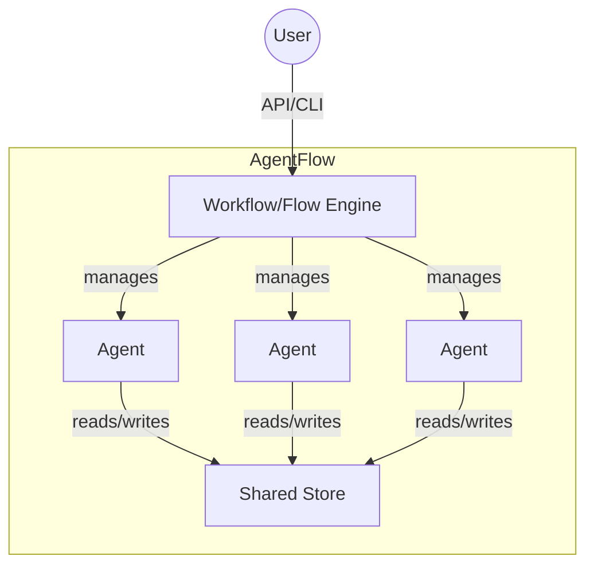
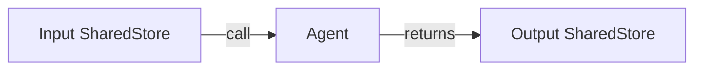
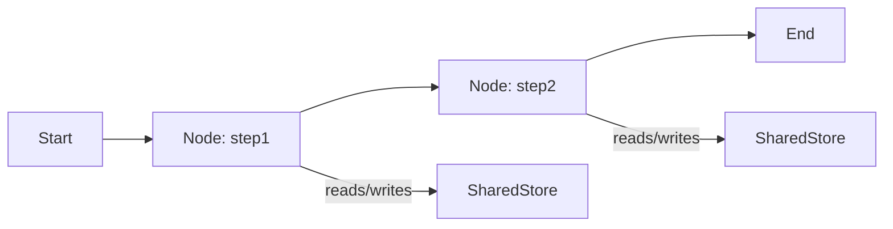
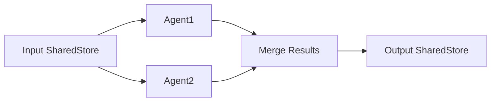
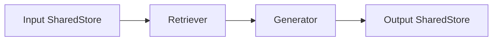
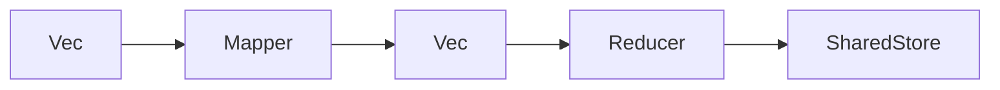
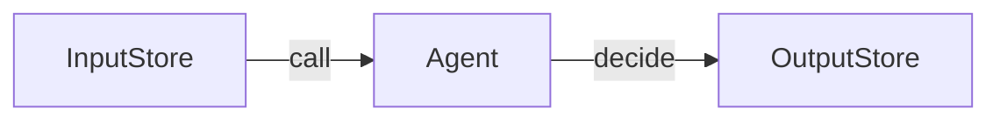
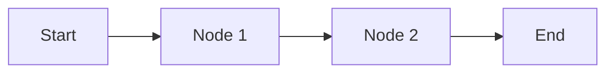

# AgentFlow

**AgentFlow** is a minimalist, async-first Rust framework for building, orchestrating, and managing AI agents and workflows. It is designed for rapid prototyping and production deployment of agentic, RAG, and multi-agent systems, with a focus on composability, extensibility, and language-agnostic patterns.

---

## 📐 Architecture Overview



- **Agents**: Specialized async units (LLM, RAG, tool-calling, etc.) that process tasks.
- **Workflow/Flow Engine**: Chains agents into flexible, configurable pipelines with conditional routing.
- **Shared Store**: Central, thread-safe data structure for passing state/results between agents.

---

## 🚀 Quickstart

Add to your `Cargo.toml`:

```toml
[dependencies]
agentflow = "0.1"
tokio = { version = "1", features = ["full"] }
serde_json = "1"
```

---

## 🧩 Patterns & Examples

### Agent

#### Description

An **Agent** is an autonomous async decision-making unit. It wraps a node (async function) and can be retried on failure.

#### Example

```rust
use agentflow::prelude::*;
use std::collections::HashMap;

#[tokio::main]
async fn main() {
    let mut store = HashMap::new();
    store.insert("name".to_string(), serde_json::Value::String("Alice".to_string()));

    let hello_agent = create_node(|mut store: SharedStore| {
        Box::pin(async move {
            let name = store.get("name").and_then(|v| v.as_str()).unwrap_or("stranger");
            store.insert("greeting".to_string(), serde_json::Value::String(format!("Hello, {}!", name)));
            store
        })
    });

    let agent = Agent::new(hello_agent);
    let result = agent.call(store).await;
    println!("{}", result.get("greeting").unwrap());
}
```

#### Agent Flow Diagram



---

### Workflow

#### Description

A **Workflow** chains agents (nodes) into a directed graph, supporting conditional routing and branching.

#### Example

```rust
use agentflow::prelude::*;
use std::collections::HashMap;

#[tokio::main]
async fn main() {
    let mut workflow = Workflow::new();
    workflow.add_step("step1", create_node(|mut store| {
        Box::pin(async move {
            store.insert("step1".to_string(), "Research done".into());
            store.insert("action".to_string(), "default".into());
            store
        })
    }));
    workflow.add_step("step2", create_node(|mut store| {
        Box::pin(async move {
            store.insert("step2".to_string(), "Code generated".into());
            store.insert("action".to_string(), "default".into());
            store
        })
    }));
    workflow.connect("step1", "step2");

    let store = HashMap::new();
    let result = workflow.run(store).await;
    println!("{:?}", result);
}
```

#### Workflow Flow Diagram



---

### MultiAgent

#### Description

**MultiAgent** runs multiple agents in parallel, each responsible for a different part of a software project. Results are merged into a single shared store.

#### Example

```rust
/*!
Runs multiple agents in parallel, each responsible for a different part of a software project.
*/
let mut multi_agent = MultiAgent::new();
multi_agent.add_agent(agent1);
multi_agent.add_agent(agent2);
let result = multi_agent.run(store).await;
```

#### MultiAgent Flow Diagram



---

### RAG (Retrieval-Augmented Generation)

#### Description

**RAG** composes a retriever node and a generator node, passing the shared store through both.

#### Example

```rust
use agentflow::prelude::*;
use std::collections::HashMap;

#[tokio::main]
async fn main() {
    let mut store = HashMap::new();
    store.insert("query".to_string(), "Rust web frameworks".into());

    let retriever = create_node(|mut store: SharedStore| {
        Box::pin(async move {
            let query = store.get("query").and_then(|v| v.as_str()).unwrap_or("");
            store.insert("context".to_string(), format!("Docs for: {}", query).into());
            store
        })
    });

    let generator = create_node(|mut store: SharedStore| {
        Box::pin(async move {
            let context = store.get("context").and_then(|v| v.as_str()).unwrap_or("");
            store.insert("response".to_string(), format!("Summary: {}", context).into());
            store
        })
    });

    let rag = Rag::new(retriever, generator);
    let result = rag.call(store).await;
    println!("{}", result.get("response").unwrap());
}
```

#### RAG Flow Diagram



---

### MapReduce

#### Description

**MapReduce** batch processes documents, summarizes each, and aggregates results.

#### Example

```rust
/*!
Batch process documents, summarize each, and aggregate results.
*/
let map_reduce = MapReduce::new(batch_mapper, reducer);
let result = map_reduce.run(inputs).await;
```

#### MapReduce Flow Diagram



---

## 🛠️ Extending PocketFlow

- **Add new agent types**: Implement the `Node` trait.
- **Compose custom workflows**: Use the `Workflow` or `Flow` API to chain, branch, or parallelize agents.
- **Integrate external tools**: Wrap API calls as nodes/agents.

---

## 📖 Philosophy

- **Composable**: Build complex systems from simple, reusable async parts.
- **Async-first**: Designed for async/await and concurrent execution.
- **Minimalist**: Focus on core abstractions, not vendor lock-in.

---

## 📦 References

- See `/examples/` for more Rust usage.
- See `/src/patterns/` for built-in patterns.
- See `/src/core/` for core abstractions.
- See `/src/utils/` for integration stubs (LLM, search, embeddings, etc).

---

## 📝 License

MIT OR Apache-2.0

---

**Happy agentic building!**
# AgentFlow (Rust)

AgentFlow is a minimalist, async-first Rust framework for building, orchestrating, and managing AI agents and workflows. It is designed for composability, extensibility, and real-world LLM applications.

---

## Features

- **Agent**: Autonomous async decision-making unit with retry logic.
- **Workflow**: Chain of agents with conditional routing and branching.
- **MultiAgent**: Parallel or coordinated agent execution.
- **RAG**: Retrieval-Augmented Generation (retriever + generator).
- **MapReduce**: Batch map and reduce over data.
- **Composable**: Build complex systems from simple, reusable async parts.
- **Async-first**: Designed for async/await and concurrent execution.

---

## Installation

Add to your `Cargo.toml`:

```toml
agentflow = "0.1"
rig = "0.1"
```

---

## Quickstart Example

```rust
use agentflow::prelude::*;
use rig::prelude::*;
use std::collections::HashMap;
use std::sync::{Arc, Mutex};

#[tokio::main]
async fn main() {
    // Create a simple agent node
    let agent_node = create_node(|store: SharedStore| {
        Box::pin(async move {
            let prompt = store.lock().unwrap().get("prompt").and_then(|v| v.as_str()).unwrap_or("").to_string();
            // ... LLM call here ...
            store.lock().unwrap().insert("response".to_string(), Value::String("Hello!".to_string()));
            store
        })
    });

    let agent = Agent::with_retry(agent_node, 3, 1000);

    let mut store = HashMap::new();
    store.insert("prompt".to_string(), Value::String("Say hello!".to_string()));
    let result = agent.decide(store).await;
    println!("{:?}", result);
}
```

---

## Diagrams

### Agent Pattern



### Workflow Pattern



---

## Example: MultiAgent

```rust
/*!
Runs multiple agents in parallel, each responsible for a different part of a software project.
*/
let mut multi_agent = MultiAgent::new();
multi_agent.add_agent(agent1);
multi_agent.add_agent(agent2);
let result = multi_agent.run(store).await;
```

---

## Example: RAG

```rust
/*!
Retrieval-Augmented Generation pipeline.
*/
let rag = Rag::new(retriever, generator);
let result = rag.call(store).await;
```

---

## Example: MapReduce

```rust
/*!
Batch process documents, summarize each, and aggregate results.
*/
let map_reduce = MapReduce::new(batch_mapper, reducer);
let result = map_reduce.run(inputs).await;
```

---

## 🏃 Running the Examples

All examples are in the [`examples/`](./examples/) directory.  
You must have Rust and Cargo installed.  
Some examples require API keys for LLM providers (e.g., OpenAI, Gemini) and the `rig-core` crate.

### 1. Set your API keys

Set your environment variables as needed for your LLM provider(s):

```bash
export OPENAI_API_KEY=sk-...
export GEMINI_API_KEY=...
```

### 2. Install dependencies

From the project root:

```bash
cargo build --all
```

If you want to run examples that use the `rig-core` crate, ensure you have network access and the correct API keys.

### 3. Run an example

You can run any example using Cargo.  
From the project root, use:

```bash
cargo run --example agent
cargo run --example async-agent
cargo run --example workflow
cargo run --example rag
cargo run --example multi-agent
cargo run --example mapreduce
cargo run --example orchestrator-multi-agent
cargo run --example structured-output
```

Or, to see a list of all available examples:

```bash
cargo run --example <example-name>
```

### Example Descriptions

- `agent` – Run a single LLM-powered agent with retry logic.
- `async-agent` – Run two agents concurrently (async/parallel).
- `workflow` – Multi-step workflow with human-in-the-loop (HITL) at each step.
- `rag` – Retrieval-Augmented Generation: retrieve context, then generate an answer.
- `multi-agent` – Run multiple agents in parallel, merging results into a shared store.
- `mapreduce` – Batch process documents, summarize each, and aggregate results.
- `orchestrator-multi-agent` – Orchestrator agent coordinates a multi-phase, multi-role workflow.
- `structured-output` – Multi-agent, interactive TUI pipeline for research, summarization, and critique, with structured output.

### Example: Run the agent example

```bash
cargo run --example agent
```

### Example: Run the workflow example

```bash
cargo run --example workflow
```

---

## License

MIT OR Apache-2.0
