# AgentFlow

**AgentFlow** is a minimalist, async-first Rust framework for building, orchestrating, and managing AI agents and workflows. It is designed for rapid prototyping and production deployment of agentic, RAG, and multi-agent systems, with a focus on composability, extensibility, and language-agnostic patterns.

---

## 📐 Architecture Overview

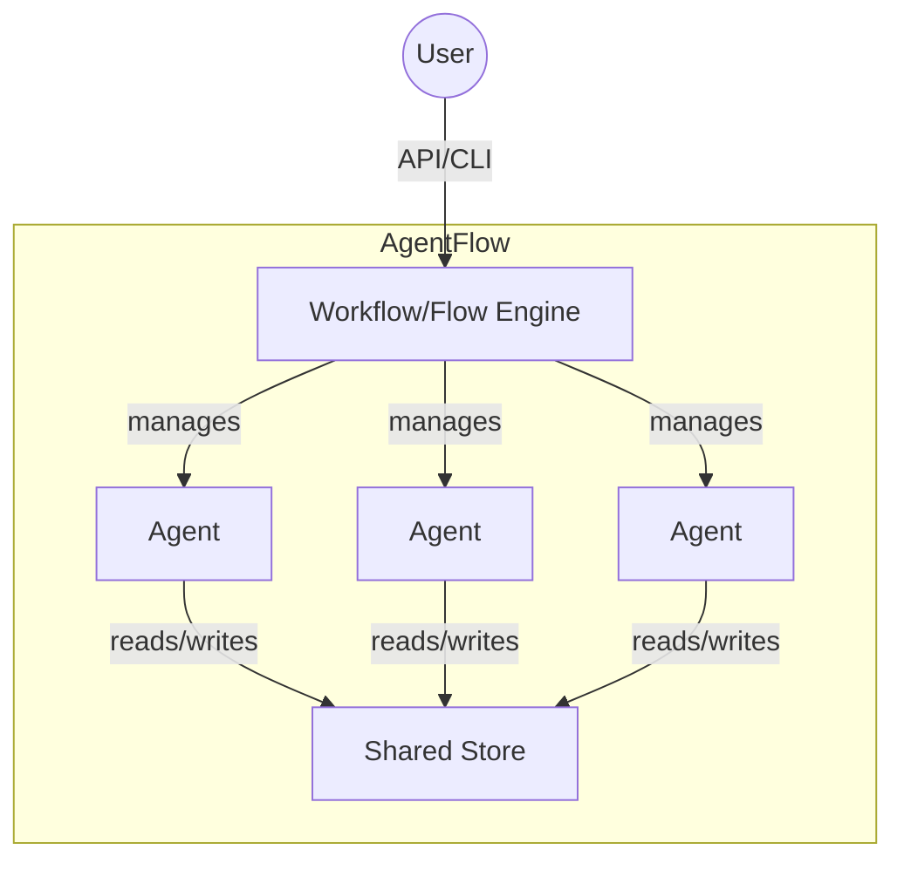
```mermaid
flowchart TD
    subgraph AgentFlow
        A1[Agent]
        A2[Agent]
        A3[Agent]
        WF[Workflow/Flow Engine]
        STORE[Shared Store]
    end
    User((User))
    User -- API/CLI --> WF
    WF -- manages --> A1
    WF -- manages --> A2
    WF -- manages --> A3
    A1 -- reads/writes --> STORE
    A2 -- reads/writes --> STORE
    A3 -- reads/writes --> STORE
```

- **Agents**: Specialized async units (LLM, RAG, tool-calling, etc.) that process tasks.
- **Workflow/Flow Engine**: Chains agents into flexible, configurable pipelines with conditional routing.
- **Shared Store**: Central, thread-safe data structure for passing state/results between agents.

---

## 🚀 Quickstart

Add to your `Cargo.toml`:

```toml
[dependencies]
agentflow = "0.1"
tokio = { version = "1", features = ["full"] }
serde_json = "1"
# Optional: if you plan to use LLMs inside nodes
rig-core = "0.16" 
```

**Note**: AgentFlow is agnostic to the underlying AI logic. It orchestrates nodes (closures/functions). In many examples, we use the `rig` (or `rig-core`) crate inside nodes to handle the actual LLM API calls and prompting.

---

## 🧩 Patterns & Examples

### Agent

#### Description

An **Agent** is an autonomous async decision-making unit. It wraps a node (async function) and can be retried on failure.

#### Example

```rust
use agentflow::prelude::*;
use std::collections::HashMap;

#[tokio::main]
async fn main() {
    let mut store = HashMap::new();
    store.insert("name".to_string(), serde_json::Value::String("Alice".to_string()));

    let hello_agent = create_node(|mut store: SharedStore| {
        Box::pin(async move {
            let name = store.get("name").and_then(|v| v.as_str()).unwrap_or("stranger");
            store.insert("greeting".to_string(), serde_json::Value::String(format!("Hello, {}!", name)));
            store
        })
    });

    let agent = Agent::new(hello_agent);
    let result = agent.call(store).await;
    println!("{}", result.get("greeting").unwrap());
}
```

#### Agent Flow Diagram

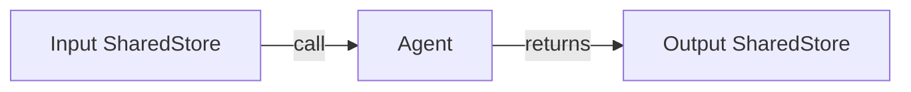
```mermaid
flowchart LR
    InputStore[Input SharedStore] -->|call| Agent
    Agent -->|returns| OutputStore[Output SharedStore]
```

---

### Workflow

#### Description

A **Workflow** chains agents (nodes) into a directed graph, supporting conditional routing and branching.

#### Example

```rust
use agentflow::prelude::*;
use std::collections::HashMap;

#[tokio::main]
async fn main() {
    let mut workflow = Workflow::new();
    
    // Agent 1: Reason
    workflow.add_step("reason", create_node(|mut store| {
        Box::pin(async move {
            let task = store.get("task").and_then(|v| v.as_str()).unwrap_or("");
            store.insert("reasoning".to_string(), "Analysis complete".into());
            store.insert("action".to_string(), "default".into());
            store
        })
    }));

    // Agent 2: Plan
    workflow.add_step("plan", create_node(|mut store| {
        Box::pin(async move {
            let reasoning = store.get("reasoning").and_then(|v| v.as_str()).unwrap_or("");
            store.insert("plan".to_string(), "Implementation plan ready".into());
            store.insert("action".to_string(), "default".into());
            store
        })
    }));

    // Agent 3: Implement
    workflow.add_step("implement", create_node(|mut store| {
        Box::pin(async move {
            let plan = store.get("plan").and_then(|v| v.as_str()).unwrap_or("");
            store.insert("output".to_string(), "Code generated".into());
            store.insert("action".to_string(), "default".into());
            store
        })
    }));

    workflow.connect("reason", "plan");
    workflow.connect("plan", "implement");

    let mut store = HashMap::new();
    store.insert("task".to_string(), "Build a rust function".into());
    let result = workflow.run(store).await;
    println!("{:?}", result);
}
```

#### Workflow Flow Diagram

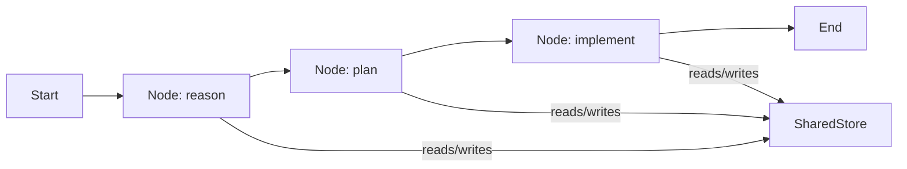
```mermaid
flowchart LR
    Start[Start] --> Reason[Node: reason]
    Reason --> Plan[Node: plan]
    Plan --> Implement[Node: implement]
    Implement --> End[End]
    Reason -- reads/writes --> Store[SharedStore]
    Plan -- reads/writes --> Store
    Implement -- reads/writes --> Store
```

**Note:** The `"action"` key is reserved by Flow for routing decisions. Nodes should set this key to control which path the workflow takes. The default action is `"default"`.

---

### MultiAgent

#### Description

**MultiAgent** runs multiple agents in parallel. All agents operate on the same shared store concurrently. Writes must use distinct keys to avoid conflicts.

#### Example

```rust
use agentflow::prelude::*;
use std::collections::HashMap;

#[tokio::main]
async fn main() {
    let mut multi_agent = MultiAgent::new();

    let agent1 = create_node(|mut store: SharedStore| {
        Box::pin(async move {
            store.insert("agent1_result".to_string(), "Data 1".into());
            store
        })
    });

    let agent2 = create_node(|mut store: SharedStore| {
        Box::pin(async move {
            store.insert("agent2_result".to_string(), "Data 2".into());
            store
        })
    });

    multi_agent.add_agent(agent1);
    multi_agent.add_agent(agent2);

    let store = HashMap::new();
    let result = multi_agent.run(store).await;
    println!("{:?}", result);
}
```

#### MultiAgent Flow Diagram

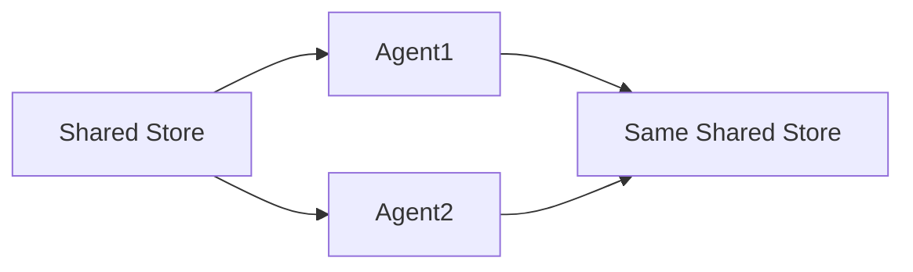
```mermaid
flowchart LR
    InputStore[Shared Store] --> Agent1
    InputStore --> Agent2
    Agent1 --> OutputStore[Same Shared Store]
    Agent2 --> OutputStore
```

---

### RAG (Retrieval-Augmented Generation)

#### Description

**RAG** composes a retriever node and a generator node, passing the shared store through both.

#### Example

```rust
use agentflow::prelude::*;
use std::collections::HashMap;

#[tokio::main]
async fn main() {
    let mut store = HashMap::new();
    store.insert("query".to_string(), "Rust web frameworks".into());

    let retriever = create_node(|mut store: SharedStore| {
        Box::pin(async move {
            let query = store.get("query").and_then(|v| v.as_str()).unwrap_or("");
            store.insert("context".to_string(), format!("Docs for: {}", query).into());
            store
        })
    });

    let generator = create_node(|mut store: SharedStore| {
        Box::pin(async move {
            let context = store.get("context").and_then(|v| v.as_str()).unwrap_or("");
            store.insert("response".to_string(), format!("Summary: {}", context).into());
            store
        })
    });

    let rag = Rag::new(retriever, generator);
    let result = rag.call(store).await;
    println!("{}", result.get("response").unwrap());
}
```

#### RAG Flow Diagram

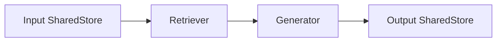
```mermaid
flowchart LR
    InputStore[Input SharedStore] --> Retriever
    Retriever --> Generator
    Generator --> OutputStore[Output SharedStore]
```

---

### MapReduce

#### Description

**MapReduce** batch processes documents, summarizes each, and aggregates results.

#### Example

```rust
use agentflow::prelude::*;
use std::collections::HashMap;

#[tokio::main]
async fn main() {
    let mapper = create_node(|mut store: SharedStore| {
        Box::pin(async move {
            let item = store.get("item").and_then(|v| v.as_str()).unwrap_or("");
            store.insert("mapped".to_string(), format!("Processed: {}", item).into());
            store
        })
    });

    let reducer = create_node(|mut store: SharedStore| {
        Box::pin(async move {
            // In a real scenario, you'd extract the mapped results and reduce them
            store.insert("reduced".to_string(), "Aggregation complete".into());
            store
        })
    });

    let map_reduce = MapReduce::new(mapper, reducer);
    
    let mut input1 = HashMap::new();
    input1.insert("item".to_string(), "Doc 1".into());
    let mut input2 = HashMap::new();
    input2.insert("item".to_string(), "Doc 2".into());
    
    let result = map_reduce.run(vec![input1, input2]).await;
    println!("{:?}", result);
}
```

#### MapReduce Flow Diagram

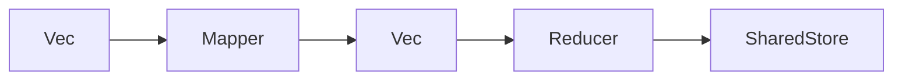
```mermaid
flowchart LR
    InputBatch[Vec<SharedStore>] --> Mapper
    Mapper --> MappedBatch[Vec<SharedStore>]
    MappedBatch --> Reducer
    Reducer --> OutputStore[SharedStore]
```

---

### Rust Agentic Skills & MCP

AgentFlow now includes built-in support for the [rust-agentic-skills](https://github.com/rust-agentic-skills) ecosystem via feature flags.

#### 1. RPI Workflow

**Description:**
A specialized graph orchestrating the **Research -> Plan -> Implement -> Verify** loop. It wraps the core `Workflow` engine to enforce this specific problem-solving pattern.

**Example:**
```rust
use agentflow::prelude::*;
use agentflow::patterns::rpi::RpiWorkflow;
use std::collections::HashMap;

#[tokio::main]
async fn main() {
    let research = create_node(|store| Box::pin(async move { store }));
    let plan = create_node(|store| Box::pin(async move { store }));
    let implement = create_node(|store| Box::pin(async move { store }));
    let verify = create_node(|store| Box::pin(async move { store }));

    let rpi = RpiWorkflow::new()
        .with_research(research)
        .with_plan(plan)
        .with_implement(implement)
        .with_verify(verify);

    let store = HashMap::new();
    let result = rpi.run(store).await;
}
```

**RPI Flow Diagram:**
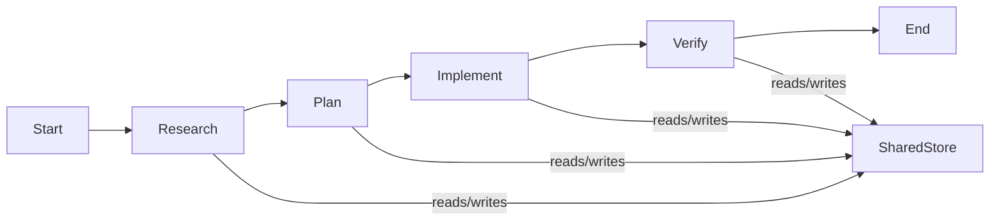
```mermaid
flowchart LR
    Start[Start] --> Research[Research]
    Research --> Plan[Plan]
    Plan --> Implement[Implement]
    Implement --> Verify[Verify]
    Verify --> End[End]
    Research -- reads/writes --> Store[SharedStore]
    Plan -- reads/writes --> Store
    Implement -- reads/writes --> Store
    Verify -- reads/writes --> Store
```

#### 2. Skill Parser & Tool Node (requires `skills` feature)

**Description:**
Parse YAML-frontmatter `SKILL.md` files (from the `rust-agentic-skills` standard) and bind local shell tools directly as executable workflow nodes.

**Example:**
```rust
use agentflow::prelude::*;
use agentflow::skills::Skill;
use agentflow::utils::tool::create_tool_node;
use std::collections::HashMap;

#[tokio::main]
async fn main() -> Result<(), Box<dyn std::error::Error>> {
    // Requires `skills` feature
    // let skill = Skill::from_file("SKILL.md").await?;
    
    // Bind a shell command directly as an AgentFlow node
    let tool_node = create_tool_node("shell", "bash", vec!["-c".into(), "echo 'Hello'".into()]);
    
    let store = HashMap::new();
    let result = tool_node.call(store).await;
    Ok(())
}
```

**Tool Node Flow Diagram:**
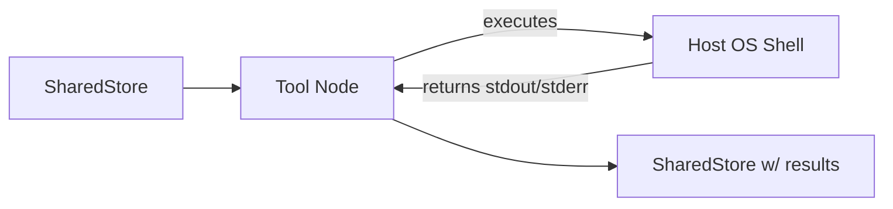
```mermaid
flowchart LR
    InputStore[SharedStore] --> ToolNode[Tool Node]
    ToolNode -- executes --> Shell[Host OS Shell]
    Shell -- returns stdout/stderr --> ToolNode
    ToolNode --> OutputStore[SharedStore w/ results]
```

#### 3. MCP Server (requires `mcp` feature)

**Description:**
Run a minimalist Model Context Protocol (MCP) server over `stdio` to expose your AgentFlow instances and tools to MCP-compatible LLM clients (like Claude Desktop or cursor).

**Example:**
```rust
use agentflow::mcp::McpServer;

#[tokio::main]
async fn main() -> Result<(), Box<dyn std::error::Error>> {
    // Requires `mcp` feature
    // McpServer::new("my-agentflow-tools", "1.0.0").run().await?;
    Ok(())
}
```

**MCP Flow Diagram:**
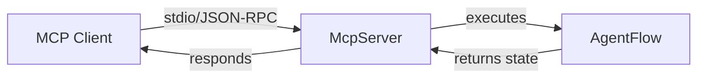
```mermaid
flowchart LR
    Client[MCP Client] -- stdio/JSON-RPC --> Server[McpServer]
    Server -- executes --> AgentFlow
    AgentFlow -- returns state --> Server
    Server -- responds --> Client
```

---

## 🚀 Advanced Features

### NodeResult - Result-Based Error Handling

For nodes that need explicit error handling, use `NodeResult` trait with `Result` return types:

```rust
use agentflow::prelude::*;
use agentflow::core::error::AgentFlowError;

let fallible_node = create_result_node(|store: SharedStore| {
    Box::pin(async move {
        let data = store.lock().await;
        if data.contains_key("error_trigger") {
            return Err(AgentFlowError::Custom("Operation failed".to_string()));
        }
        drop(data);

        store.lock().await.insert("result".to_string(), "success".into());
        Ok(store)
    })
});
```

**Key differences:**
- `create_result_node()` - Returns `ResultNode` that produces `Result<SharedStore, AgentFlowError>`
- `create_node()` - Returns `SimpleNode` that produces `SharedStore` (infallible)

### MultiAgent MergeStrategy

Control how multiple agents combine their results with different merge strategies:

```rust
use agentflow::prelude::*;

// Strategy 1: SharedStore (default) - All agents modify the same store
let mut multi = MultiAgent::new();
multi.add_agent(agent1);
multi.add_agent(agent2);

// Strategy 2: Namespaced - Each agent's results get prefixed (agent_0.*, agent_1.*)
let mut multi = MultiAgent::with_strategy(MergeStrategy::Namespaced);
multi.add_agent(agent1);
multi.add_agent(agent2);

// Strategy 3: Custom - Provide your own merge function
fn custom_merge(results: Vec<SharedStore>) -> SharedStore {
    // Your custom merging logic
    results[0].clone()
}
let mut multi = MultiAgent::with_strategy(MergeStrategy::Custom(custom_merge));
```

**Available strategies:**
- `MergeStrategy::SharedStore` - All agents share and modify the same store concurrently
- `MergeStrategy::Namespaced` - Results are merged with agent-specific prefixes
- `MergeStrategy::Custom(fn)` - Provide a custom merge function

### Typed Store Wrapper

For type-safe store access, use the `Store` wrapper with typed helper methods:

```rust
use agentflow::prelude::*;

let store = Store::new();

// Typed setters
store.set_string("name", "Alice").await;
store.set_i64("age", 30).await;
store.set_bool("active", true).await;

// Typed getters (return Option<T>)
let name = store.get_string("name").await; // Option<String>
let age = store.get_i64("age").await;       // Option<i64>

// Required getters (return Result<T, String>)
let name = store.require_string("name").await?; // Result<String, String>
let age = store.require_i64("age").await?;       // Result<i64, String>

// Utility methods
let has_key = store.contains_key("name").await;
let keys = store.keys().await;
let len = store.len().await;

// Convert to/from SharedStore
let shared = store.into_shared(); // Store -> SharedStore
let store = Store::from_shared(shared); // SharedStore -> Store
```

**Benefits:**
- Type-safe access with `get_string()`, `get_i64()`, `get_f64()`, `get_bool()`
- Enforced validation with `require_*()` methods
- Cleaner API surface without manual JSON type checking

### TypedFlow & TypedStore

For stricter type safety, `TypedFlow` orchestrates state graphs over a generic, user-defined `TypedStore<T>`, preventing runtime type mismatches.

```rust
use agentflow::core::{TypedFlow, TypedStore, create_typed_node};

#[derive(Debug, Clone)]
struct MyState {
    count: u32,
}

#[tokio::main]
async fn main() {
    // Create a flow for MyState with a maximum of 10 steps
    let mut flow = TypedFlow::<MyState>::new().with_max_steps(10);

    let node_a = create_typed_node(|store: TypedStore<MyState>| async move {
        store.inner.write().await.count += 1;
        store
    });

    flow.add_node("A", node_a);
    
    // Transition based on strongly-typed state
    flow.add_transition("A", |state| {
        if state.count < 3 { Some("A".to_string()) } else { None }
    });

    let final_store = flow.run(TypedStore::new(MyState { count: 0 })).await;
    println!("Final Count: {}", final_store.inner.read().await.count);
}
```

---

## 🛠️ Extending AgentFlow

- **Add new agent types**: Implement the `Node` trait.
- **Compose custom workflows**: Use the `Workflow` or `Flow` API to chain, branch, or parallelize agents.
- **Integrate external tools**: Wrap API calls as nodes/agents.

---

## 📖 Philosophy

- **Composable**: Build complex systems from simple, reusable async parts.
- **Async-first**: Designed for async/await and concurrent execution.
- **Minimalist**: Focus on core abstractions, not vendor lock-in.

## ⚠️ Async Safety Guidelines

AgentFlow uses `tokio::sync::Mutex` for thread-safe shared state. To prevent deadlocks and blocking the async runtime:

- **Never hold a lock across `.await` points**: Always drop the lock guard before any async operation.

**Bad Example:**
```rust
let mut store = shared_store.lock().await;
store.insert("key".to_string(), value);
some_async_function().await; // ❌ Lock held across await!
```

**Good Example:**
```rust
{
    let mut store = shared_store.lock().await;
    store.insert("key".to_string(), value);
} // Lock dropped here
some_async_function().await; // ✅ Safe
```

- Locks are acquired with `.lock().await` (async)
- Always scope lock guards in blocks `{}` to ensure they're dropped early
- Read the data you need, drop the lock, then perform async operations

---

## 📦 References

- See `/examples/` for more Rust usage.
- See `/src/patterns/` for built-in patterns.
- See `/src/core/` for core abstractions.
- See `/src/utils/` for integration stubs (LLM, search, embeddings, etc).

---

## 📝 License

MIT OR Apache-2.0

---

**Happy agentic building!**
# AgentFlow (Rust)

AgentFlow is a minimalist, async-first Rust framework for building, orchestrating, and managing AI agents and workflows. It is designed for composability, extensibility, and real-world LLM applications.

---

## Features

- **Agent**: Autonomous async decision-making unit with retry logic.
- **Workflow**: Chain of agents with conditional routing and branching.
- **MultiAgent**: Parallel or coordinated agent execution.
- **RAG**: Retrieval-Augmented Generation (retriever + generator).
- **MapReduce**: Batch map and reduce over data.
- **rust-agentic-skills**: Built-in support for the `rust-agentic-skills` standard, including the RPI (Research, Plan, Implement, Verify) workflow and declarative `SKILL.md` parser.
- **MCP Server**: Built-in Model Context Protocol server exposing AgentFlow skills to compatible clients (Cursor, Claude Desktop, etc.).
- **Composable**: Build complex systems from simple, reusable async parts.
- **Async-first**: Designed for async/await and concurrent execution.

---

## Installation

Add to your `Cargo.toml`:

```toml
agentflow = "0.1"
rig = "0.1"
```

---

## Quickstart Example

```rust
use agentflow::prelude::*;
use rig::prelude::*;
use std::collections::HashMap;
use std::sync::{Arc, Mutex};

#[tokio::main]
async fn main() {
    // Create a simple agent node
    let agent_node = create_node(|store: SharedStore| {
        Box::pin(async move {
            let prompt = store.lock().unwrap().get("prompt").and_then(|v| v.as_str()).unwrap_or("").to_string();
            // ... LLM call here ...
            store.lock().unwrap().insert("response".to_string(), Value::String("Hello!".to_string()));
            store
        })
    });

    let agent = Agent::with_retry(agent_node, 3, 1000);

    let mut store = HashMap::new();
    store.insert("prompt".to_string(), Value::String("Say hello!".to_string()));
    let result = agent.decide(store).await;
    println!("{:?}", result);
}
```

---

## Diagrams

### Agent Pattern

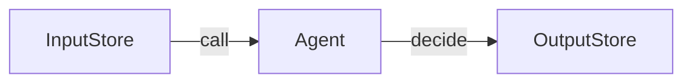
```mermaid
flowchart LR
    InputStore -->|call| Agent
    Agent -->|decide| OutputStore
```

### Workflow Pattern

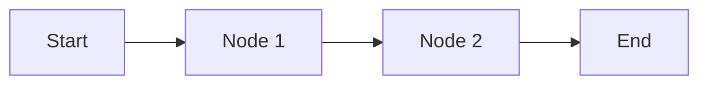
```mermaid
flowchart LR
    Start[Start] --> Step1[Node 1]
    Step1 --> Step2[Node 2]
    Step2 --> End[End]
```

---

## Example: MultiAgent

```rust
/*!
Runs multiple agents in parallel, each responsible for a different part of a software project.
*/
let mut multi_agent = MultiAgent::new();
multi_agent.add_agent(agent1);
multi_agent.add_agent(agent2);
let result = multi_agent.run(store).await;
```

---

## Example: RAG

```rust
/*!
Retrieval-Augmented Generation pipeline.
*/
let rag = Rag::new(retriever, generator);
let result = rag.call(store).await;
```

---

## Example: MapReduce

```rust
/*!
Batch process documents, summarize each, and aggregate results.
*/
let map_reduce = MapReduce::new(batch_mapper, reducer);
let result = map_reduce.run(inputs).await;
```

---

## 🏃 Running the Examples

All examples are in the [`examples/`](./examples/) directory.  
You must have Rust and Cargo installed.  
Some examples require API keys for LLM providers (e.g., OpenAI, Gemini) and the `rig-core` crate.

### 1. Set your API keys

Set your environment variables as needed for your LLM provider(s):

```bash
export OPENAI_API_KEY=sk-...
export GEMINI_API_KEY=...
```

### 2. Install dependencies

From the project root:

```bash
cargo build --all
```

If you want to run examples that use the `rig-core` crate, ensure you have network access and the correct API keys.

### 3. Run an example

You can run any example using Cargo.  
From the project root, use:

```bash
cargo run --example agent
cargo run --example async-agent
cargo run --example workflow
cargo run --example rag
cargo run --example multi-agent
cargo run --example mapreduce
cargo run --example orchestrator-multi-agent
cargo run --example structured-output
```

Or, to see a list of all available examples:

```bash
cargo run --example <example-name>
```

### Example Descriptions

- `agent` – Run a single LLM-powered agent with retry logic.
- `async-agent` – Run two agents concurrently (async/parallel).
- `workflow` – Multi-step workflow with human-in-the-loop (HITL) at each step.
- `rag` – Retrieval-Augmented Generation: retrieve context, then generate an answer.
- `multi-agent` – Run multiple agents in parallel, merging results into a shared store.
- `mapreduce` – Batch process documents, summarize each, and aggregate results.
- `orchestrator-multi-agent` – Orchestrator agent coordinates a multi-phase, multi-role workflow.
- `structured-output` – Multi-agent, interactive TUI pipeline for research, summarization, and critique, with structured output.

### Example: Run the agent example

```bash
cargo run --example agent
```

### Example: Run the workflow example

```bash
cargo run --example workflow
```

---

## License

MIT OR Apache-2.0
