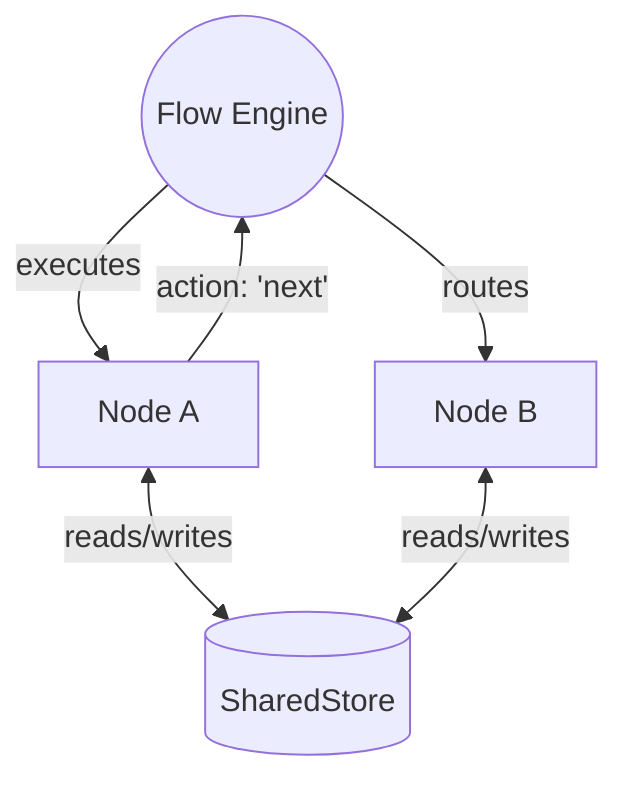
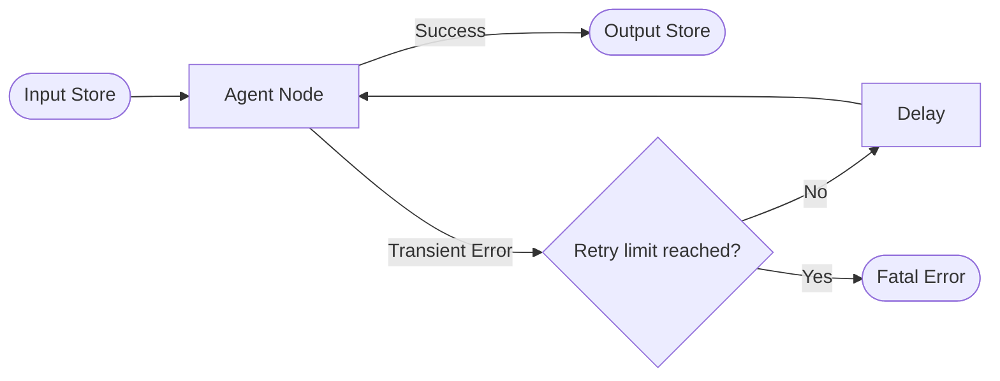
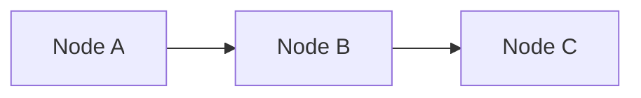
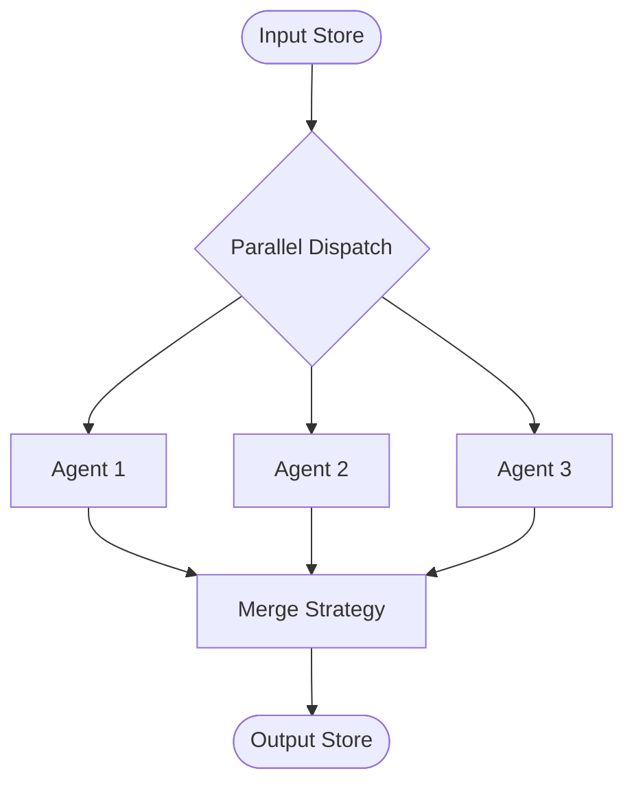
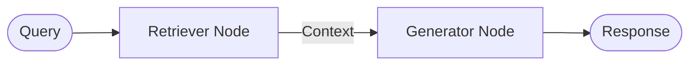
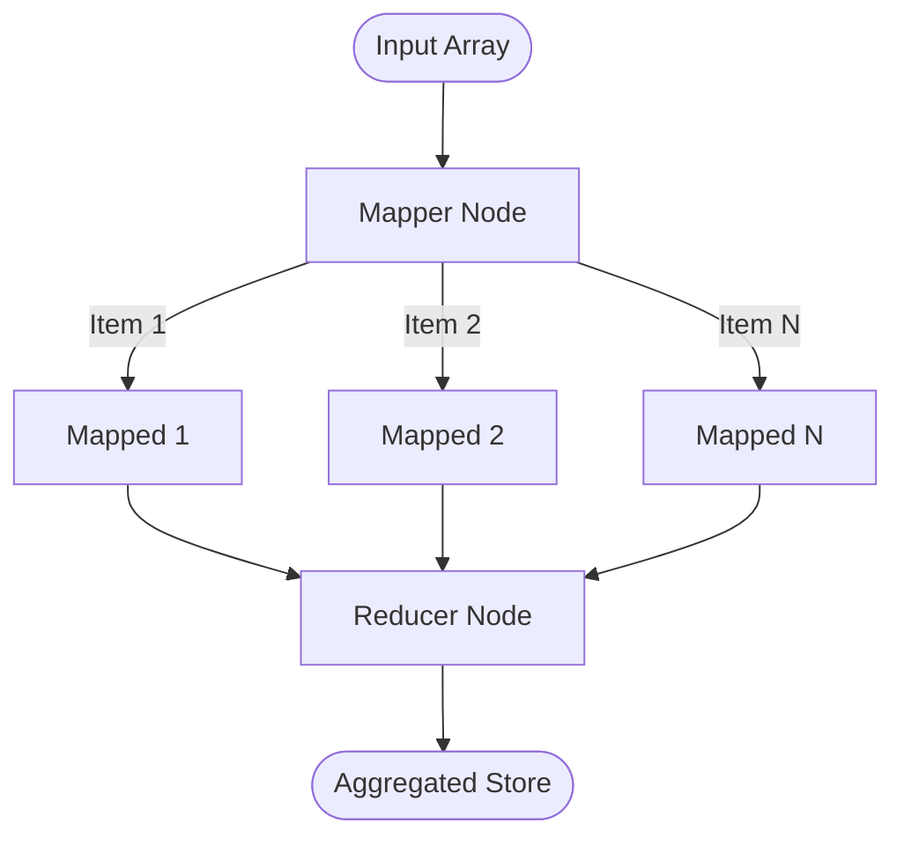
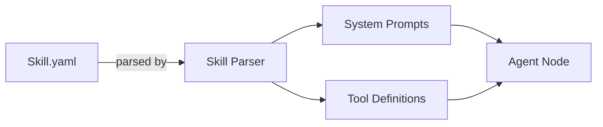
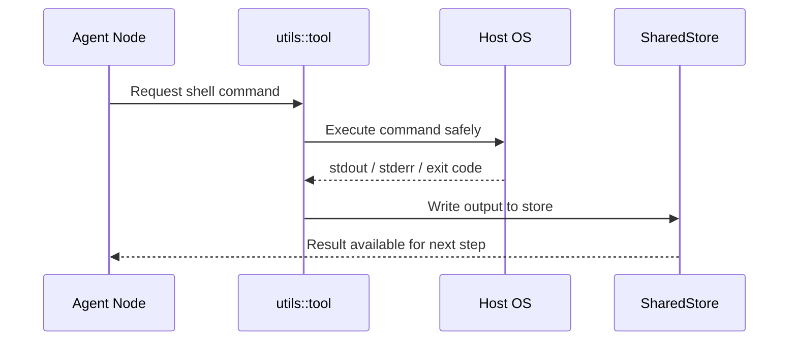

# AgentFlow

[](https://crates.io/crates/agentflow)
[](#license)
[](https://www.rust-lang.org)

**AgentFlow** is a provider-agnostic, async-native Rust framework for building LLM agents, RAG pipelines, multi-agent workflows, and agentic orchestration systems.

Bring your own LLM provider (`rig`, `openai`, `anthropic`, etc.) — AgentFlow handles the orchestration.

---

## High-Level Architecture

AgentFlow is composed of five distinct layers designed to work together seamlessly:

```mermaid
graph TD
    Client[External Client<br>Cursor / Claude Desktop] -->|stdio| MCP(mcp)
    MCP --> Patterns
    Skills(skills)<br>YAML Definitions -->|generates| Patterns
    Patterns(patterns)<br>Agent, Workflow, RAG --> Core
    Core(core)<br>Flow, Nodes, SharedStore --> Utils
    Utils(utils)<br>System Tools, Shell --> OS[Operating System]
    
    classDef layer fill:#f9f,stroke:#333,stroke-width:2px;
    class MCP,Skills,Patterns,Core,Utils layer;
```

---

## Features

| Feature | Description |
|---|---|
| `Flow` | Directed graph of nodes with labeled-edge routing and cycle prevention |
| `Agent` | Async decision unit with configurable retry logic |
| `Workflow` | Linear chain of nodes with conditional branching |
| `MultiAgent` | Parallel agent execution with 3 merge strategies |
| `MapReduce` | Batch map + reduce over document collections |
| `Rag` | Retriever → Generator pipeline |
| `StructuredOutput` | Typed JSON output extraction from LLM responses |
| `Store` / `TypedStore` | Type-safe wrappers over the shared store |
| `TypedFlow` | Generic flow over user-defined state structs |
| `ResultNode` | Nodes that return `Result<SharedStore, AgentFlowError>` |
| `AgentFlowError` | Unified error type: `NotFound`, `Timeout`, `NodeFailure`, `ExecutionLimitExceeded` |
| `tracing` | Built-in structured logging via the `tracing` crate |
| `skills` feature | Skill parser, tool nodes, RPI workflow |
| `mcp` feature | MCP server over stdio for Claude Desktop / Cursor |

---

## Installation

```toml
[dependencies]
agentflow = "0.2"
tokio = { version = "1", features = ["full"] }
serde_json = "1"
```

Optional features:

```toml
# YAML skill files + RPI workflow
agentflow = { version = "0.2", features = ["skills"] }

# MCP server (includes skills)
agentflow = { version = "0.2", features = ["mcp"] }

# Qdrant-backed RAG
agentflow = { version = "0.2", features = ["rag"] }

# Interactive REPL / TUI
agentflow = { version = "0.2", features = ["repl"] }
```

---

## Quick Start

```rust
use agentflow::prelude::*;
use std::collections::HashMap;
use std::sync::Arc;
use tokio::sync::RwLock;

#[tokio::main]
async fn main() {
    let node_a = create_node(|store: SharedStore| async move {
        store.write().await.insert("result_a".into(), serde_json::json!("done by A"));
        store.write().await.insert("action".into(), serde_json::json!("next"));
        store
    });

    let node_b = create_node(|store: SharedStore| async move {
        let prev = store.read().await
            .get("result_a").and_then(|v| v.as_str()).unwrap_or("").to_string();
        store.write().await.insert("final".into(), serde_json::json!(format!("B got: {}", prev)));
        store
    });

    let mut flow = Flow::new();
    flow.add_node("a", node_a);
    flow.add_node("b", node_b);
    flow.add_edge("a", "next", "b");

    let store: SharedStore = Arc::new(RwLock::new(HashMap::new()));
    let result = flow.run(store).await;
    println!("{}", result.read().await["final"]); // B got: done by A
}
```

---

## Module Deep-Dives

### 1. `core` (Execution Engine & State)

The `core` module contains the fundamental building blocks of AgentFlow: thread-safe state storage and the graph-based execution engine.


```mermaid
graph TD
    Flow((Flow Engine))
    NodeA[Node A]
    NodeB[Node B]
    Store[(SharedStore)]
    
    Flow -->|executes| NodeA
    NodeA <-->|reads/writes| Store
    NodeA -->|action: 'next'| Flow
    Flow -->|routes| NodeB
    NodeB <-->|reads/writes| Store
```

**SharedStore**
```rust
pub type SharedStore = Arc<RwLock<HashMap<String, serde_json::Value>>>;
```
- All nodes communicate through a single `SharedStore`.
- The `"action"` key is reserved by `Flow` for routing decisions. **It is automatically consumed (removed) upon each transition** to prevent state leaks.
- **Always drop the write guard before `.await`** to avoid deadlocks.

**Nodes**
```rust
// Infallible node
let node = create_node(|store: SharedStore| async move {
    store.write().await.insert("key".into(), serde_json::json!("value"));
    store
});

// Fallible node — returns Result
let node = create_result_node(|store: SharedStore| async move {
    if store.read().await.contains_key("bad") {
        return Err(AgentFlowError::NodeFailure("bad input".into()));
    }
    Ok(store)
});
```

**Flow**
Directed graph with labeled-edge routing and infinite-loop prevention.
```rust
let mut flow = Flow::new().with_max_steps(50);

flow.add_node("planner",   planner_node);
flow.add_node("executor",  executor_node);
flow.add_node("validator", validator_node);

flow.add_edge("planner",   "execute",  "executor");
flow.add_edge("executor",  "validate", "validator");
flow.add_edge("validator", "retry",    "planner"); // loop back

// run() executes until no transition matches or max_steps is hit.
// writes "error" key to the store if limit exceeded.
let result = flow.run(store).await;

// run_safe() returns Err(ExecutionLimitExceeded) if max_steps is hit.
let result = flow.run_safe(store).await?;
```

**TypedFlow**
Like `Flow`, but uses compile-time typed state and function closures for routing. Fully instrumented with `tracing` to visualize state machine execution.

```rust
use agentflow::core::{TypedFlow, TypedStore, create_typed_node};

#[derive(Debug, Clone)]
struct MyState { count: u32 }

let mut flow = TypedFlow::<MyState>::new().with_max_steps(10);

let node = create_typed_node(|s: TypedStore<MyState>| async move {
    s.inner.write().await.count += 1;
    s
});

flow.add_node("inc", node);
flow.add_transition("inc", |state| {
    if state.count < 5 { Some("inc".into()) } else { None }
});

let final_state = flow.run(TypedStore::new(MyState { count: 0 })).await;
```

---

### 2. `patterns` (High-Level Abstractions)

Pre-built architectures that compose `core` primitives into standard AI workflows.

**Agent**
Retry-aware async decision unit.

```mermaid
flowchart LR
    Start([Input Store]) --> AgentNode[Agent Node]
    AgentNode -->|Success| End([Output Store])
    AgentNode -->|Transient Error| Retry{Retry limit reached?}
    Retry -->|No| Wait[Delay]
    Wait --> AgentNode
    Retry -->|Yes| Error([Fatal Error])
```

**Workflow**
Linear steps with conditional branching.

```mermaid
flowchart LR
    Step1[Node A] --> Step2[Node B]
    Step2 --> Step3[Node C]
```

**MultiAgent**
Parallel agent execution with configurable merge strategies.

```mermaid
flowchart TD
    Input([Input Store]) --> Split{Parallel Dispatch}
    Split --> Agent1[Agent 1]
    Split --> Agent2[Agent 2]
    Split --> Agent3[Agent 3]
    Agent1 --> Merge[Merge Strategy]
    Agent2 --> Merge
    Agent3 --> Merge
    Merge --> Output([Output Store])
```

**RAG (Retrieval-Augmented Generation)**

```mermaid
flowchart LR
    Query([Query]) --> Retriever[Retriever Node]
    Retriever -->|Context| Generator[Generator Node]
    Generator --> Response([Response])
```

**MapReduce**
Batch map + reduce over document collections.

```mermaid
flowchart TD
    Input([Input Array]) --> Map[Mapper Node]
    Map -->|Item 1| M1[Mapped 1]
    Map -->|Item 2| M2[Mapped 2]
    Map -->|Item N| MN[Mapped N]
    M1 --> Reduce[Reducer Node]
    M2 --> Reduce
    MN --> Reduce
    Reduce --> Output([Aggregated Store])
```

---

### 3. `skills` (Declarative Logic)

The `skills` module allows defining agent behaviors, prompts, and tool requirements in YAML, cleanly separating logic from Rust code.


```mermaid
flowchart LR
    YAML[Skill.yaml] -->|parsed by| Parser[Skill Parser]
    Parser --> Prompts[System Prompts]
    Parser --> Tools[Tool Definitions]
    Prompts --> Agent[Agent Node]
    Tools --> Agent
```

*(Requires the `skills` feature flag)*

---

### 4. `utils` (System Interfacing)

The `utils` module provides safe, standardized ways for agents to interact with the host system, such as executing shell commands.


```mermaid
sequenceDiagram
    participant Agent as Agent Node
    participant Tool as utils::tool
    participant OS as Host OS
    participant Store as SharedStore

    Agent->>Tool: Request shell command
    Tool->>OS: Execute command safely
    OS-->>Tool: stdout / stderr / exit code
    Tool->>Store: Write output to store
    Store-->>Agent: Result available for next step
```

*(e.g., `create_tool_node` for shell execution)*

---

### 5. `mcp` (Model Context Protocol)

The `mcp` module exposes your AgentFlow pipelines as an MCP server over `stdio`. This allows IDEs like Cursor or the Claude Desktop app to interact directly with your custom tools and agents.


```mermaid
flowchart LR
    Client[Cursor / Claude Desktop] <-->|stdio JSON-RPC| Server[AgentFlow MCP Server]
    Server <-->|translate request| Flow[AgentFlow Workflow]
    Flow <--> Store[SharedStore]
```

*(Requires the `mcp` feature flag)*

---

## Examples

All examples live in [`examples/`](./examples/). Run with `cargo run --example <name>`.

| Example | Description |
|---|---|
| `agent` | Single LLM agent with retry |
| `async-agent` | Two agents running concurrently |
| `workflow` | Multi-step workflow with human-in-the-loop |
| `rag` | RAG pipeline (retrieve → generate) |
| `multi-agent` | Parallel agents, shared store |
| `mapreduce` | Batch map + reduce over documents |
| `orchestrator-multi-agent` | Orchestrator coordinating multi-role agents |
| `orchestrator-with-tools` | Orchestrator with tool-calling nodes |
| `structured-output` | Typed JSON extraction from LLM |
| `error-handling` | `ResultNode` + `AgentFlowError` patterns |
| `react` | ReAct (Reason + Act) loop |
| `reflection` | Self-critique + reflection loop |
| `plan-and-execute` | Planner → executor pattern |
| `routing` | Conditional routing between nodes |
| `repl` | Interactive REPL agent loop |
| `typed-flow` | `TypedFlow` over a custom state struct |
| `dynamic-orchestrator` | TOML-configured agent registry, runtime orchestration |
| `rpi` | Research → Plan → Implement → Verify loop |
| `rust-agentic-skills` | YAML skill files + RPI workflow (`--features skills`) |
| `document-processing` | Document pipeline with skill nodes (`--features skills`) |

### Environment setup

```bash
export OPENAI_API_KEY=sk-...
export GEMINI_API_KEY=...   # if using Gemini
```

Or use a `.env` file — examples call `dotenvy::dotenv().ok()` at startup.

---

## Architecture

```
agentflow/
├── core/
│   ├── node.rs         Node trait, SimpleNode, ResultNode, create_node, create_result_node
│   ├── flow.rs         Flow — labeled-edge graph, max_steps, run / run_safe
│   ├── store.rs        Store — typed helper over SharedStore
│   ├── typed_store.rs  TypedStore<T> — generic state wrapper
│   ├── typed_flow.rs   TypedFlow<T> — generic state machine
│   ├── batch.rs        Batch, ParallelBatch
│   └── error.rs        AgentFlowError
├── patterns/
│   ├── agent.rs        Agent — retry, decide_shared, decide_result
│   ├── workflow.rs     Workflow — linear steps, execute_shared
│   ├── multi_agent.rs  MultiAgent — SharedStore / Namespaced / Custom
│   ├── rag.rs          Rag — retriever + generator
│   ├── mapreduce.rs    MapReduce
│   ├── structured_output.rs
│   └── rpi.rs          RpiWorkflow
├── utils/
│   └── tool.rs         create_tool_node — shell commands as nodes
├── skills/             (feature: skills) YAML skill parser
└── mcp/                (feature: mcp) MCP stdio server
```

---

## License

Licensed under the GNU Affero General Public License v3.0 ([AGPL-3.0](LICENSE)).