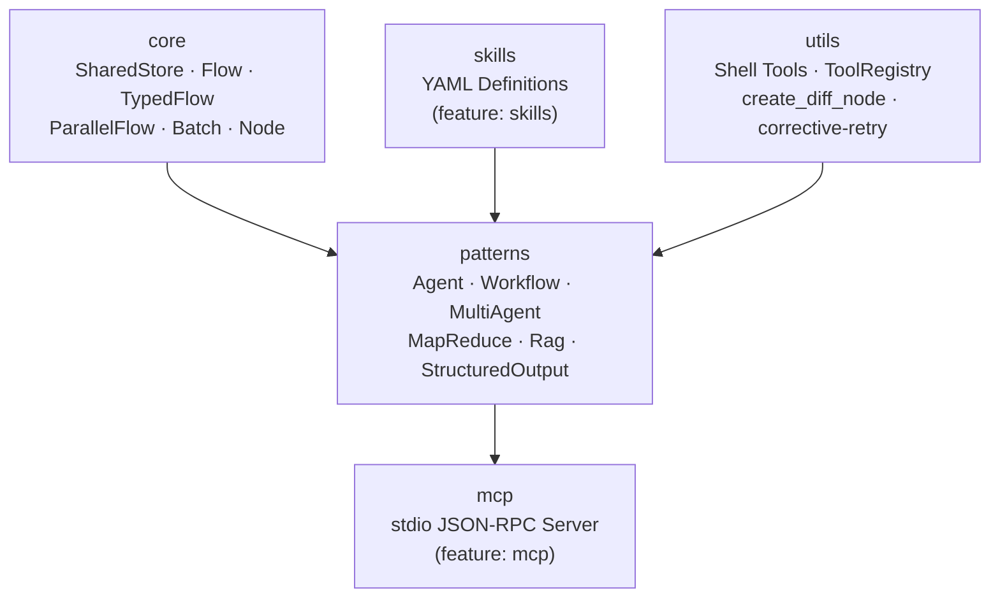
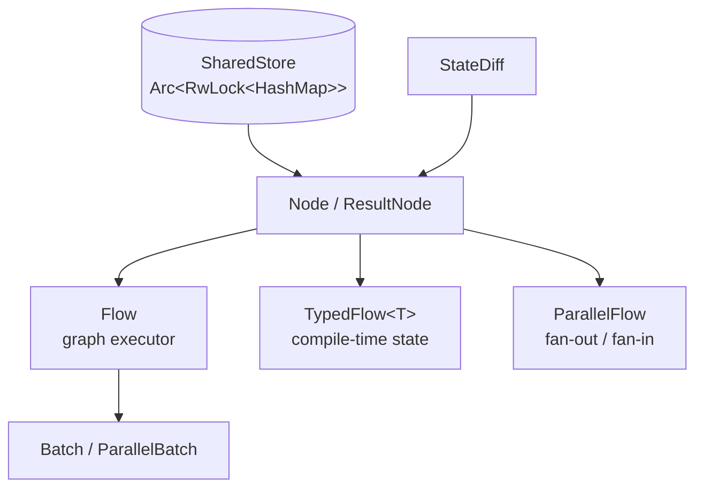
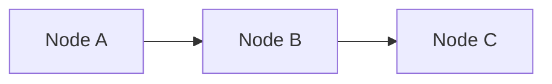
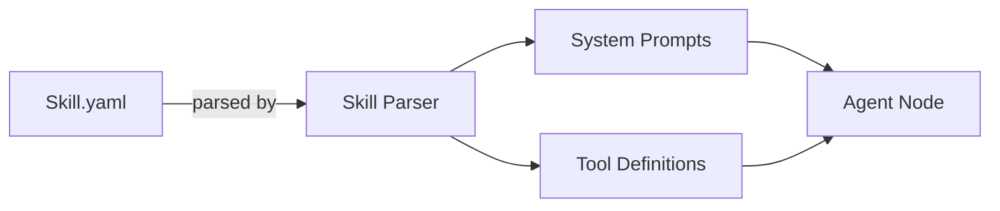
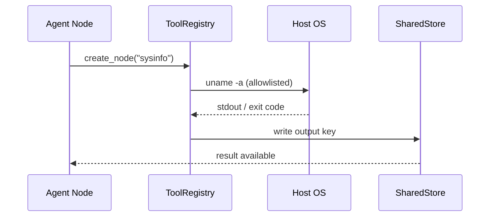

# AgentFlow

[](https://crates.io/crates/agentflow)
[](#license)
[](https://www.rust-lang.org)

**AgentFlow** is a provider-agnostic, async-native Rust framework for building LLM agents, RAG pipelines, multi-agent workflows, and orchestration systems. Bring your own LLM client — AgentFlow handles the orchestration.

---

## Quick Start

```bash
cargo add agentflow
export OPENAI_API_KEY=sk-...
cargo run --example agent
```

---

## High-Level Architecture


```mermaid
graph TD
    Core["core<br>SharedStore · Flow · TypedFlow<br>ParallelFlow · Batch · Node"]
    Patterns["patterns<br>Agent · Workflow · MultiAgent<br>MapReduce · Rag · StructuredOutput"]
    Skills["skills<br>YAML Definitions<br>(feature: skills)"]
    Utils["utils<br>Shell Tools · ToolRegistry<br>create_diff_node · corrective-retry"]
    MCP["mcp<br>stdio JSON-RPC Server<br>(feature: mcp)"]

    Core --> Patterns
    Skills --> Patterns
    Utils --> Patterns
    Patterns --> MCP
```

---

## Module Breakdown

### 1. `core` (Primitives)

The foundation. Every other module builds on these.


```mermaid
flowchart TD
    SS[(SharedStore<br>Arc&lt;RwLock&lt;HashMap&gt;&gt;)] --> Node[Node / ResultNode]
    Node --> Flow[Flow<br>graph executor]
    Node --> TF[TypedFlow&lt;T&gt;<br>compile-time state]
    Node --> PF[ParallelFlow<br>fan-out / fan-in]
    Flow --> Batch[Batch / ParallelBatch]
    SD[StateDiff] --> Node
```

**Key types:**

| Type | Purpose |
|------|---------|
| `SharedStore` | Central `Arc<RwLock<HashMap>>` data bus |
| `SimpleNode` / `ResultNode` | Infallible / fallible async node trait objects |
| `Flow` | Labeled-edge graph executor; routes via `"action"` key |
| `TypedFlow<T>` | Compile-time typed state machine |
| `ParallelFlow` | Fan-out N independent flows, fan-in with a merge fn |
| `StateDiff` | Lockless node output; framework applies under one write lock |
| `Batch` / `ParallelBatch` | Sequential / concurrent node-over-items execution |
| `AgentFlowError` | Unified error type (`NotFound`, `Timeout`, `NodeFailure`, …) |

---

### 2. `patterns` (High-Level Abstractions)

Pre-built architectures that compose `core` primitives into standard AI workflows.

**Agent** — Retry-aware async decision unit.

```mermaid
flowchart LR
    Start([Input Store]) --> AgentNode[Agent Node]
    AgentNode -->|Success| End([Output Store])
    AgentNode -->|Transient Error| Retry{Retry limit reached?}
    Retry -->|No| Wait[Delay]
    Wait --> AgentNode
    Retry -->|Yes| Error([Fatal Error])
```

**Workflow** — Linear steps with shared context.

```mermaid
flowchart LR
    Step1[Node A] --> Step2[Node B] --> Step3[Node C]
```

**MultiAgent** — Parallel agents with configurable merge strategies.

```mermaid
flowchart TD
    Input([Input Store]) --> Split{Parallel Dispatch}
    Split --> Agent1[Agent 1]
    Split --> Agent2[Agent 2]
    Split --> Agent3[Agent 3]
    Agent1 --> Merge[Merge Strategy]
    Agent2 --> Merge
    Agent3 --> Merge
    Merge --> Output([Output Store])
```

**RAG (Retrieval-Augmented Generation)**

```mermaid
flowchart LR
    Query([Query]) --> Retriever[Retriever Node]
    Retriever -->|Context| Generator[Generator Node]
    Generator --> Response([Response])
```

**MapReduce** — Batch map + reduce over document collections.

```mermaid
flowchart TD
    Input([Input Array]) --> Map[Mapper Node]
    Map -->|Item 1| M1[Mapped 1]
    Map -->|Item 2| M2[Mapped 2]
    Map -->|Item N| MN[Mapped N]
    M1 --> Reduce[Reducer Node]
    M2 --> Reduce
    MN --> Reduce
    Reduce --> Output([Aggregated Store])
```

---

### 3. `skills` (Declarative Logic)

Define agent personas, prompts, and tool requirements in YAML — no Rust recompile needed.


```mermaid
flowchart LR
    YAML[Skill.yaml] -->|parsed by| Parser[Skill Parser]
    Parser --> Prompts[System Prompts]
    Parser --> Tools[Tool Definitions]
    Prompts --> Agent[Agent Node]
    Tools --> Agent
```

*(Requires the `skills` feature flag)*

---

### 4. `utils` (System Interfacing)

Safe, standardised ways for agents to interact with the host system.


```mermaid
sequenceDiagram
    participant Agent as Agent Node
    participant Registry as ToolRegistry
    participant OS as Host OS
    participant Store as SharedStore

    Agent->>Registry: create_node("sysinfo")
    Registry->>OS: uname -a (allowlisted)
    OS-->>Registry: stdout / exit code
    Registry->>Store: write output key
    Store-->>Agent: result available
```

**Primitives:**

| Function / Type | Purpose |
|-----------------|---------|
| `create_tool_node` | Run a shell command as a node |
| `ToolRegistry` | Explicit allowlist of permitted tools; blocks arbitrary LLM-generated names |
| `create_diff_node` | Node receives a read-only snapshot, returns `StateDiff`; framework applies under one brief write lock — structurally deadlock-free |
| `create_corrective_retry_node` | Self-correction loop: writes the failure reason into a store key before each retry so the LLM can read and adjust |

---

### 5. `mcp` (Model Context Protocol)

Expose AgentFlow pipelines as an MCP server over `stdio`, allowing IDEs like Cursor or Claude Desktop to call your agents directly.


```mermaid
flowchart LR
    Client[Cursor / Claude Desktop] <-->|stdio JSON-RPC| Server[AgentFlow MCP Server]
    Server <-->|translate request| Flow[AgentFlow Workflow]
    Flow <--> Store[SharedStore]
```

*(Requires the `mcp` feature flag)*

---

## Examples

All examples live in [`examples/`](./examples/). Run with `cargo run --example <name>`.

| Example | Description |
|---------|-------------|
| `agent` | Single LLM agent with retry |
| `async-agent` | Two agents running concurrently |
| `workflow` | Multi-step workflow with human-in-the-loop |
| `rag` | RAG pipeline (retrieve → generate) |
| `multi-agent` | Parallel agents, shared store |
| `mapreduce` | Batch map + reduce over documents |
| `orchestrator-multi-agent` | Orchestrator coordinating multi-role agents |
| `orchestrator-with-tools` | Orchestrator + ReAct sub-agent with real shell tools |
| `structured-output` | Typed JSON extraction from LLM |
| `error-handling` | `ResultNode` + `AgentFlowError` patterns |
| `react` | ReAct (Reason + Act) loop |
| `reflection` | Self-critique + reflection loop |
| `plan-and-execute` | Planner → executor pattern |
| `routing` | LLM-powered intent routing between specialist nodes |
| `repl` | Interactive REPL agent loop with conversation history |
| `typed-flow` | `TypedFlow` over a custom state struct |
| `dynamic-orchestrator` | TOML-configured agent registry, runtime orchestration |
| `rpi` | Research → Plan → Implement → Verify loop |
| `rust-agentic-skills` | YAML skill files + RPI workflow (`--features skills`) |
| `document-processing` | Document pipeline with skill nodes (`--features skills`) |

### Environment setup

```bash
export OPENAI_API_KEY=sk-...
export GEMINI_API_KEY=...   # if using Gemini
```

Or use a `.env` file — examples call `dotenvy::dotenv().ok()` at startup.

---

## Architecture

```
agentflow/
├── core/
│   ├── node.rs         Node, ResultNode, SimpleNode, StateDiff, create_diff_node, factory fns
│   ├── flow.rs         Flow — labeled-edge graph, max_steps, run / run_safe
│   ├── parallel.rs     ParallelFlow — fan-out N flows, fan-in with merge fn
│   ├── store.rs        Store — typed ergonomic wrapper over SharedStore
│   ├── typed_store.rs  TypedStore<T> — generic state wrapper
│   ├── typed_flow.rs   TypedFlow<T> — generic typed state machine
│   ├── batch.rs        Batch, ParallelBatch
│   └── error.rs        AgentFlowError
├── patterns/
│   ├── agent.rs        Agent — retry, decide_shared, decide_result
│   ├── workflow.rs     Workflow — linear steps, execute_shared
│   ├── multi_agent.rs  MultiAgent — SharedStore / Namespaced / Custom
│   ├── rag.rs          Rag — retriever + generator
│   ├── mapreduce.rs    MapReduce
│   ├── structured_output.rs
│   └── rpi.rs          RpiWorkflow
├── utils/
│   └── tool.rs         create_tool_node, ToolRegistry, create_diff_node,
│                       create_corrective_retry_node
├── skills/             (feature: skills) YAML skill parser
└── mcp/                (feature: mcp) MCP stdio server
```

---

## License

Licensed under the GNU Affero General Public License v3.0 ([AGPL-3.0](LICENSE)).
