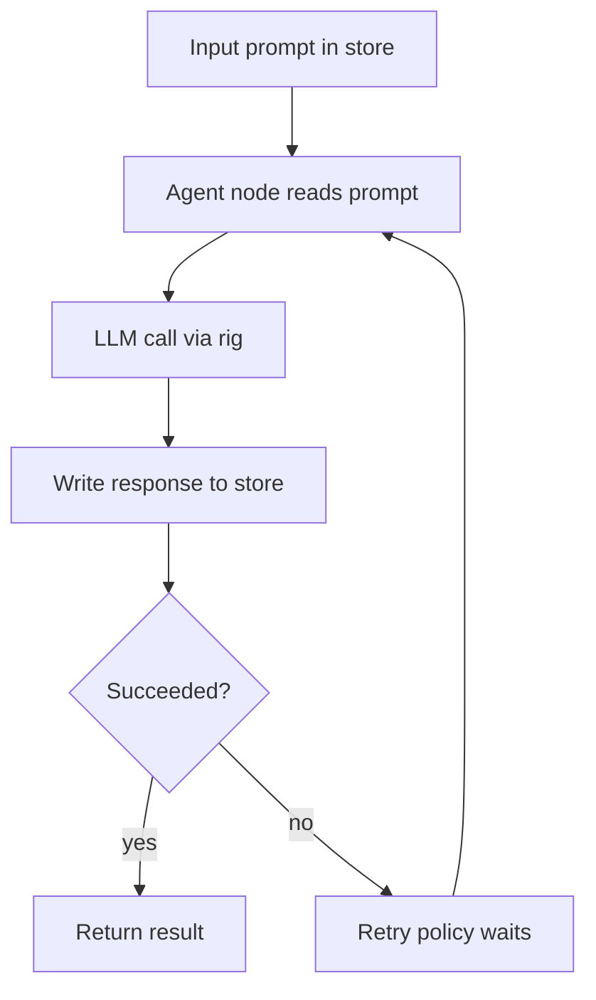

# Single Agent with Retry

## What this example is for

Demonstrates how to create a single LLM-powered agent using AgentFlow and the rig crate, including retry logic and both ergonomic and low-level usage.

**Primary AgentFlow pattern:** `Agent`  
**Why you would use it:** wrap a node with retry-aware single-step execution.

## How the example works

1. Defines a node that takes a prompt from the store and calls an LLM (via rig) to generate a response.
2. Wraps the node in an `Agent` with retry logic.
3. Shows both the high-level `decide` method (HashMap in/out) and the lower-level `call` method (SharedStore in/out).

## Execution diagram



## Key implementation details

- The example source is `examples/agent.rs`.
- It uses AgentFlow primitives to move data through a store, flow, or higher-level pattern wrapper.
- The implementation is meant to be adapted by swapping in your own prompts, tool handlers, retrieval logic, or business rules.
- When an LLM provider is used, the example relies on `rig` and environment-provided credentials.

## Build your own with this pattern

Use the same pattern in your own project like this:

```rust
use agentflow::prelude::*;
use serde_json::Value;
use std::collections::HashMap;

let support_agent = Agent::with_retry(
    create_node(|store| Box::pin(async move {
        store.write().await.insert("response".into(), Value::String("Ticket triaged".into()));
        store
    })),
    3,
    500,
);

let mut input = HashMap::new();
input.insert("ticket".into(), Value::String("Reset password".into()));
let result = support_agent.decide(input).await?;
```

### Customization ideas

- Change the prompt or LLM model to suit your use case.
- Use `Agent::with_retry` to add robustness to any LLM or tool call.
- Use `decide` for ergonomic, single-step agent calls in your own projects.

## How to run

```bash
cargo run --example agent
```

## Requirements and notes

Typically requires `OPENAI_API_KEY` (or the provider credentials used by `rig`).
