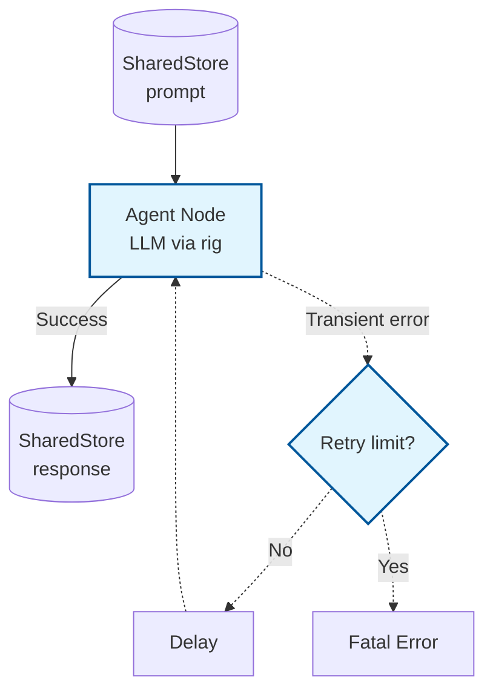

# Example: agent

*This documentation is generated from the source code.*

# Example: agent.rs

**Purpose:**
Demonstrates how to create a single LLM-powered agent using AgentFlow and the `rig` crate, including retry logic and both ergonomic and low-level usage.

**How it works:**
- Defines a node that reads a prompt from the store and calls an LLM (via `rig`) to generate a response.
- Wraps the node in an `Agent` with retry logic (`Agent::with_retry`).
- Shows both the high-level `decide` method (HashMap in/out) and the lower-level `decide_shared` method (SharedStore in/out).

**How to adapt:**
- Change the prompt or LLM model to suit your use case.
- Use `Agent::with_retry` to add robustness to any LLM or tool call.
- Use `decide` for ergonomic single-step agent calls; use `decide_shared` to keep the `SharedStore` reference across multiple steps.

**Requires:** `OPENAI_API_KEY`
**Run with:** `cargo run --example agent`

---

## Implementation Architecture



**Example:**
```rust
let agent = Agent::with_retry(my_node, 3, 1000);

// Ergonomic HashMap API
let result: HashMap<String, Value> = agent.decide(input_map).await?;

// SharedStore API
let store_out = agent.decide_shared(store).await;
```
