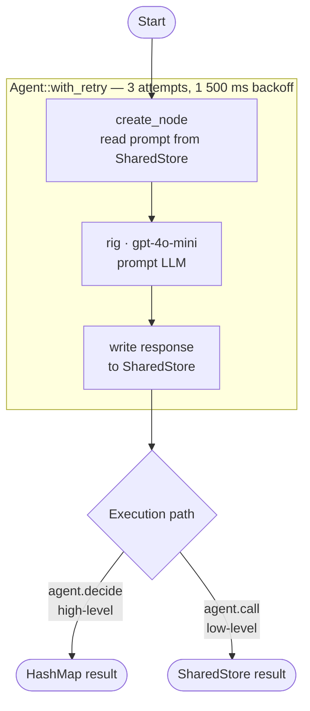

# Agent Tutorial

## What this example is for

This example demonstrates how to create a single LLM-powered `Agent` using AgentFlow. It shows how to integrate the `rig` library for OpenAI inference, apply built-in retry logic, and interact with the agent using both high-level and low-level execution methods.

**Primary AgentFlow pattern:** `Basic Agent`  
**Why you would use it:** As the atomic building block of AgentFlow. Every node in a complex flow or orchestrator is essentially an Agent. Use this pattern when you need robust, single-turn LLM generation with automatic retries for flaky network connections or API rate limits.

## How it works

At its core, an `Agent` is just a wrapper around a `Node`. The node defines the business logic (reading a prompt, hitting OpenAI via `rig`, saving the response).

The `Agent` struct wraps that node and provides:
1. `decide`: A high-level, ergonomic method that accepts a standard `HashMap` instead of an `Arc<RwLock<HashMap>>`, hiding the async synchronization primitives.
2. `call`: The low-level standard `Node` method that accepts the raw `SharedStore` state.
3. `Agent::with_retry`: Built-in backoff for network resilience.

### Step-by-Step Code Walkthrough

First, we define a standard asynchronous node. The node extracts the `prompt` string from the store and uses `rig::providers::openai` to ask GPT for a poem about AI in Shakespearean style.

```rust
let agent_node = create_node(move |store: SharedStore| {
    Box::pin(async move {
        // 1. Read the input prompt
        let prompt = {
            let guard = store.write().await;
            guard.get("prompt").unwrap().to_string()
        };

        // 2. Build the LLM call using `rig`
        let openai_client = providers::openai::Client::from_env();
        let rig_agent = openai_client
            .agent("gpt-4o-mini")
            .preamble(r#"You are a helpful assistant who is very skilled at writing poetry."#)
            .build();

        // 3. Prompt the model
        let response = rig_agent.prompt(&prompt).await.unwrap();

        // 4. Save the response
        store.write().await.insert("response".to_string(), Value::String(response));
        store
    })
});
```

Next, instead of adding this node to a `Flow`, we wrap it in an `Agent` struct. This gives us `with_retry`, meaning if the OpenAI API fails, AgentFlow will automatically wait and try again up to 3 times, with a 1500ms delay.

```rust
let agent = Agent::with_retry(agent_node, 3, 1500);
```

Finally, we execute the agent. For simple use cases, you can use `.decide()` which takes a plain `HashMap` and abstracts away the `SharedStore` lock handling.

```rust
let result = agent.decide(store.clone()).await;

if let Some(response) = result.get("response").and_then(|v| v.as_str()) {
    println!("[llm response]: \n{}\n", response);
}
```

If you need the raw `SharedStore` (for instance, to pass into a `Flow`), you can use the lower-level `.call()` method:

```rust
let shared_store = std::sync::Arc::new(tokio::sync::RwLock::new(store));
let result_store = agent.call(shared_store).await;
```

## Execution diagram



**AgentFlow patterns used:** `Node` · `Agent` · `Agent::with_retry`

## How to run

Ensure you have your `OPENAI_API_KEY` set in your environment or `.env` file, then run:

```bash
cargo run --example agent
```