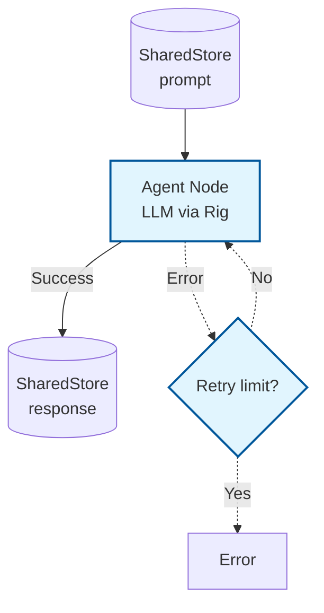

# Example: agent

*This documentation is automatically generated from the source code.*

# Example: agent.rs

**Purpose:**
Demonstrates how to create a single LLM-powered agent using AgentFlow and the rig crate, including retry logic and both ergonomic and low-level usage.


## Implementation Architecture



**How it works:**
- Defines a node that takes a prompt from the store and calls an LLM (via rig) to generate a response.
- Wraps the node in an `Agent` with retry logic.
- Shows both the high-level `decide` method (HashMap in/out) and the lower-level `call` method (SharedStore in/out).

**How to adapt:**
- Change the prompt or LLM model to suit your use case.
- Use `Agent::with_retry` to add robustness to any LLM or tool call.
- Use `decide` for ergonomic, single-step agent calls in your own projects.

**Example:**
```rust
let agent = Agent::with_retry(my_node, 3, 1000);
let result = agent.decide(my_input).await;
```