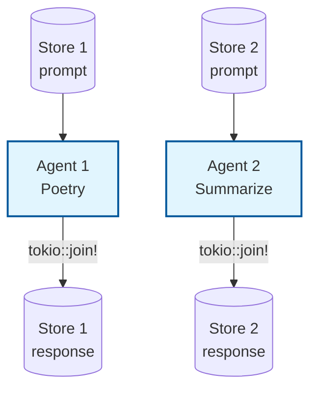

# Example: async_agent

*This documentation is generated from the source code.*

# Example: async_agent.rs

**Purpose:**
Showcases running multiple agents concurrently (async/parallel) using AgentFlow and `rig`.

**How it works:**
- Defines two LLM nodes with different prompts (poetry and summarization).
- Wraps each in an `Agent`.
- Runs both agents concurrently using `tokio::join!`.
- Prints both prompts and both responses.

**How to adapt:**
- Use this pattern to parallelize independent LLM calls (e.g., batch processing, multi-task pipelines).
- For more than two agents, prefer `MultiAgent` or `ParallelFlow` over manual `tokio::join!`.
- Add more agents or change the prompts/models as needed.

**Requires:** `OPENAI_API_KEY`
**Run with:** `cargo run --example async-agent`

---

## Implementation Architecture



**Example:**
```rust
let fut1 = agent1.decide_shared(store1);
let fut2 = agent2.decide_shared(store2);
let (out1, out2) = tokio::join!(fut1, fut2);
```
