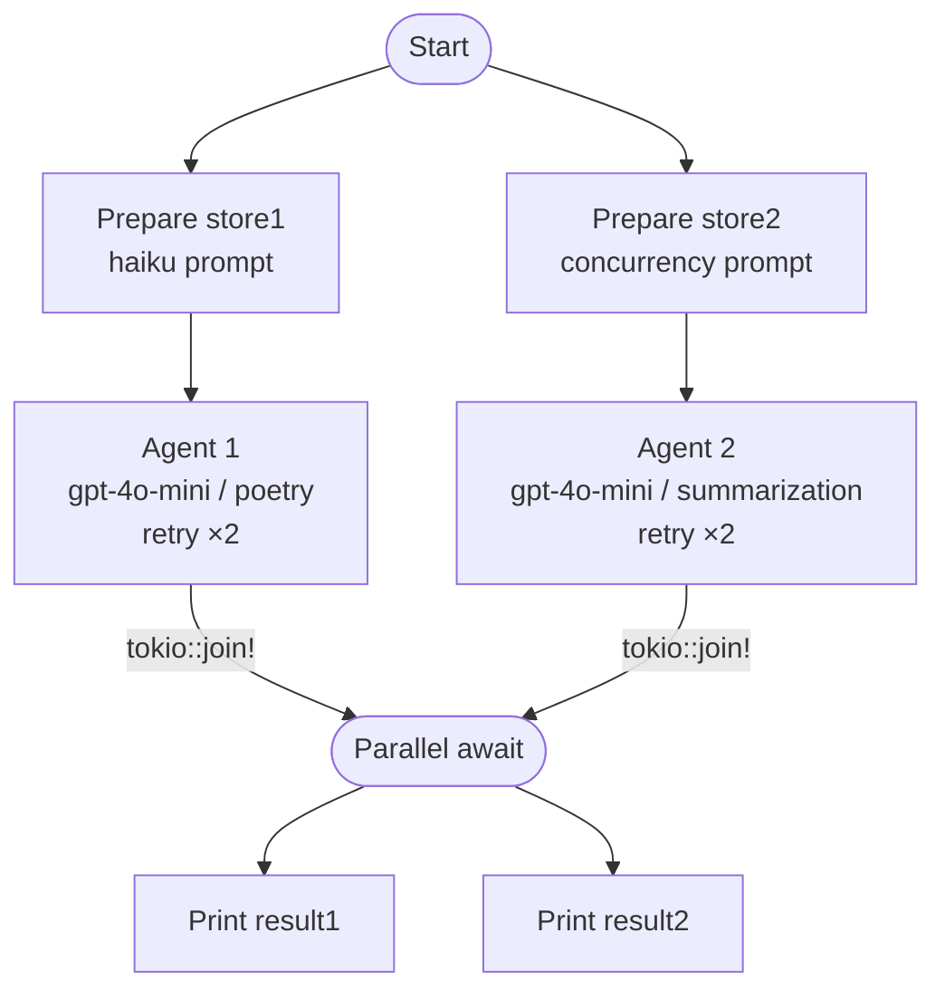

# Async Agent Tutorial

## What this example is for

This example demonstrates how to run multiple `Agent` instances concurrently (in parallel) using AgentFlow and `tokio`. 

**Primary AgentFlow pattern:** `Parallel Execution`  
**Why you would use it:** When you need to fan-out LLM requests, such as calling multiple specialized agents at the same time, processing a batch of prompts, or requesting multiple perspectives on a single issue without blocking on each network request.

## How it works

The example creates two separate input stores with two different prompts (one asking for a haiku, the other asking for a summary). It then defines an asynchronous LLM node factory that generates rig-powered nodes.

Each node is wrapped in an `Agent` wrapper with retry logic. Finally, we use `tokio::join!` to execute both agents simultaneously.

### Step-by-Step Code Walkthrough

First, we define a reusable node factory. This is a closure that takes a description and returns a boxed async `Node`. Inside the node, we extract the prompt from the shared store and call the OpenAI API using the `rig` crate.

```rust
let llm_node = |desc: &'static str| {
    create_node(move |store: SharedStore| {
        Box::pin(async move {
            // Read the prompt
            let prompt = {
                let guard = store.read().await;
                guard.get("prompt").unwrap().to_string()
            };

            // Call the LLM
            let openai_client = providers::openai::Client::from_env();
            let rig_agent = openai_client
                .agent("gpt-4o-mini")
                .preamble(&format!("You are a helpful assistant for {}.", desc))
                .build();

            let response = rig_agent.prompt(&prompt).await.unwrap();

            // Write the response back to the store
            store.write().await.insert("response".to_string(), Value::String(response));
            store
        })
    })
};
```

Next, we wrap the nodes in `Agent::with_retry`. The `Agent` struct provides a high-level wrapper over a raw node, adding built-in retry mechanisms (helpful for flaky network calls).

```rust
let agent1 = Agent::with_retry(llm_node("poetry"), 2, 500);
let agent2 = Agent::with_retry(llm_node("summarization"), 2, 500);
```

Finally, instead of awaiting them one by one, we use `decide` (which takes a standard `HashMap` instead of a thread-safe `SharedStore` for convenience) to get the futures, and execute them concurrently with `tokio::join!`.

```rust
let fut1 = agent1.decide(store1);
let fut2 = agent2.decide(store2);

// Run both agents in parallel
let (result1, result2) = tokio::join!(fut1, fut2);
```

## Execution diagram



**AgentFlow patterns used:** `Node` · `Agent::with_retry` · Parallel execution via `tokio::join!`

## How to run

Ensure you have your `OPENAI_API_KEY` set in your environment or `.env` file, then run:

```bash
cargo run --example async_agent
```