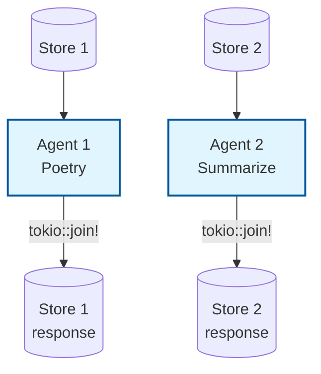

# Example: async_agent

*This documentation is automatically generated from the source code.*

# Example: async_agent.rs

**Purpose:**
Showcases running multiple agents concurrently (async/parallel) using PocketFlow and rig.


## Implementation Architecture



**How it works:**
- Defines two LLM nodes with different prompts.
- Wraps each in an `Agent`.
- Runs both agents concurrently using `tokio::join!`.
- Prints both prompts and both responses.

**How to adapt:**
- Use this pattern to parallelize LLM calls (e.g., for batch processing, multi-agent chat, or tool use).
- Add more agents or change the prompts/models as needed.

**Example:**
```rust
let fut1 = agent1.decide(input1);
let fut2 = agent2.decide(input2);
let (result1, result2) = tokio::join!(fut1, fut2);
```