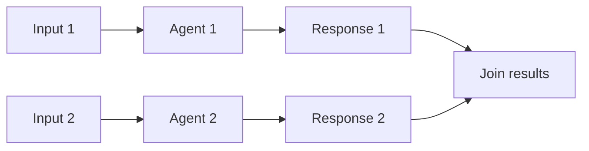

# Concurrent Agents

## What this example is for

Showcases running multiple agents concurrently (async/parallel) using AgentFlow and rig.

**Primary AgentFlow pattern:** `Agent + Tokio concurrency`  
**Why you would use it:** run multiple agents in parallel and join their results.

## How the example works

1. Defines two LLM nodes with different prompts.
2. Wraps each in an `Agent`.
3. Runs both agents concurrently using `tokio::join!`.
4. Prints both prompts and both responses.

## Execution diagram



## Key implementation details

- The example source is `examples/async_agent.rs`.
- It uses AgentFlow primitives to move data through a store, flow, or higher-level pattern wrapper.
- The implementation is meant to be adapted by swapping in your own prompts, tool handlers, retrieval logic, or business rules.
- When an LLM provider is used, the example relies on `rig` and environment-provided credentials.

## Build your own with this pattern

Use the same pattern in your own project like this:

```rust
let research = research_agent.decide(research_input);
let summary = summary_agent.decide(summary_input);
let (research_result, summary_result) = tokio::join!(research, summary);
```

### Customization ideas

- Use this pattern to parallelize LLM calls (e.g., for batch processing, multi-agent chat, or tool use).
- Add more agents or change the prompts/models as needed.

## How to run

```bash
cargo run --example async_agent
```

## Requirements and notes

Typically requires `OPENAI_API_KEY` because both concurrent agents call the LLM.
