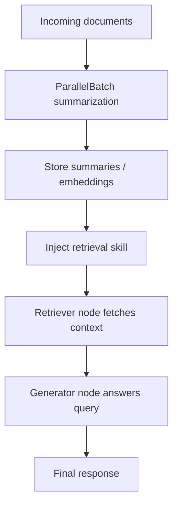

# Continuous RAG Pipeline

## What this example is for

This example demonstrates the `Continuous RAG Pipeline` pattern in AgentFlow.

**Primary AgentFlow pattern:** `ParallelBatch + Rag + SkillInjector`  
**Why you would use it:** combine ingestion, retrieval, and dynamic capability injection.

## How the example works

1. "AgentFlow is a framework for orchestrating LLM agents in Rust.",
2. "AgentFlow uses Tokio for asynchronous execution and `SharedStore` for state.",
3. "AgentFlow supports Human-in-the-Loop (HITL) workflows natively.",
4. "ParallelBatch allows data parallelism for processing lists concurrently.",
5. Data-Parallel Batching: Summarize Documents
6. .unwrap_or("")

## Execution diagram



## Key implementation details

- The example source is `examples/continuous_rag.rs`.
- It uses AgentFlow primitives to move data through a store, flow, or higher-level pattern wrapper.
- The implementation is meant to be adapted by swapping in your own prompts, tool handlers, retrieval logic, or business rules.
- When an LLM provider is used, the example relies on `rig` and environment-provided credentials.

## Build your own with this pattern

Use the same pattern in your own project like this:

```rust
let batch = ParallelBatch::new(vec![summarize_doc_node]);
let summaries = batch.run(document_inputs).await?;

let rag = Rag::new(retriever_node, generator_node);
let answer_store = rag.run(query_store).await?;
```

### Customization ideas

- Use this when you need to combine ingestion, retrieval, and dynamic capability injection.
- Replace the demo prompts, tools, or handlers with your application logic.
- Persist or forward the final result at your system boundary.

## How to run

```bash
cargo run --features="rag skills" --example continuous_rag
```

## Requirements and notes

Requires the `rag` feature and provider credentials; adapt the vector-store layer for production backends.
