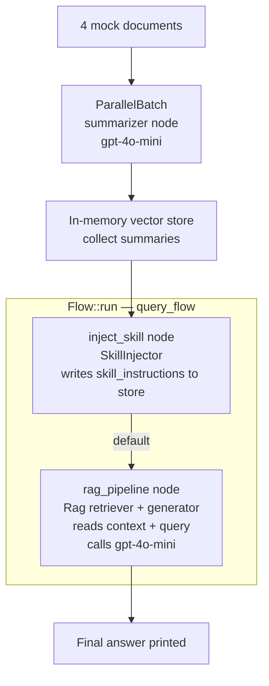

# Continuous RAG Pipeline

## What this example is for

This example demonstrates the `Continuous RAG Pipeline` pattern in AgentFlow.

**Primary AgentFlow pattern:** `ParallelBatch + Rag + SkillInjector`  
**Why you would use it:** Combine document ingestion with parallel summarization, skill-injected context, and a retrieval-augmented generation pipeline — all wired together inside a single `Flow`.

## How the example works

1. **Document ingestion** — four mock documents are prepared, each placed into its own `SharedStore`.
2. **Parallel summarization** — `ParallelBatch` runs an LLM summarizer node concurrently over all four documents, producing one summary per document.
3. **In-memory vector store** — summaries are collected into an in-memory `Vec` (simulating a vector database; no live Qdrant server required).
4. **Skill injection** — a `SkillInjector` node writes the `query_qdrant` skill's instructions into the store under the `"skill_instructions"` key so the downstream generator can use them as a prompt preamble.
5. **RAG query** — a `Rag` node pairs a retriever (reads all summaries as context) with a generator (calls gpt-4o-mini with the assembled context and query) to produce a final answer.
6. **Flow orchestration** — `SkillInjector` and `Rag` are wired as two nodes inside a `Flow`: `inject_skill` →(default)→ `rag_pipeline`.

## Execution diagram



**AgentFlow patterns used:** `ParallelBatch` · `SkillInjector` · `Rag` · `Flow`

## Key implementation details

- The example source is `examples/continuous_rag.rs`.
- `ParallelBatch::new(node)` takes a single node and is called via `batch.call(inputs).await` — no `.run()` method exists.
- `SkillInjector` writes `"skill_instructions"` into the store; it does **not** set an `"action"` key, so an explicit `add_edge("inject_skill", "default", "rag_pipeline")` is required to route into `Rag`.
- The vector store is fully in-memory — `qdrant-client` is compiled in via the `rag` feature but no live Qdrant server is contacted. The retriever node simply joins all summaries as plain text context.
- `Skill.version` is `Option<String>` and `SkillTool.description` is `Option<String>` in the actual structs.
- When an LLM provider is used, the example relies on `rig` and environment-provided credentials (`OPENAI_API_KEY`).

## Build your own with this pattern

```rust
use agentflow::core::batch::ParallelBatch;
use agentflow::core::flow::Flow;
use agentflow::core::node::{create_node, Node, SharedStore};
use agentflow::patterns::rag::Rag;
use agentflow::patterns::skill::SkillInjector;

// 1. Parallel summarization over a batch of input stores
let batch = ParallelBatch::new(summarize_node);
let results: Vec<SharedStore> = batch.call(input_stores).await;

// 2. Wire SkillInjector + Rag into a Flow
let mut query_flow = Flow::new();
query_flow.add_node("inject_skill", skill_injector);
query_flow.add_node("rag_pipeline", Rag::new(retriever_node, generator_node));
query_flow.add_edge("inject_skill", "default", "rag_pipeline");

let final_store = query_flow.run(query_store).await;
```

### Customization ideas

- Replace the in-memory `Vec` with a real Qdrant collection for production use.
- Swap the mock documents with a live ingestion stream (e.g. webhook, file watcher, message queue).
- Add more `Flow` nodes after `rag_pipeline` for post-processing, formatting, or storage.
- Use `SkillInjector::with_key("my_key")` to change the store key the instructions are written to.

## How to run

```bash
export OPENAI_API_KEY=sk-...
cargo run --example continuous-rag --features "rag skills"
```

## Requirements and notes

- Requires `OPENAI_API_KEY` for the LLM summarizer and generator nodes.
- Requires `--features "rag skills"` — `rag` enables the `Rag` pattern and `ParallelBatch`; `skills` enables `SkillInjector`.
- No live Qdrant server is required — the vector store layer is mocked with an in-memory `Vec<String>`.
