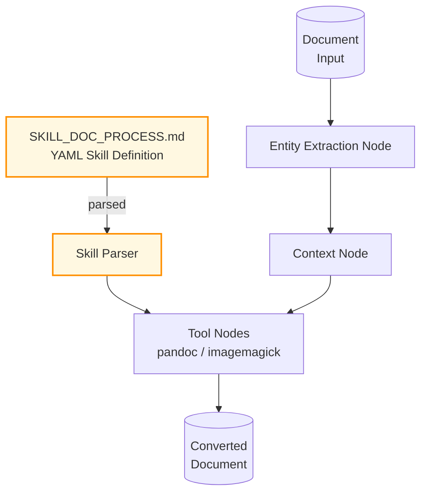

# Example: document_processing

*This documentation is generated from the source code.*

# Example: document_processing.rs

**Purpose:**
Implements a document processing pipeline using AgentFlow's `skills` feature. Demonstrates YAML-defined agents and tools processing documents through extraction, context identification, and format conversion.

**How it works:**
- Loads a `Skill` definition from `examples/SKILL_DOC_PROCESS.md` (YAML front matter).
- Parses the skill's tool definitions (e.g., `convert_text` via pandoc, `convert_image` via imagemagick).
- Builds an AgentFlow pipeline with skill-driven nodes.
- Processes a document through entity extraction, context identification, and format conversion stages.

**How to adapt:**
- Edit `examples/SKILL_DOC_PROCESS.md` to add tools or change conversions without recompiling.
- Swap the document input for any file path or URL.
- Add LLM stages before or after the tool stages for intelligent pre/post-processing.

**Requires:** `OPENAI_API_KEY`, `--features skills`
**Run with:** `cargo run --example document-processing --features skills`

---

## Implementation Architecture

