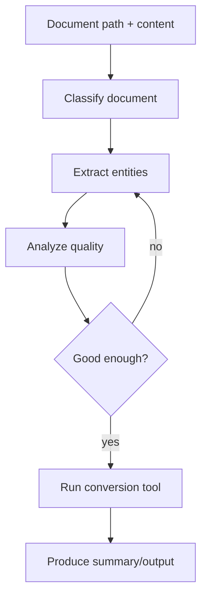

# Document Processing Pipeline

## What this example is for

This example demonstrates the `Document Processing Pipeline` pattern in AgentFlow.

**Primary AgentFlow pattern:** `Workflow + retries + tools`  
**Why you would use it:** chain classification, extraction, analysis, and tool execution.

## How the example works

1. Classifies the incoming document so the workflow can choose the right handling path.
2. Extracts entities or structured facts from the document content.
3. Analyzes extraction quality and semantic context.
4. Retries extraction when the quality signal is too low.
5. Invokes the configured conversion tool for the document type.
6. Produces a final summary and processed output.

## Execution diagram



## Key implementation details

- The example source is `examples/document_processing.rs`.
- It uses AgentFlow primitives to move data through a store, flow, or higher-level pattern wrapper.
- The implementation is meant to be adapted by swapping in your own prompts, tool handlers, retrieval logic, or business rules.
- When an LLM provider is used, the example relies on `rig` and environment-provided credentials.

## Build your own with this pattern

Use the same pattern in your own project like this:

```rust
let pipeline = Workflow::new()
    .then(classify_node)
    .then(extract_node)
    .then(analyze_node)
    .then(convert_node);

let output = pipeline.run(document_store).await?;
```

### Customization ideas

- Use this when you need to chain classification, extraction, analysis, and tool execution.
- Replace the demo prompts, tools, or handlers with your application logic.
- Persist or forward the final result at your system boundary.

## How to run

```bash
cargo run --features="skills" --example document_processing
```

## Requirements and notes

Requires `OPENAI_API_KEY`; optional external tools like `pandoc` or ImageMagick may be used if installed.
