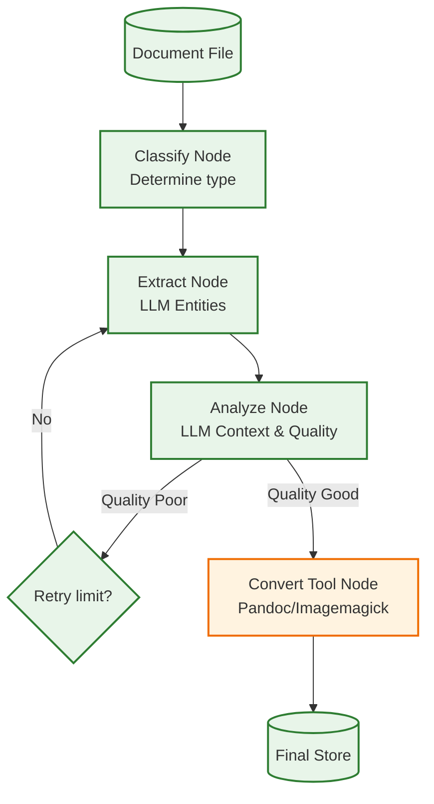

# Example: document_processing

*This documentation is automatically generated from the source code.*

# Example: document_processing.rs

Real-world document processing pipeline. The workflow:

1. **Classify** — detects document type (image vs text) from the file extension
2. **Extract** — LLM extracts named entities from the document content
3. **Analyze** — LLM assesses extraction quality and determines semantic context
4. **Retry** — re-runs extraction up to 3 times if the LLM deems quality poor
5. **Convert** — runs a real shell tool (`pandoc` for text, `convert` for images)
   loaded dynamically from `SKILL_DOC_PROCESS.md`
6. **End** — prints a summary

Domain: contract / business document processing.

Requires: OPENAI_API_KEY
Optional: pandoc, imagemagick (falls back to echo mock if not installed)
Run with: cargo run --example document-processing

## Implementation Architecture

