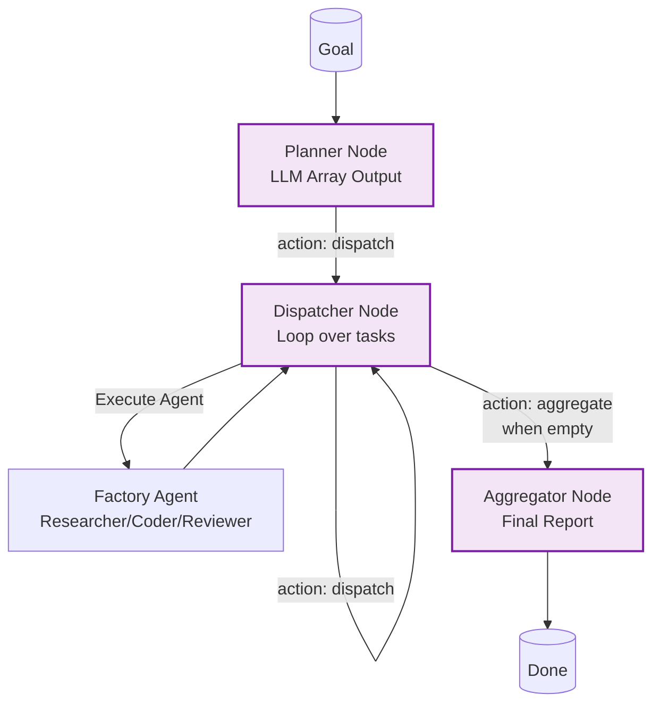

# Example: dynamic_orchestrator

*This documentation is automatically generated from the source code.*

# Example: dynamic_orchestrator.rs

A dynamic orchestrator that reads agent configuration from `examples/agents.toml`
at runtime. If the file does not exist it is created with defaults before proceeding.

How it works:
1. Boot       — load (or create) `examples/agents.toml`, build an AgentRegistry.
2. Planner    — LLM receives the goal + available agent names, returns a JSON array
   of { name, prompt } objects selecting which agents to run and in what order.
3. Dispatcher — pops one AgentSpec per cycle, looks it up in the registry, runs it,
   appends the result; loops until the plan is empty.
4. Aggregator — LLM synthesises every agent result into a final report.

Requires: OPENAI_API_KEY
Run with: cargo run --example dynamic-orchestrator

---

## Extended Architecture Documentation

# Dynamic Orchestrator

> **Keep this document in sync with `examples/dynamic_orchestrator.rs`.**
> Every time the example changes, update the relevant section(s) below.

---

## Overview

`dynamic-orchestrator` is an AgentFlow example that spins up modular LLM agents
at runtime based on a TOML configuration file. The orchestrator itself never
hard-codes which agents to run or in what order — the LLM planner decides that
at runtime from the registry of available agents.

**Run with:**
```bash
OPENAI_API_KEY=sk-... cargo run --example dynamic-orchestrator
```

---

## File Layout

```
examples/
├── dynamic_orchestrator.rs   ← orchestrator source
├── agents.toml               ← agent registry config (auto-created if absent)
├── DYNAMIC_ORCHESTRATOR.md   ← this document
```

---

## How It Works

### 1. Boot — Config Loading

```
examples/agents.toml exists?
  NO  → write DEFAULT_TOML to disk (3 agents: researcher, coder, reviewer) → print notice
  YES → load it silently
↓
toml::from_str → AgentsFile { agent: Vec<AgentConfig> }
↓
build_registry() → HashMap<String, (AgentFactory, output_key)>
```

Each `AgentConfig` becomes a **factory closure** — a `Fn(prompt, store) -> Future`
captured with its own `provider`, `model`, `preamble`, and `output_key`. The registry
maps agent name → (factory, output_key). Nothing runs yet.

---

### 2. Flow Wiring

Three nodes connected by the `"action"` key in the `SharedStore`:

```
┌─────────┐  action="dispatch"  ┌────────────┐  action="dispatch"  ┌────────────┐
│ planner │ ──────────────────► │ dispatcher │ ◄─────────────────── │ dispatcher │
└─────────┘                     └────────────┘     (self-loop)       └────────────┘
                                       │ action="aggregate"
                                       ▼
                                 ┌────────────┐
                                 │ aggregator │
                                 └────────────┘
                                       │ (no action set → Flow stops)
```

`Flow` checks `store["action"]` after every node to determine the next node.
When no matching edge exists the flow stops naturally.

---

### 3. Planner Node

- Reads `store["goal"]`
- Builds a system prompt listing **only the agent names present in the registry**
  (the LLM cannot invent names outside this list)
- Calls the LLM → expects a raw JSON array back:
  ```json
  [
    {"name": "researcher", "prompt": "Research async HTTP in Rust"},
    {"name": "coder",      "prompt": "Write a fetch_url() function"},
    {"name": "reviewer",   "prompt": "Review the code for correctness"}
  ]
  ```
- Writes to store:
  | Key | Value |
  |---|---|
  | `"agent_plan"` | Parsed JSON array of `{name, prompt}` objects |
  | `"agent_results"` | Empty array (accumulator for agent outputs) |
  | `"action"` | `"dispatch"` → routes Flow to the dispatcher |

---

### 4. Dispatcher Node — Self-Loop

Each cycle:

1. **Reads** `store["agent_plan"]`, pops `arr[0]`, keeps `arr[1..]` as `remaining`
2. **If plan is empty** → sets `action="aggregate"` → exits the loop
3. **Looks up** `spec["name"]` in the registry
4. **Calls** `factory(prompt, store)` → the agent runs its LLM call and writes
   its result into `store[output_key]`
5. **Appends** a formatted entry to `store["agent_results"]`:
   ```
   ### researcher (research_result)
   <LLM output text>
   ```
6. **Writes** `store["agent_plan"]` = `remaining`, sets `action="dispatch"` → loops back

> Each agent receives the **full SharedStore**, so later agents can read earlier
> agents' outputs — e.g. `coder` can read `research_result`, `reviewer` can read
> `code_result`.

Unknown agent names (not in registry) are **skipped with a warning** — the loop
continues with the next spec. This prevents LLM hallucinations from causing panics.

---

### 5. Aggregator Node

- Reads `store["goal"]` and joins all entries in `store["agent_results"]`
- Calls the LLM with both → produces a structured, section-headed final report
- Writes result to `store["final_report"]`
- Sets **no `"action"` key** → `Flow` finds no matching edge → stops

---

## What Makes It "Dynamic"

| Static orchestrator | This orchestrator |
|---|---|
| Agent list hard-coded in source | Agent list in `agents.toml` — edit without recompile |
| Fixed execution order in code | LLM decides which agents to run and in what order at runtime |
| Fixed prompts per agent | LLM generates a tailored prompt per agent per goal |
| Adding an agent requires a code change | Add a new `[[agent]]` block in `agents.toml` |

---

## Agent Configuration (`examples/agents.toml`)

The TOML file is **auto-created** with defaults on first run if it does not exist.

### Schema

```toml
# Each [[agent]] block registers one modular agent.

[[agent]]
name        = "researcher"         # unique identifier used by the planner
provider    = "openai"             # "openai" | "gemini"
model       = "gpt-4o-mini"        # any model supported by the provider
preamble    = "You are a ..."      # system prompt injected at agent spin-up
output_key  = "research_result"    # SharedStore key where the result is written
```

### Default agents

| name | provider | model | output_key |
|---|---|---|---|
| `researcher` | openai | gpt-4o-mini | `research_result` |
| `coder` | openai | gpt-4o-mini | `code_result` |
| `reviewer` | openai | gpt-4o-mini | `review_result` |

### Customising without recompiling

- **Swap model:** change `model = "gpt-4o"` in any block
- **Swap provider:** change `provider = "gemini"` and set `GEMINI_API_KEY`
- **Add an agent:** append a new `[[agent]]` block — the planner will see it on next run
- **Remove an agent:** delete the block — the planner's name list shrinks automatically

---

## SharedStore Key Reference

| Key | Written by | Type | Description |
|---|---|---|---|
| `"goal"` | `main` | `String` | Top-level task passed to the planner |
| `"agent_plan"` | Planner / Dispatcher | `Array<{name,prompt}>` | Remaining agent specs to execute |
| `"agent_results"` | Dispatcher | `Array<String>` | Accumulated formatted agent outputs |
| `"final_report"` | Aggregator | `String` | Synthesised final report |
| `"action"` | Every node | `String` | Flow routing key (`dispatch` / `aggregate`) |
| `<output_key>` | Each agent factory | `String` | Raw LLM output for that agent |

---

## Dependencies

| Crate | Where declared | Purpose |
|---|---|---|
| `toml = "1.0"` | `[dev-dependencies]` | Parse `agents.toml` |
| `serde` (derive) | `[dependencies]` | Deserialise `AgentConfig` / `AgentsFile` |
| `rig-core` | `[dev-dependencies]` | LLM provider clients (openai, gemini) |
| `agentflow` | crate itself | `Flow`, `create_node`, `SharedStore` |

---

## Rollback

```bash
# Remove all artefacts introduced by this example
rm examples/dynamic_orchestrator.rs
rm examples/agents.toml
rm examples/DYNAMIC_ORCHESTRATOR.md
# Revert Cargo.toml: remove toml = "1.0" from [dev-dependencies]
#                    remove [[example]] name = "dynamic-orchestrator"
git checkout Cargo.toml
```


# Dynamic Orchestrator: Main Flow Points

The `dynamic_orchestrator`'s execution is defined by four main points within its `Flow`. Here is a step-by-step breakdown of each one and its purpose:

### 1. The Planner Node (The "Brain")
This is the starting point of the automated logic.

*   **Input**: It reads the high-level `"goal"` from the `SharedStore` (e.g., "write a Rust function that fetches a URL and handles errors").
*   **Action**: It calls an LLM with a carefully constructed prompt that includes the list of all available agents loaded from `agents.toml`. It instructs the LLM to act as a planner and create a step-by-step plan.
*   **Output**:
    1.  It produces a JSON array of agent tasks, like `[{"name": "researcher", "prompt": "..."}, {"name": "coder", "prompt": "..."}]`.
    2.  This plan is written to the `SharedStore` under the key `"agent_plan"`.
    3.  It sets **`"action" = "dispatch"`** in the store, which tells the `Flow` engine to proceed to the next node.

**Purpose**: To translate a high-level human goal into a concrete, machine-executable plan.

---

### 2. The Dispatcher Node (The "Engine")
This node is a loop that executes the plan created by the Planner.

*   **Input**: It reads the `"agent_plan"` from the `SharedStore`.
*   **Action (Loop Cycle)**:
    1.  It **pops the first task** off the `agent_plan` list.
    2.  If the plan is now empty, it changes the flow's direction by setting **`"action" = "aggregate"`** and the loop ends.
    3.  If tasks remain, it uses the task's `"name"` to look up the corresponding agent "factory" in the registry.
    4.  It **executes that specific agent** with the given `"prompt"`. The agent runs and writes its result to its unique output key (e.g., `"code_result"`).
    5.  It saves the remaining tasks back to `"agent_plan"` and sets **`"action" = "dispatch"`**, which makes the `Flow` route back to this same Dispatcher node for the next cycle.
*   **Output**: It progressively executes the plan, collecting each agent's output in an `"agent_results"` list in the `SharedStore`.

**Purpose**: To execute the plan step-by-step, invoking the correct agent for each task and managing the state of the plan.

---

### 3. The Aggregator Node (The "Synthesizer")
This is the final active step, triggered after the Dispatcher finishes the plan.

*   **Input**: It reads the original `"goal"` and the complete list of `"agent_results"`.
*   **Action**: It calls an LLM one last time, providing all the intermediate results and asking it to synthesize them into a single, final, well-structured report.
*   **Output**: It writes this comprehensive final answer to the `SharedStore` under the key `"final_report"`.

**Purpose**: To combine the work of all the specialized agents into a single, coherent, user-facing response.

---

### 4. Flow Termination (The "Stop Signal")
This isn't a node, but a crucial mechanism.

*   **How it works**: After the Aggregator node runs, it **does not set an `"action"` key** in the `SharedStore`.
*   **Result**: The `Flow` engine finishes the node, checks the store for the next action, and finds nothing. With no action to take, the flow concludes successfully.

**Purpose**: To provide a clean and definitive end to the execution loop.


## Implementation Architecture



