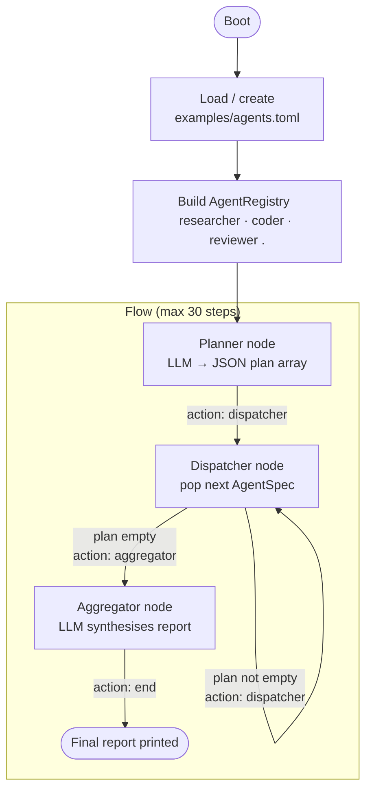

# Dynamic Orchestrator Tutorial

## What this example is for

This example demonstrates the **Dynamic Orchestrator** pattern in AgentFlow. 

**Primary AgentFlow pattern:** `Dynamic Execution Graph`  
**Why you would use it:** When your application requires the LLM to decide which agents to run and in what order at runtime, rather than hardcoding a static `Flow` graph beforehand. This is incredibly powerful for general-purpose autonomous assistants that need to pull from a varying toolbox of modular agents.

## How it works

The example uses four main components:
1. **Boot loader**: It reads a `toml` configuration file to discover what agents are available (e.g., `researcher`, `coder`, `reviewer`). It builds an `AgentRegistry` dynamically.
2. **Planner Node**: It takes a user's goal, gives the list of available agents to an LLM, and asks the LLM to output a JSON array (a plan) indicating which agents to call and with what prompts.
3. **Dispatcher Node**: A loop that pops the next agent off the plan, looks it up in the `AgentRegistry`, executes it, and saves the output.
4. **Aggregator Node**: A final LLM step that synthesises all the individual agent outputs into a cohesive final report.

### Step-by-Step Code Walkthrough

First, we build a **Registry** of agent factories. Instead of instantiating nodes directly in the flow, we store a closure that can create and run them on demand.

```rust
fn build_registry(configs: Vec<AgentConfig>) -> HashMap<String, (AgentFactory, String)> {
    let mut registry = HashMap::new();
    
    for cfg in configs {
        // ... store config values ...
        let factory: AgentFactory = Arc::new(move |prompt: String, store: SharedStore| {
            // This closure actually hits the LLM when called by the dispatcher
            Box::pin(async move {
                let result = llm_call(&provider, &model, &preamble, &prompt).await;
                store.write().await.insert(output_key.clone(), Value::String(result));
                store
            })
        });
        registry.insert(name, (factory, cfg.output_key.clone()));
    }
    registry
}
```

Next, the **Planner** node asks an LLM to generate the execution plan as a JSON array. It saves this plan into the store under the `"plan"` key.

```rust
let planner = create_node(move |store: SharedStore| {
    Box::pin(async move {
        // Ask the LLM to pick from the available agents based on the goal
        let raw_plan = llm_call("openai", "gpt-4-mini", &planner_system_prompt, &goal).await;
        
        // Parse the JSON array of { "name": "...", "prompt": "..." }
        let plan: Vec<Value> = serde_json::from_str(&raw_plan).unwrap();
        store.write().await.insert("plan".to_string(), Value::Array(plan));
        store
    })
});
```

Finally, the **Dispatcher** node loops over the plan. It pops the first item, looks up the agent in the registry, and executes its factory closure.

```rust
let dispatcher = create_node(move |store: SharedStore| {
    Box::pin(async move {
        let mut plan = store.write().await.get("plan").unwrap().clone();
        
        if plan.is_empty() {
            // If the plan is empty, move to the aggregator
            store.write().await.insert("action".to_string(), Value::String("aggregator".to_string()));
            return store;
        }

        // Pop the next task and execute the registered agent
        let next_task = plan.remove(0);
        let agent_name = next_task["name"].as_str().unwrap();
        let agent_prompt = next_task["prompt"].as_str().unwrap();

        if let Some((factory, _)) = registry.get(agent_name) {
            // Execute the agent factory
            factory(agent_prompt.to_string(), store.clone()).await;
        }

        // Keep looping dispatcher -> dispatcher
        store.write().await.insert("plan".to_string(), Value::Array(plan));
        store.write().await.insert("action".to_string(), Value::String("dispatcher".to_string()));
        store
    })
});
```

The flow is wired to loop on the dispatcher until the plan is empty, at which point it routes to the aggregator.

```rust
flow.add_edge("planner", "default", "dispatcher");
flow.add_edge("dispatcher", "dispatcher", "dispatcher"); // Loop
flow.add_edge("dispatcher", "aggregator", "aggregator"); // Exit loop
```

## Execution diagram



**AgentFlow patterns used:** `Flow` · `create_node` · Dynamic agent registry · Planner-Dispatcher-Aggregator loop

## How to run

Ensure you have your `OPENAI_API_KEY` set in your environment or `.env` file, then run:

```bash
cargo run --example dynamic_orchestrator
```
