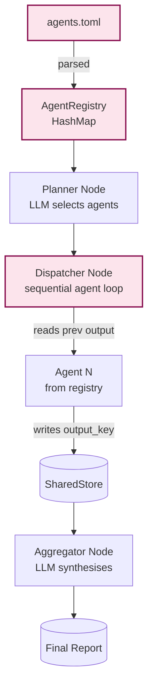

# Example: dynamic_orchestrator

*This documentation is generated from the source code.*

# Example: dynamic_orchestrator.rs

**Purpose:**
Demonstrates a fully dynamic, TOML-configured orchestrator that reads its agent registry from `examples/agents.toml` at runtime, so agents can be reconfigured (model, provider, preamble, output key) without recompiling.

**How it works:**
1. **Boot** — Checks for `examples/agents.toml`. If missing, writes sensible defaults and prints a notice.
2. **Parse** — Reads TOML into `Vec<AgentConfig>` and builds an `AgentRegistry` (`HashMap<name, AgentFactory>`).
3. **Planner node** — LLM receives the list of available agent names and selects a subset + execution order.
4. **Dispatcher node** — Pops each `AgentSpec` from the plan, looks up the registry, instantiates the agent, and runs it sequentially so each agent can read the previous agent's output key.
5. **Aggregator node** — LLM synthesises all `output_key` values from the store into a final report.

**How to adapt:**
- Edit `examples/agents.toml` to add, remove, or change agents without touching Rust source.
- Add a `gemini` provider variant to `AgentConfig` and the factory to route to a Gemini client.
- Replace the sequential dispatcher with `ParallelFlow` for independent agents.

**Requires:** `OPENAI_API_KEY`
**Run with:** `cargo run --example dynamic-orchestrator`

---

## TOML Schema (`examples/agents.toml`)

```toml
[[agent]]
name        = "researcher"
provider    = "openai"
model       = "gpt-4o-mini"
preamble    = "You are a concise research assistant."
output_key  = "research_result"

[[agent]]
name        = "coder"
provider    = "openai"
model       = "gpt-4o-mini"
preamble    = "You are a senior Rust developer."
output_key  = "code_result"

[[agent]]
name        = "reviewer"
provider    = "openai"
model       = "gpt-4o-mini"
preamble    = "You are a thorough code reviewer."
output_key  = "review_result"
```

---

## Implementation Architecture


