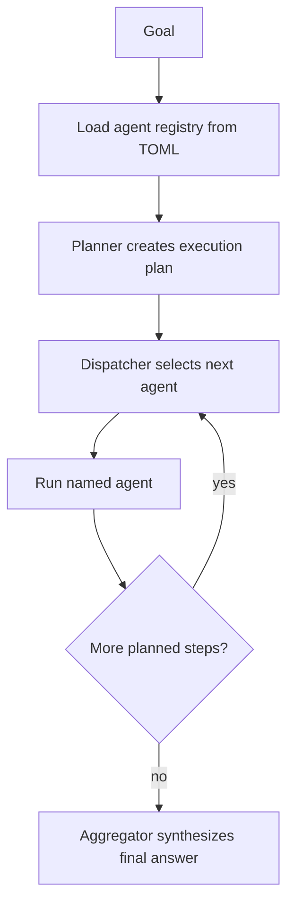

# Dynamic Orchestrator

## What this example is for

This example demonstrates the `Dynamic Orchestrator` pattern in AgentFlow.

**Primary AgentFlow pattern:** `Dynamic orchestrator`  
**Why you would use it:** build an execution plan from runtime agent metadata.

## How the example works

1. A dynamic orchestrator that reads agent configuration from `examples/agents.toml`
2. at runtime. If the file does not exist it is created with defaults before proceeding.
3. Boot       — load (or create) `examples/agents.toml`, build an AgentRegistry.
4. Planner    — LLM receives the goal + available agent names, returns a JSON array
5. of { name, prompt } objects selecting which agents to run and in what order.
6. Dispatcher — pops one AgentSpec per cycle, looks it up in the registry, runs it,

## Execution diagram



## Key implementation details

- The example source is `examples/dynamic_orchestrator.rs`.
- It uses AgentFlow primitives to move data through a store, flow, or higher-level pattern wrapper.
- The implementation is meant to be adapted by swapping in your own prompts, tool handlers, retrieval logic, or business rules.
- When an LLM provider is used, the example relies on `rig` and environment-provided credentials.

## Build your own with this pattern

Use the same pattern in your own project like this:

```rust
let registry = AgentRegistry::default()
    .register("researcher", researcher_agent)
    .register("writer", writer_agent);

let result = orchestrator.run(goal_store).await?;
```

### Customization ideas

- Use this when you need to build an execution plan from runtime agent metadata.
- Replace the demo prompts, tools, or handlers with your application logic.
- Persist or forward the final result at your system boundary.

## How to run

```bash
cargo run --example dynamic_orchestrator
```

## Requirements and notes

Requires `OPENAI_API_KEY` and reads runtime agent configuration from `examples/agents.toml`.
