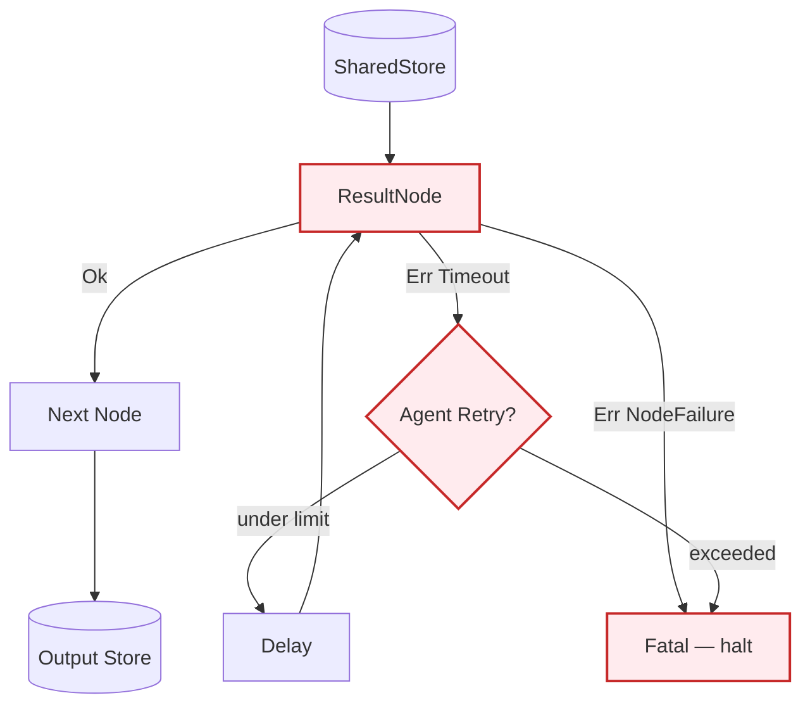

# Example: error_handling

*This documentation is generated from the source code.*

# Example: error_handling.rs

**Purpose:**
Demonstrates type-safe error handling in AgentFlow using `ResultNode`, `AgentFlowError`, and `Flow::run_safe`.

**How it works:**
- Creates nodes that return `Result<SharedStore, AgentFlowError>` using `create_result_node`.
- Distinguishes between transient errors (`Timeout`) and fatal errors (`NodeFailure`).
- Uses `Flow::run_safe` to halt execution and surface errors instead of silently continuing.
- Shows how `Agent::decide_result` propagates typed errors to the caller.

**How to adapt:**
- Replace any `unwrap()` or panic-prone node with `create_result_node` for production code.
- Match on `AgentFlowError` variants to apply different recovery strategies.
- Use `AgentFlowError::Custom(msg)` to wrap third-party errors.

**Requires:** No API key needed (demonstrates error paths with mock nodes).
**Run with:** `cargo run --example error-handling`

---

## Implementation Architecture



**AgentFlowError variants:**
```rust
pub enum AgentFlowError {
    NotFound(String),          // registry / store key missing
    NodeFailure(String),       // node returned a fatal error
    Timeout(String),           // operation timed out (retryable)
    IoError(String),           // I/O failure
    SerdeError(String),        // serialisation / deserialisation failure
    TypeMismatch(String),      // wrong value type in store
    Custom(String),            // catch-all
}
```
