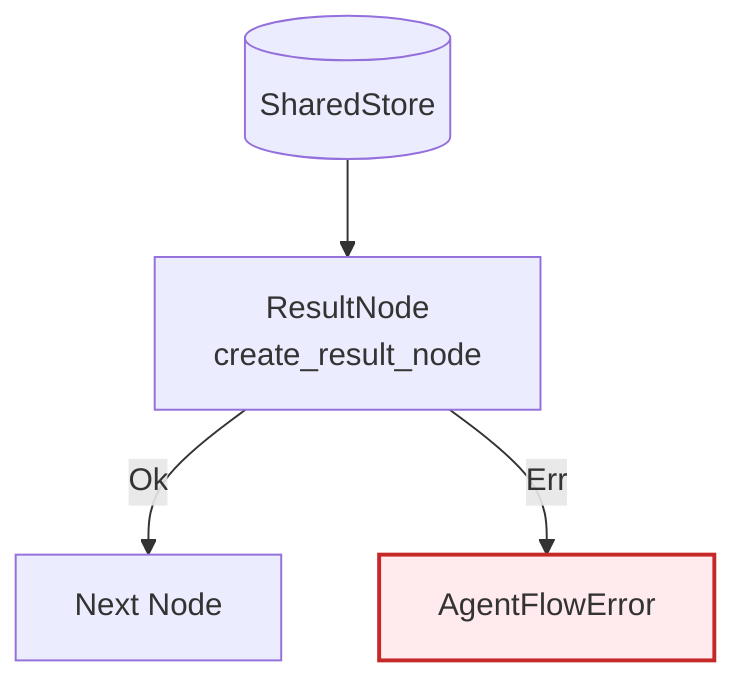

# Example: error_handling

*This documentation is automatically generated from the source code.*

No documentation provided in the source file `error_handling.rs`.

## Implementation Architecture

```mermaid
graph TD
    Input[(SharedStore)] --> Node[ResultNode<br>create_result_node]
    Node -->|Ok| Next[Next Node]
    Node -->|Err| Error[AgentFlowError]
    
    classDef error fill:#ffebee,stroke:#c62828,stroke-width:2px;
    class Error error;
```

