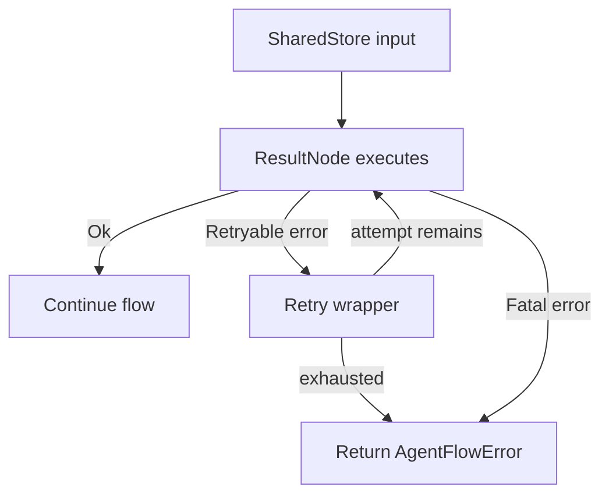

# Error Handling and Safe Execution

## What this example is for

This example demonstrates the `Error Handling and Safe Execution` pattern in AgentFlow.

**Primary AgentFlow pattern:** `ResultNode + Flow::run_safe`  
**Why you would use it:** surface and classify failures explicitly.

## How the example works

1. ! Demonstrates `ResultNode` / `create_result_node` for type-safe error propagation,
2. ! Run with:
3. !   cargo run --example error-handling
4. Flow,
5. Initialise tracing so debug/warn lines from AgentFlow are visible.
6. Agent<N> only needs N for decide_shared; decide_result takes an independent node ref.

## Execution diagram



## Key implementation details

- The example source is `examples/error_handling.rs`.
- It uses AgentFlow primitives to move data through a store, flow, or higher-level pattern wrapper.
- The implementation is meant to be adapted by swapping in your own prompts, tool handlers, retrieval logic, or business rules.
- When an LLM provider is used, the example relies on `rig` and environment-provided credentials.

## Build your own with this pattern

Use the same pattern in your own project like this:

```rust
let safe_node = create_result_node(|store| Box::pin(async move {
    if store.read().await.get("payload").is_none() {
        return Err(AgentFlowError::NotFound("payload".into()));
    }
    Ok(store)
}));

let result = Flow::new().node("validate", safe_node).run_safe(store).await;
```

### Customization ideas

- Use this when you need to surface and classify failures explicitly.
- Replace the demo prompts, tools, or handlers with your application logic.
- Persist or forward the final result at your system boundary.

## How to run

```bash
cargo run --example error_handling
```

## Requirements and notes

No API key is required when using the mock/error-focused paths in the example.
