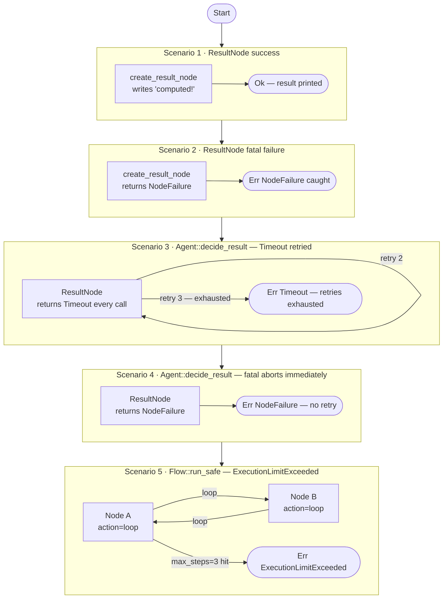

# Error Handling Tutorial

## What this example is for

This example demonstrates how AgentFlow handles **Errors** gracefully within its state machine using the `NodeResult` trait and `create_result_node`.

**Primary AgentFlow pattern:** `Fallible Execution`  
**Why you would use it:** To ensure the entire flow does not crash when an individual node encounters a recoverable network timeout, API error, or validation failure. It allows you to catch errors at the orchestrator level, log them, or branch the logic based on failure.

## How it works

Instead of a standard `Node` that must return a `SharedStore`, you create a fallible node using `create_result_node` which returns a `Result<SharedStore, AgentFlowError>`.

If the node returns an `Err`, the execution of the entire `Flow` stops, and `.run_safe()` propagates that error up to the caller.

### Step-by-Step Code Walkthrough

First, we create a node that simulates a deliberate network failure using `create_result_node`. Notice the return type is `Result<SharedStore, AgentFlowError>`.

```rust
let error_node = create_result_node(|store: SharedStore| {
    Box::pin(async move {
        // Log the failure
        println!("  -> Node starting, simulating an error...");

        // Return a generic custom error
        Err(AgentFlowError::Custom("Simulated API failure".to_string()))
    })
});
```

Next, we add it to the flow as a start node.

```rust
flow.add_result_node("failing_step", error_node);
flow.set_start("failing_step");
```

Finally, we run the flow using `.run_safe()`. This method is designed specifically for fallible flows. Instead of unwrapping the final store immediately, it yields a `Result`. We pattern match against `AgentFlowError` to gracefully handle the failure without crashing the host application.

```rust
// Run the flow and capture any error that bubbles up
let result = flow.run_safe(store).await;

match result {
    Ok(_) => println!("Flow succeeded (unexpected!)."),
    Err(e) => {
        // Catch the error
        println!("Caught error from flow: {}", e);
        
        // Assert it was the custom error we simulated
        if let AgentFlowError::Custom(msg) = e {
            println!("Confirmed custom error: {}", msg);
        }
    }
}
```

## Execution diagram



**AgentFlow patterns used:** `create_result_node` · `Agent::decide_result` · `Flow::run_safe` · `AgentFlowError` variants

## How to run

Run the example using cargo. It doesn't require an LLM API key since it just demonstrates the error handling mechanics:

```bash
cargo run --example error_handling
```