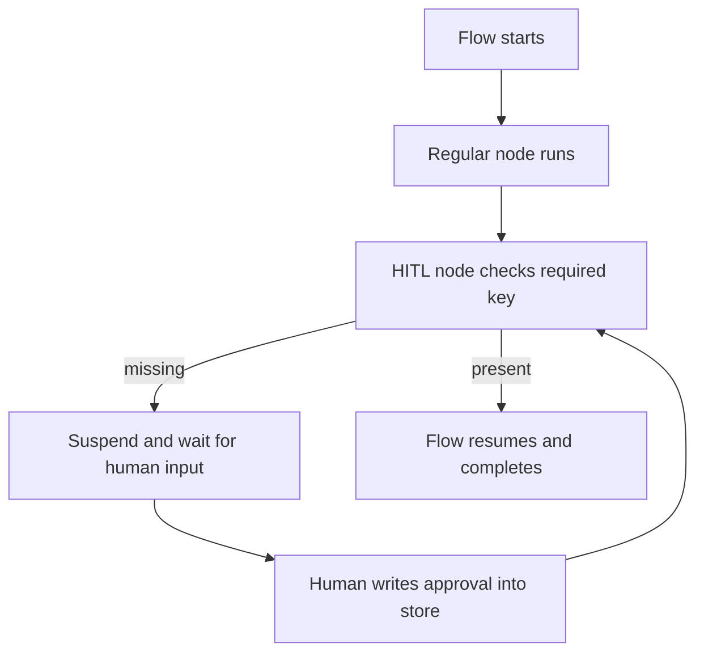

# Human in the Loop

## What this example is for

Demonstrates the native Human-in-the-Loop (HITL) pattern, which suspends execution until specific input is provided.

**Primary AgentFlow pattern:** `HITL node`  
**Why you would use it:** pause until a human provides required state.

## How the example works

1. Creates a flow with a standard node and a HITL node.
2. The HITL node is configured to check for the `human_approval` key.
3. The first run suspends because the key is missing.
4. After simulating human input by inserting the key into the store, the second run succeeds.

## Execution diagram



## Key implementation details

- The example source is `examples/hitl.rs`.
- It uses AgentFlow primitives to move data through a store, flow, or higher-level pattern wrapper.
- The implementation is meant to be adapted by swapping in your own prompts, tool handlers, retrieval logic, or business rules.
- When an LLM provider is used, the example relies on `rig` and environment-provided credentials.

## Build your own with this pattern

Use the same pattern in your own project like this:

```rust
let approval_gate = create_hitl_node("manager_approval");
let output = flow.run(store).await?;
// later: insert manager_approval and rerun/resume
```

### Customization ideas

- Use `create_hitl_node` in your flows to pause for external input (e.g., API webhook, user CLI input).
- Catch `AgentFlowError::Suspended` to handle the pause gracefully.

## How to run

```bash
cargo run --example hitl
```

## Requirements and notes

No special credentials are needed unless you swap in LLM-backed nodes.
