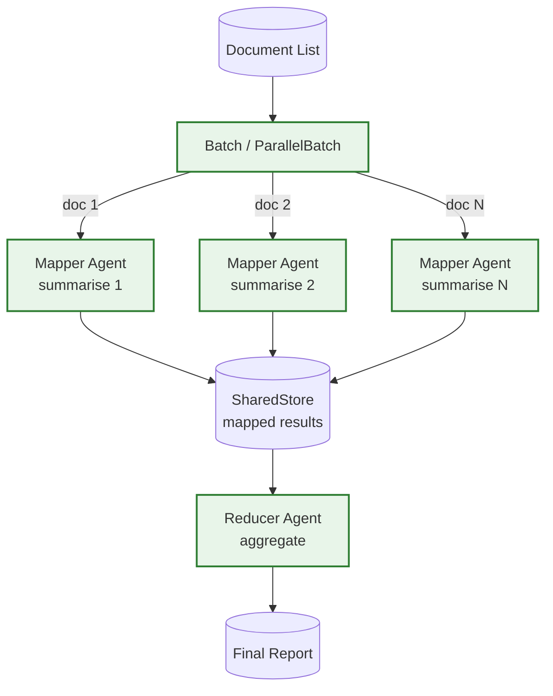

# Example: mapreduce

*This documentation is generated from the source code.*

# Example: mapreduce.rs

**Purpose:**
Demonstrates a MapReduce pipeline where a mapper agent summarises each document independently and a reducer agent aggregates all summaries into a final report.

**How it works:**
- Loads a list of documents into the store.
- Mapper agent runs once per document via `Batch` (sequential) or `ParallelBatch` (concurrent).
- Each mapped result is stored with a unique key.
- Reducer agent reads all mapped outputs and produces a single aggregated output.

**How to adapt:**
- Swap `Batch` for `ParallelBatch` when documents are independent and throughput matters.
- Replace the reducer with a simple string concatenation node for cheaper aggregation.
- Use with `ParallelFlow` branches if each document requires a different pipeline.

**Requires:** `OPENAI_API_KEY`
**Run with:** `cargo run --example mapreduce`

---

## Implementation Architecture

