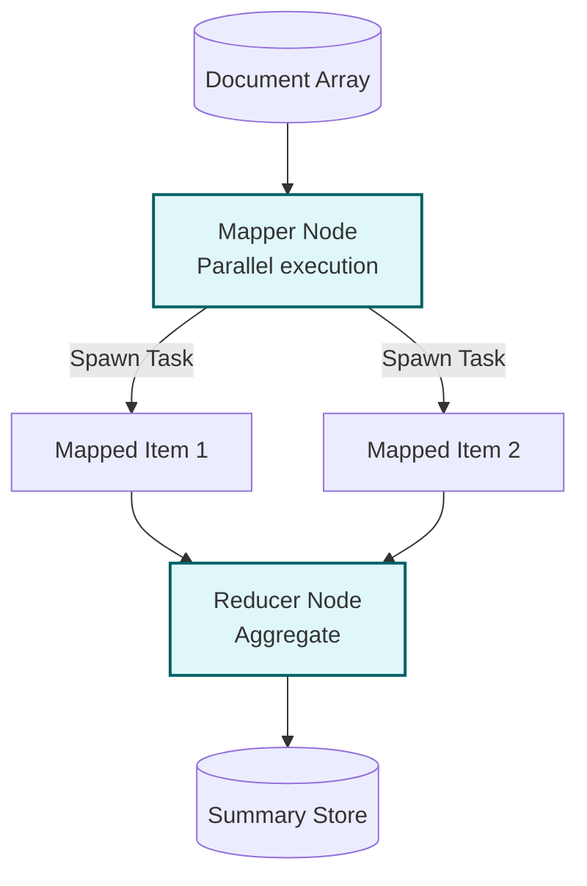

# Example: mapreduce

*This documentation is automatically generated from the source code.*

# Example: mapreduce.rs

**Purpose:**
Shows how to use the MapReduce pattern to process a batch of documents, summarize each with an LLM, and aggregate the results.


## Implementation Architecture



**How it works:**
- The mapper agent summarizes each document using an LLM.
- The reducer agent concatenates all summaries into a single string.
- The MapReduce pattern handles the orchestration.

**How to adapt:**
- Use this for any batch processing scenario: batch LLM calls, aggregation, analytics.
- Change the mapper/reducer logic to fit your data and goals.

**Example:**
```rust
let map_reduce = MapReduce::new(batch_mapper, reducer);
let result = map_reduce.run(inputs).await;
```