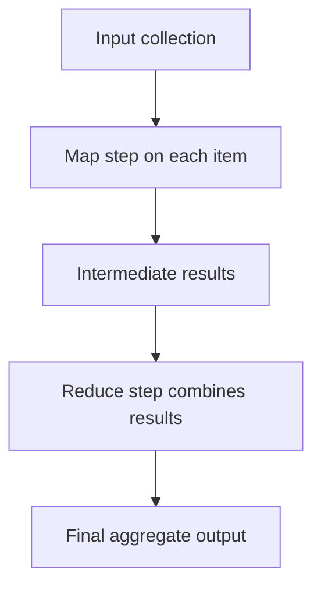

# MapReduce Pattern

## What this example is for

Shows how to use the MapReduce pattern to process a batch of documents, summarize each with an LLM, and aggregate the results.

**Primary AgentFlow pattern:** `MapReduce`  
**Why you would use it:** fan out work, then aggregate the results.

## How the example works

1. The mapper agent summarizes each document using an LLM.
2. The reducer agent concatenates all summaries into a single string.
3. The MapReduce pattern handles the orchestration.

## Execution diagram



## Key implementation details

- The example source is `examples/mapreduce.rs`.
- It uses AgentFlow primitives to move data through a store, flow, or higher-level pattern wrapper.
- The implementation is meant to be adapted by swapping in your own prompts, tool handlers, retrieval logic, or business rules.
- When an LLM provider is used, the example relies on `rig` and environment-provided credentials.

## Build your own with this pattern

Use the same pattern in your own project like this:

```rust
let report_job = MapReduce::new(map_node, reduce_node);
let result = report_job.run(input_store).await?;
```

### Customization ideas

- Use this for any batch processing scenario: batch LLM calls, aggregation, analytics.
- Change the mapper/reducer logic to fit your data and goals.

## How to run

```bash
cargo run --example mapreduce
```

## Requirements and notes

Requirements depend on what your map/reduce nodes do; the pattern itself is provider-agnostic.
