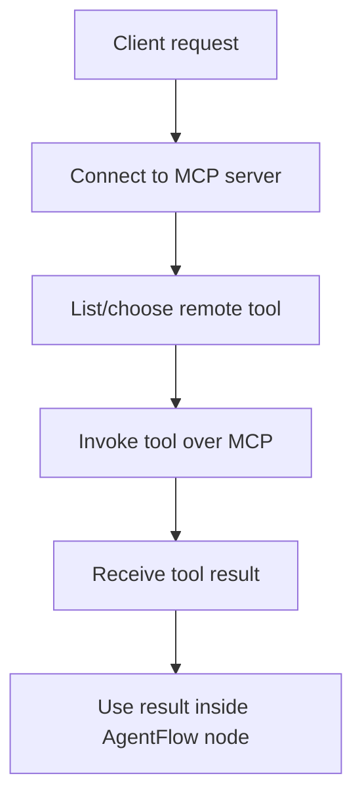

# MCP Client

## What this example is for

This example demonstrates the `MCP Client` pattern in AgentFlow.

**Primary AgentFlow pattern:** `MCP client integration`  
**Why you would use it:** consume tools exposed by an MCP server.

## How the example works

1. Creates or connects to an MCP client transport and negotiates server metadata.
2. Discovers the tools exposed by the remote MCP server.
3. Chooses a tool and sends a structured request over the MCP protocol.
4. Receives the remote tool result and makes it available to the local AgentFlow logic.

## Execution diagram



## Key implementation details

- The example source is `examples/mcp_client.rs`.
- It shows how AgentFlow can interoperate with the Model Context Protocol boundary instead of only local tools.
- In production, you would add authentication, stronger input validation, and explicit policy checks around exposed capabilities.

## Build your own with this pattern

```rust
let mut client = McpClient::connect_stdio("my-mcp-server").await?;
let tools = client.list_tools().await?;
let result = client.call_tool(&tools[0].name, serde_json::json!({"query": "status"})).await?;
```

### Customization ideas

- Replace the demo transport or tool handlers with the MCP server/client your application actually uses.
- Add application-specific schemas so tool inputs and outputs are validated before execution.
- Log and audit tool invocations if the MCP boundary reaches sensitive systems.

## How to run

```bash
cargo run --features="mcp" --example mcp_client
```

## Requirements and notes

Requires the `mcp` feature and a reachable MCP server to connect to.
