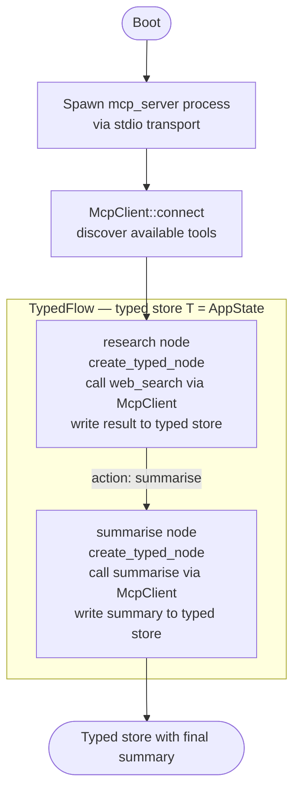
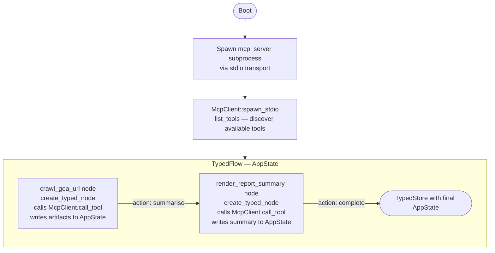

# MCP Client Tutorial

## What this example is for

This example demonstrates how to create a Model Context Protocol (MCP) client in AgentFlow. Specifically, it spawns an MCP Server process (`mcp_server`), connects to it via stdio, discovers its available tools, and orchestrates an LLM workflow using a typed state machine (`TypedFlow`).

**Primary AgentFlow pattern:** `MCP Client + TypedFlow Orchestrator`  
**Why you would use it:** To give your LLM agents the ability to dynamically discover and execute external tools provided by any MCP-compliant server (e.g. Claude Desktop tools, remote databases, specialized scripts), while managing the overall state securely via `TypedFlow`.

## How it works

The core of this example is the integration between an MCP Client and a strongly typed AgentFlow state machine (`TypedFlow<AppState>`).
1. **Spawn MCP Server**: The client spawns `mcp_server` as a subprocess and connects its standard I/O channels.
2. **Discover Tools**: The client queries the server for its list of available tools.
3. **Execute Flow**: An LLM agent reads its owned lock-free state, calls the MCP tools using `client.call_tool()`, parses the JSON output, updates the `AppState` directly, and returns it alongside an `Action` Enum variant.

### Step-by-Step Code Walkthrough

First, we spawn the MCP server as a subprocess and connect to it over stdio.

```rust
let client = McpClient::spawn_stdio(
    tokio::process::Command::new("path/to/mcp_server"),
    McpClientOptions {
        client_name: "agentflow-mcp-client".into(),
        client_version: "1.0".into(),
    },
).await?;

// List the tools the server is exposing
let mcp_tools = client.list_tools().await?;
info!("Discovered {} MCP tools", mcp_tools.len());
```

Next, we wrap the client in an `Arc<Mutex<McpClient>>` so it can be safely shared across our async flow nodes. Inside a typed node, we can lock the client and execute an MCP tool (like `crawl_goa_url` defined in the server example). Because nodes receive owned `TypedStore` instances, we no longer need `.write().await` blocking lock scopes.

```rust
let crawl_node = create_typed_node(move |mut store: TypedStore<AppState>| {
    let mcp_client_crawl = Arc::clone(&mcp_client);
    async move {
        // Execute the MCP tool remotely on the server
        let crawl_result = {
            let mut client = mcp_client_crawl.lock().await;
            client.call_tool("crawl_goa_url", json!({ "url": "https://example.com" })).await
        };

        // Parse and handle the result
        if let Ok(result) = crawl_result {
            store.inner.artifacts.push(CrawlArtifact { /* ... */ });
            store.inner.state = StoreState::Crawled;
        }

        (store, Some(Action::ReviewCrawlResults))
    }
});
```

Finally, we construct a strongly typed state machine (`TypedFlow<AppState, Action>`) mapped by Enums, and run it to completion via actor message passing.

```rust
let mut flow = TypedFlow::<AppState, Action>::new().with_max_steps(10);
flow.add_node("Crawl", crawl_node);
flow.add_edge("Crawl", Action::ReviewCrawlResults, "Review");

// Initialize state and start the flow
let initial_store = TypedStore::new(initial_state);
let final_store = flow.run(initial_store).await;
```

## Execution diagram



**AgentFlow patterns used:** `TypedFlow` · `create_typed_node` · `McpClient` · `McpCallResult`

## Execution diagram



**AgentFlow patterns used:** `TypedFlow` · `create_typed_node` · `McpClient` · `McpCallResult`

## How to run

Because this client spawns the `mcp_server` binary as a subprocess, you must ensure the server is built first.

```bash
cargo build --example mcp-server --features "mcp skills"
cargo run --example mcp-client --features "mcp skills"
```