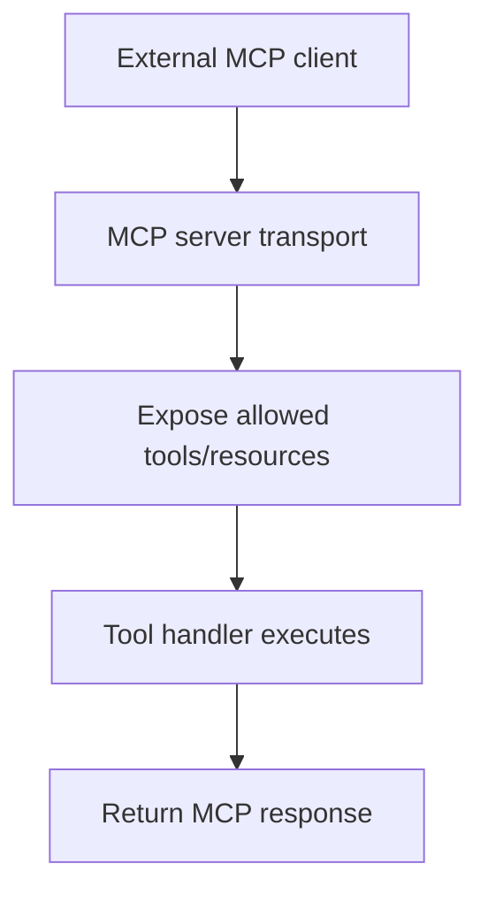

# MCP Server

## What this example is for

This example demonstrates the `MCP Server` pattern in AgentFlow.

**Primary AgentFlow pattern:** `MCP server integration`  
**Why you would use it:** publish AgentFlow capabilities to external clients.

## How the example works

1. Builds an MCP server and registers the tools or resources it wants to expose.
2. Starts the MCP transport so external clients can connect.
3. Validates incoming requests and dispatches them to the matching tool handlers.
4. Returns structured responses back to the MCP client.

## Execution diagram



## Key implementation details

- The example source is `examples/mcp_server.rs`.
- It shows how AgentFlow can interoperate with the Model Context Protocol boundary instead of only local tools.
- In production, you would add authentication, stronger input validation, and explicit policy checks around exposed capabilities.

## Build your own with this pattern

```rust
let output = flow.run(store).await?;
```

### Customization ideas

- Replace the demo transport or tool handlers with the MCP server/client your application actually uses.
- Add application-specific schemas so tool inputs and outputs are validated before execution.
- Log and audit tool invocations if the MCP boundary reaches sensitive systems.

## How to run

```bash
cargo run --features="mcp" --example mcp_server
```

## Requirements and notes

Requires the `mcp` feature and any credentials needed by the tools you expose.
