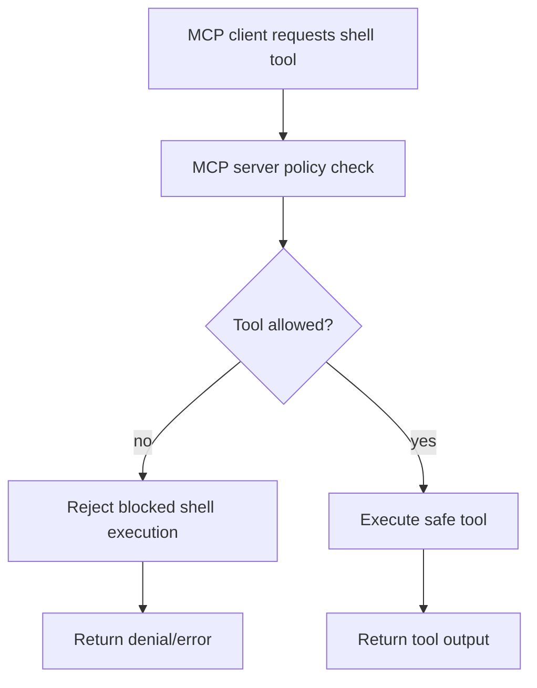

# MCP Server with Blocked Shell Tool

## What this example is for

This example demonstrates the `MCP Server with Blocked Shell Tool` pattern in AgentFlow.

**Primary AgentFlow pattern:** `MCP policy enforcement`  
**Why you would use it:** block sensitive tools while exposing safe capabilities.

## How the example works

1. Builds an MCP server with an explicit allow/deny policy for tool exposure.
2. Receives a tool request from an MCP client.
3. Rejects calls to blocked tools such as shell execution.
4. Allows safe tools to run and returns their output normally.

## Execution diagram



## Key implementation details

- The example source is `examples/mcp_server_blocked_shell.rs`.
- It shows how AgentFlow can interoperate with the Model Context Protocol boundary instead of only local tools.
- In production, you would add authentication, stronger input validation, and explicit policy checks around exposed capabilities.

## Build your own with this pattern

```rust
let output = flow.run(store).await?;
```

### Customization ideas

- Replace the demo transport or tool handlers with the MCP server/client your application actually uses.
- Add application-specific schemas so tool inputs and outputs are validated before execution.
- Log and audit tool invocations if the MCP boundary reaches sensitive systems.

## How to run

```bash
cargo run --features="mcp" --example mcp_server_blocked_shell
```

## Requirements and notes

Requires the `mcp` feature; demonstrates policy checks rather than permissive shell access.
