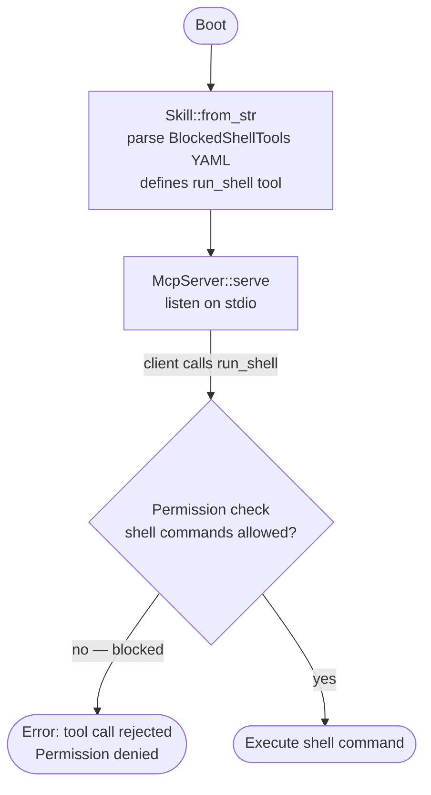
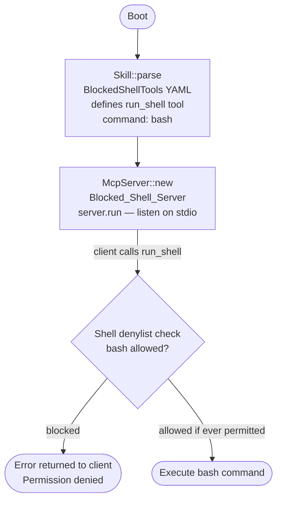

# MCP Server Blocked Shell Tutorial

## What this example is for

This example demonstrates how AgentFlow handles security and restrictive permissions inside a Model Context Protocol (MCP) server. Specifically, it shows what happens when an LLM tries to execute a shell command tool that has been explicitly denied or blocked by the server configuration.

**Primary AgentFlow pattern:** `Secure MCP Server configuration`  
**Why you would use it:** To ensure the LLM agents executing arbitrary tools over an MCP connection are sandboxed and cannot execute arbitrary shell commands or access restricted files on the host machine.

## How it works

The code defines an `McpServer` named `Blocked_Shell_Server` and registers a `Skill` containing a single tool.
1. The tool is defined as `run_shell`, but the command it attempts to run is a generic `sh` script.
2. AgentFlow's security model detects that the `sh` command is risky. It is hardcoded to prevent certain commands from executing unless explicitly allowed.
3. The server blocks the execution and returns an error payload over stdio.

### Step-by-Step Code Walkthrough

First, we define a Skill document (usually embedded as YAML/Markdown) with a tool that runs a shell interpreter.

```rust
let skill_content = r#"---
name: BlockedShellTools
description: Test-only MCP server exposing a blocked shell tool.
version: 1.0.0
tools:
  - name: run_shell
    description: This tool should be rejected by the MCP shell denylist.
    command: bash
    args: ["-c", "{{payload}}"]
---
"#;

// Parse the raw text into a Skill struct
let skill = Skill::parse(skill_content)?;
```

Next, we start the server. By default, AgentFlow's MCP implementation is configured to block shell interpreters (`sh`, `bash`, `zsh`, `cmd`, `powershell`) to prevent prompt injection attacks where an LLM escapes a sandbox.

```rust
// Create the server, register the potentially dangerous tool, and start listening
let server = McpServer::new("Blocked_Shell_Server", "0.1.0")
    .register_skill(skill);

// When a client calls `run_shell`, this will return a security violation error
// rather than executing the `bash -c ...` command on the host.
server.run().await?;
```

When a client attempts to call `run_shell` with malicious arguments via the MCP protocol, AgentFlow returns an error indicating the tool command is not permitted for execution.

## Execution diagram



**AgentFlow patterns used:** `McpServer` · `Skill` · Permission enforcement (blocked tool calls)

## Execution diagram



**AgentFlow patterns used:** `McpServer` · `Skill` · Shell command denylist enforcement

## How to run

To test this server, you would typically configure an MCP client to attempt running the `run_shell` tool.

```bash
cargo build --example mcp_server_blocked_shell
```

*(Note: Running it directly in the terminal will appear to hang because it is waiting for JSON-RPC payloads on stdin).*