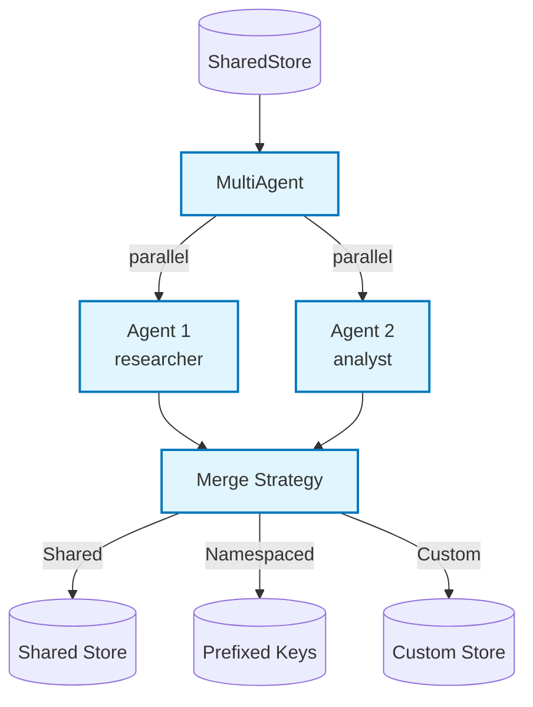

# Example: multi_agent

*This documentation is generated from the source code.*

# Example: multi_agent.rs

**Purpose:**
Demonstrates how to run multiple agents in parallel against a shared store using `MultiAgent`, with configurable merge strategies.

**How it works:**
- Defines two or more agents with different specialisations (e.g., researcher, analyst).
- Adds them to a `MultiAgent`.
- Runs all agents concurrently via `MultiAgent::run`.
- Merges their output stores using one of three strategies: `Shared` (one store), `Namespaced` (prefixed keys), or `Custom(fn)`.

**How to adapt:**
- Use `Namespaced` when agents write the same key names to prevent collisions.
- Use `Custom` for domain-specific merge logic (e.g., pick the best result by score).
- Use `MultiAgent` as one step inside a larger `Workflow` or `Flow`.

**Requires:** `OPENAI_API_KEY`
**Run with:** `cargo run --example multi-agent`

---

## Implementation Architecture

