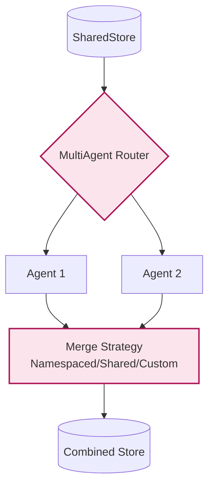

# Example: multi_agent

*This documentation is automatically generated from the source code.*

# Example: multi_agent.rs

**Purpose:**
Demonstrates running multiple agents in parallel, each responsible for a different part of a software project (e.g., generating TypeScript, HTML, and TailwindCSS for a Space Invader game).


## Implementation Architecture



**How it works:**
- Each agent is an LLM node with a specialized prompt.
- All agents write their results to a shared store.
- A progress spinner is shown while agents work.
- Final results from all agents are displayed.

**How to adapt:**
- Use this pattern for any multi-role, multi-agent scenario (e.g., research, code, test, deploy).
- Add or remove agents as needed for your workflow.

**Example:**
```rust
let mut multi_agent = MultiAgent::new();
multi_agent.add_agent(agent1);
multi_agent.add_agent(agent2);
let result = multi_agent.run(store).await;
```