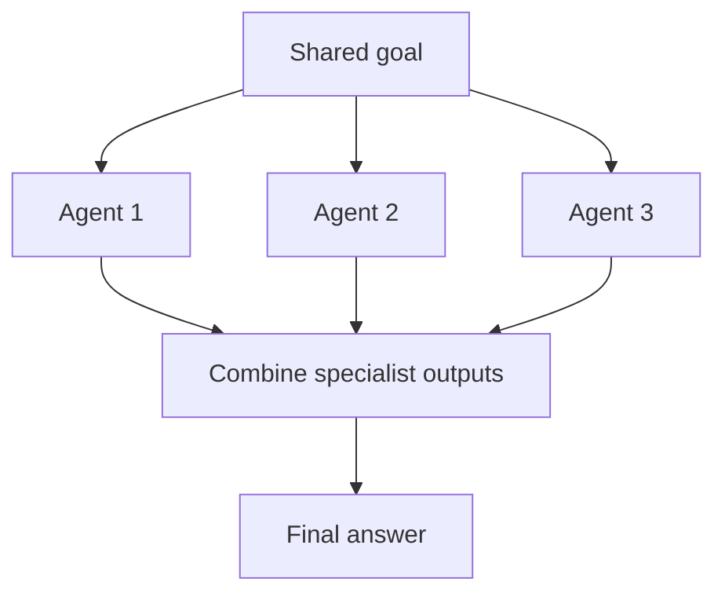

# Multi-Agent Collaboration

## What this example is for

Demonstrates running multiple agents in parallel, each responsible for a different part of a software project (e.g., generating TypeScript, HTML, and TailwindCSS for a Space Invader game).

**Primary AgentFlow pattern:** `MultiAgent`  
**Why you would use it:** coordinate multiple cooperating agents.

## How the example works

1. Each agent is an LLM node with a specialized prompt.
2. All agents write their results to a shared store.
3. A progress spinner is shown while agents work.
4. Final results from all agents are displayed.

## Execution diagram



## Key implementation details

- The example source is `examples/multi_agent.rs`.
- It uses AgentFlow primitives to move data through a store, flow, or higher-level pattern wrapper.
- The implementation is meant to be adapted by swapping in your own prompts, tool handlers, retrieval logic, or business rules.
- When an LLM provider is used, the example relies on `rig` and environment-provided credentials.

## Build your own with this pattern

Use the same pattern in your own project like this:

```rust
let mut multi_agent = MultiAgent::new();
multi_agent.add_agent(agent1);
multi_agent.add_agent(agent2);
multi_agent.add_agent(agent3);
let result = multi_agent.run(store).await;
```

### Customization ideas

- Use this pattern for any multi-role, multi-agent scenario (e.g., research, code, test, deploy).
- Add or remove agents as needed for your workflow.

## How to run

```bash
cargo run --example multi-agent
```

## Requirements and notes

Usually requires provider credentials because multiple agents may call the LLM.
