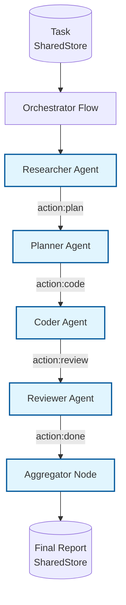

# Example: orchestrator_multi_agent

*This documentation is generated from the source code.*

# Example: orchestrator_multi_agent.rs

**Purpose:**
Demonstrates an orchestrator agent that coordinates a multi-phase, multi-role pipeline — research → plan → code → review — using AgentFlow's `Flow`, `Agent`, and `SharedStore`.

**How it works:**
- An orchestrator `Flow` routes the task through four specialist agent nodes in sequence.
- Each agent reads the previous agent's output from the store and adds its own.
- A final aggregator node synthesises all outputs into a report.
- Routing between stages is driven by the `"action"` key written by each agent node.

**How to adapt:**
- Add or remove specialist nodes (e.g., add a `tester` node between `coder` and `reviewer`).
- Replace sequential routing with `ParallelFlow` for independent stages.
- Inject a human-approval node between stages for human-in-the-loop workflows.

**Requires:** `OPENAI_API_KEY`
**Run with:** `cargo run --example orchestrator-multi-agent`

---

## Implementation Architecture

