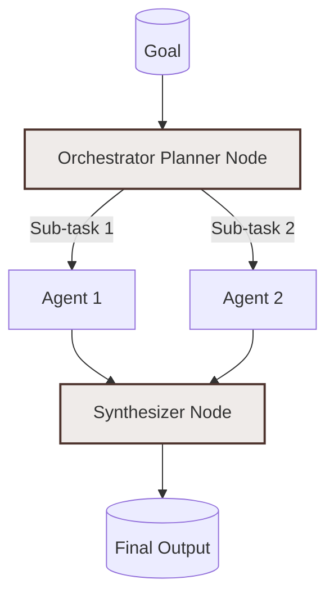

# Example: orchestrator_multi_agent

*This documentation is automatically generated from the source code.*

# Example: orchestrator_multi_agent.rs

**Purpose:**
Demonstrates an orchestrator agent coordinating a multi-phase, multi-role workflow (research, code, review) with real LLM calls and user progress updates.


## Implementation Architecture



**How it works:**
- Each phase is a separate LLM agent.
- The orchestrator runs each phase in sequence, passing real data between them.
- Progress is displayed at each step, and the final report is aggregated and shown.

**How to adapt:**
- Use this pattern for any orchestrated, multi-phase workflow (e.g., document processing, multi-stage approval, content generation).
- Add more phases or change the logic as needed.

**Example:**
```rust
let orchestrator_node = create_node(move |store| { ... });
let agent = Agent::new(orchestrator_node);
let result = agent.decide(store).await;
```