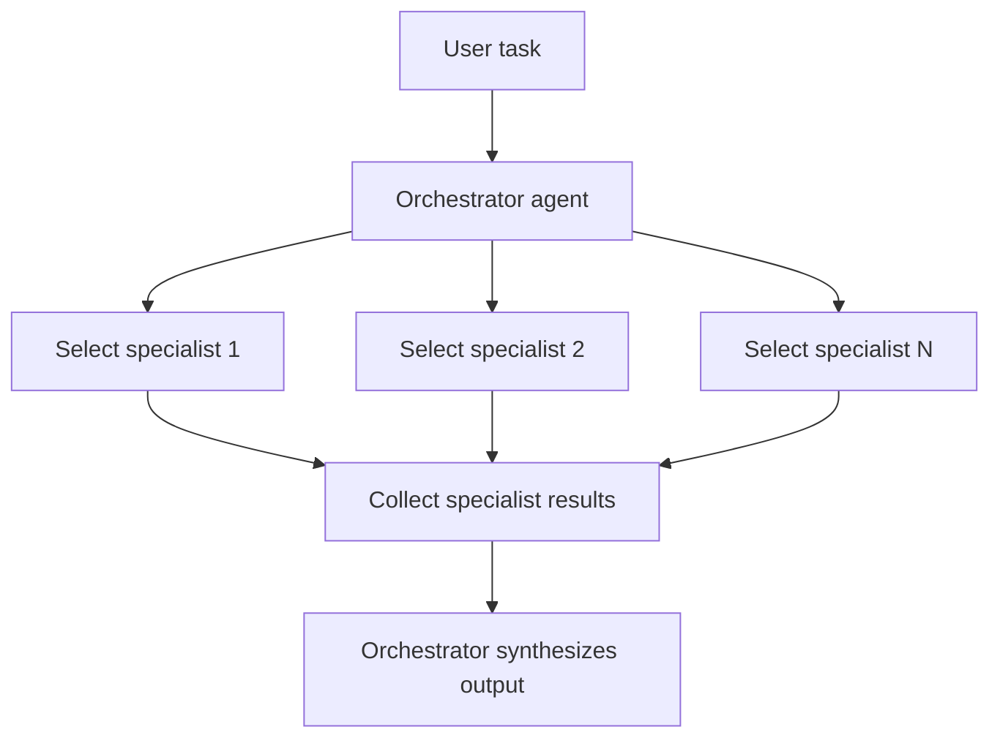

# Orchestrator with Specialist Agents

## What this example is for

Demonstrates an orchestrator agent coordinating a multi-phase, multi-role workflow (research, code, review) with real LLM calls and user progress updates.

**Primary AgentFlow pattern:** `Orchestrator + specialists`  
**Why you would use it:** delegate work to focused agents and synthesize the outcome.

## How the example works

1. Each phase is a separate LLM agent.
2. The orchestrator runs each phase in sequence, passing real data between them.
3. Progress is displayed at each step, and the final report is aggregated and shown.

## Execution diagram



## Key implementation details

- The example source is `examples/orchestrator_multi_agent.rs`.
- It uses AgentFlow primitives to move data through a store, flow, or higher-level pattern wrapper.
- The implementation is meant to be adapted by swapping in your own prompts, tool handlers, retrieval logic, or business rules.
- When an LLM provider is used, the example relies on `rig` and environment-provided credentials.

## Build your own with this pattern

Use the same pattern in your own project like this:

```rust
let result = orchestrator
    .delegate("researcher", task.clone()).await?
    .delegate("analyst", task.clone()).await?
    .synthesize().await?;
```

### Customization ideas

- Use this pattern for any orchestrated, multi-phase workflow (e.g., document processing, multi-stage approval, content generation).
- Add more phases or change the logic as needed.

## How to run

```bash
cargo run --example orchestrator_multi_agent
```

## Requirements and notes

Usually requires provider credentials for the orchestrator and specialist agents.
