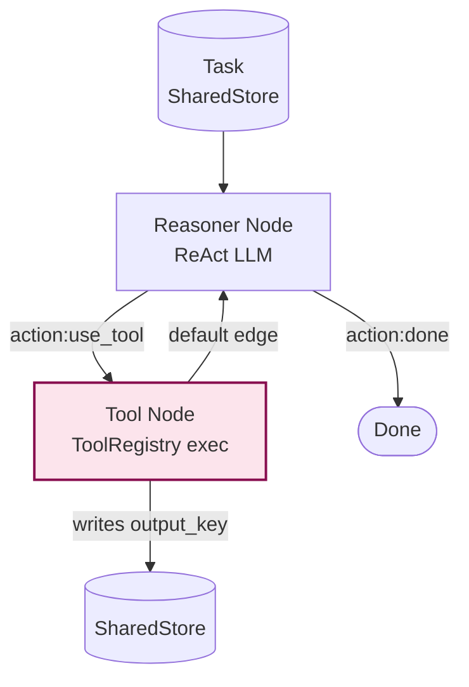

# Example: orchestrator_with_tools

*This documentation is generated from the source code.*

# Example: orchestrator_with_tools.rs

**Purpose:**
Demonstrates a ReAct-style orchestrator that routes between a reasoning LLM and real shell tool calls, using `ToolRegistry` to prevent LLM-generated tool names from executing arbitrary binaries.

**How it works:**
1. `reasoner` node — LLM receives the task and emits either `ACTION: <tool_name>` or `ANSWER: <result>`.
2. The flow reads the `"action"` key:
   - `use_tool` edge → `tool` node runs the shell tool via `ToolRegistry`.
   - `done` edge → flow terminates; answer is in the store.
3. `tool` node writes `{tool_name}_output` to the store and emits no action (default edge).
4. `default` edge from `tool` routes back to `reasoner`, which reads the tool output.
5. The parser extracts `ANSWER:` first; if present, the loop breaks regardless of any `ACTION:` also present.

**How to adapt:**
- Add more tools via `ToolRegistry::register` without changing the Flow topology.
- Replace the default merge with `create_diff_node` for deadlock-safe store access inside `reasoner`.
- Set `flow.with_max_steps(n)` to guard against ReAct loops that never terminate.

**Requires:** `OPENAI_API_KEY`
**Run with:** `cargo run --example orchestrator-with-tools`

---

## Implementation Architecture



**ToolRegistry example:**
```rust
let mut registry = ToolRegistry::new();
registry.register("sysinfo",  "uname",    vec!["-a".into()], None);
registry.register("hostname", "hostname", vec![],            None);

// LLM says ACTION: rm  →  Err(NotFound) — blocked
let node = registry.create_node("sysinfo").unwrap();
```
