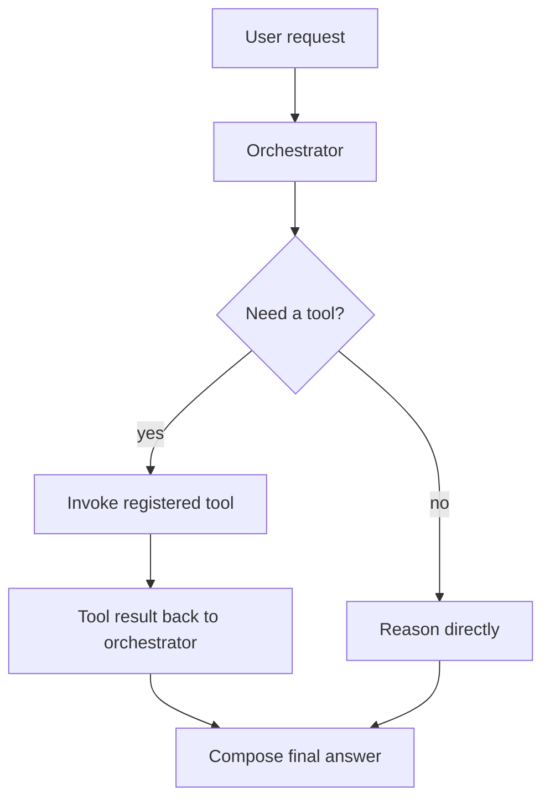

# Orchestrator with Tools

## What this example is for

This example demonstrates the `Orchestrator with Tools` pattern in AgentFlow.

**Primary AgentFlow pattern:** `Orchestrator + ToolRegistry`  
**Why you would use it:** mix tool use with orchestration decisions.

## How the example works

1. # Example: orchestrator_with_tools.rs
2. Real-world orchestrator that delegates to a ReAct sub-agent. The sub-agent
3. uses a real shell tool (`uname -a`) and passes the result back to the
4. Orchestrator LLM, which then writes a human-readable system summary.
5. Orchestrator (LLM) receives the main task and delegates to the ReAct flow.
6. ReAct Reasoner (LLM) decides to call the `sysinfo` tool.

## Execution diagram



## Key implementation details

- The example source is `examples/orchestrator_with_tools.rs`.
- It uses AgentFlow primitives to move data through a store, flow, or higher-level pattern wrapper.
- The implementation is meant to be adapted by swapping in your own prompts, tool handlers, retrieval logic, or business rules.
- When an LLM provider is used, the example relies on `rig` and environment-provided credentials.

## Build your own with this pattern

Use the same pattern in your own project like this:

```rust
let tools = ToolRegistry::new().register("search_docs", search_docs_tool);
let orchestrator = Workflow::new().then(decide_node).then(tool_node).then(answer_node);
```

### Customization ideas

- Use this when you need to mix tool use with orchestration decisions.
- Replace the demo prompts, tools, or handlers with your application logic.
- Persist or forward the final result at your system boundary.

## How to run

```bash
cargo run --example orchestrator_with_tools
```

## Requirements and notes

Requires provider credentials plus any tool-specific environment/configuration.
