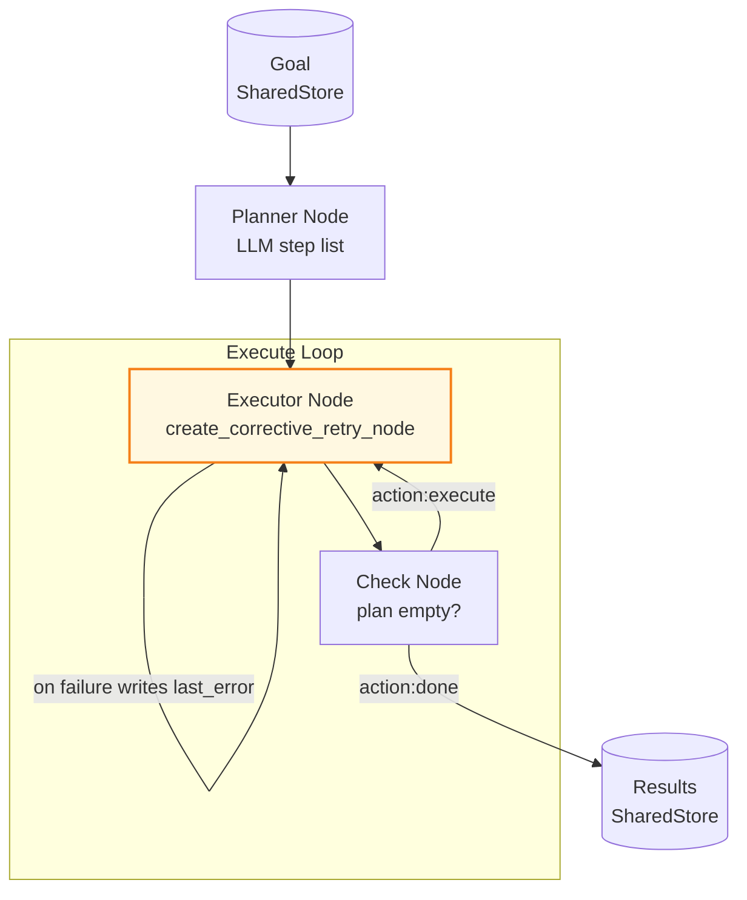

# Example: plan_and_execute

*This documentation is generated from the source code.*

# Example: plan_and_execute.rs

**Purpose:**
Real-world Plan-and-Execute agent. A Planner LLM breaks a high-level goal into numbered steps. An Executor LLM processes each step in turn, building up a result. When the plan is empty the flow terminates.

**How it works:**
1. **Planner node** — LLM receives the goal and outputs a numbered step list stored as `plan`.
2. **Executor node** — Pops the first step from `plan`, runs it with accumulated context, writes the result to `results`. Uses `create_corrective_retry_node`: on each failure the error is written to `last_error` so the next LLM call can read it and self-correct.
3. **Check node** — If `plan` is empty, sets `action = "done"`. Otherwise sets `action = "execute"` to loop.
4. **Flow** — routes `execute → executor → check → execute` until done.

**How to adapt:**
- Increase `max_attempts` in `create_corrective_retry_node` for tasks requiring multiple correction rounds.
- Replace the pop-first strategy with a priority queue for dependency-aware execution.
- Add a `validator` node between `executor` and `check` for automated step verification.

**Requires:** `OPENAI_API_KEY`
**Run with:** `cargo run --example plan-and-execute`

---

## Implementation Architecture



**`create_corrective_retry_node` example:**
```rust
let executor = create_corrective_retry_node(
    |store| async move {
        let hint = store.read().await
            .get("last_error")
            .and_then(|v| v.as_str())
            .unwrap_or("")
            .to_string();
        // Build prompt incorporating hint, call LLM, validate output
        Err(AgentFlowError::NodeFailure("bad JSON".into()))
    },
    3,            // max attempts
    500,          // ms between retries
    "last_error", // store key for error feedback
);
```
