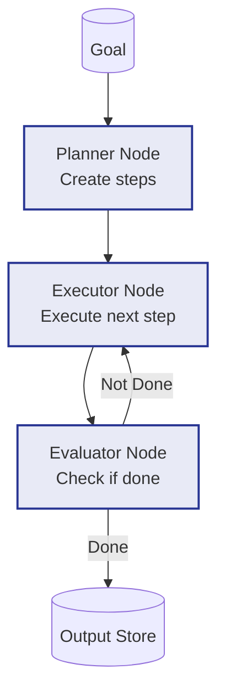

# Example: plan_and_execute

*This documentation is automatically generated from the source code.*

# Example: plan_and_execute.rs

Real-world Plan-and-Execute agent. A Planner LLM breaks a high-level goal into
numbered steps. An Executor LLM processes each step in turn, popping it off the
plan and producing a result. When the plan is empty the flow terminates.

Domain: writing a short technical report on a user-supplied topic.

Requires: OPENAI_API_KEY
Run with: cargo run --example plan-and-execute

## Implementation Architecture

