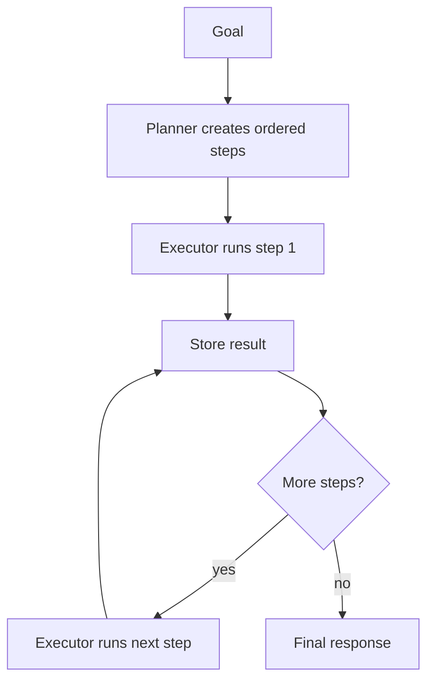

# Plan and Execute

## What this example is for

This example demonstrates the `Plan and Execute` pattern in AgentFlow.

**Primary AgentFlow pattern:** `Plan-and-execute`  
**Why you would use it:** separate planning from execution across multiple steps.

## How the example works

1. Real-world Plan-and-Execute agent. A Planner LLM breaks a high-level goal into
2. plan and producing a result. When the plan is empty the flow terminates.
3. Run with: cargo run --example plan-and-execute
4. const PLANNER_SYSTEM: &str =
5. return l[pos + 2..].to_string();
6. 1 planner step + N executor steps. 20 is safe for plans up to 19 tasks.

## Execution diagram



## Key implementation details

- The example source is `examples/plan_and_execute.rs`.
- It uses AgentFlow primitives to move data through a store, flow, or higher-level pattern wrapper.
- The implementation is meant to be adapted by swapping in your own prompts, tool handlers, retrieval logic, or business rules.
- When an LLM provider is used, the example relies on `rig` and environment-provided credentials.

## Build your own with this pattern

Use the same pattern in your own project like this:

```rust
let planner = Agent::new(plan_node);
let executor = Workflow::new().then(step_node).then(report_node);
let plan = planner.call(store.clone()).await?;
let result = executor.run(plan).await?;
```

### Customization ideas

- Use this when you need to separate planning from execution across multiple steps.
- Replace the demo prompts, tools, or handlers with your application logic.
- Persist or forward the final result at your system boundary.

## How to run

```bash
cargo run --example plan_and_execute
```

## Requirements and notes

Usually requires provider credentials for both the planner and executor agents.
