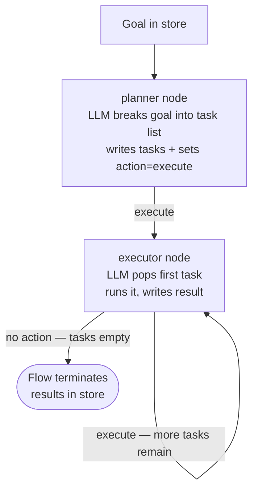

# Plan and Execute

## What this example is for

This example demonstrates the `Plan and Execute` pattern in AgentFlow.

**Primary AgentFlow pattern:** `Plan-and-execute`  
**Why you would use it:** separate planning from execution across multiple steps.

## How the example works

1. A **Planner** LLM node breaks a high-level goal into an ordered list of tasks and writes them to the store.
2. An **Executor** LLM node pops the first task from the list, runs it, and writes the result to the store.
3. While tasks remain, the executor self-loops (`execute → executor`). When the list is empty it stops setting `"action"` and the flow terminates.
4. The flow uses `Flow::new().with_max_steps(20)` to allow the executor self-loop (1 planner step + up to 19 executor steps).

## Execution diagram



**AgentFlow patterns used:** `Flow` · `create_node` · executor self-loop via `add_edge("executor", "execute", "executor")`

## Key implementation details

- The example source is `examples/plan_and_execute.rs`.
- It uses AgentFlow primitives to move data through a store, flow, or higher-level pattern wrapper.
- The implementation is meant to be adapted by swapping in your own prompts, tool handlers, retrieval logic, or business rules.
- When an LLM provider is used, the example relies on `rig` and environment-provided credentials.

## Build your own with this pattern

Use the same pattern in your own project like this:

```rust
let mut flow = Flow::new().with_max_steps(20);
flow.add_node("planner", planner_node);
flow.add_node("executor", executor_node);
flow.add_edge("planner", "execute", "executor");
flow.add_edge("executor", "execute", "executor"); // self-loop while tasks remain
let result = flow.run(store).await;
```

### Customization ideas

- Use this when you need to separate planning from execution across multiple steps.
- Replace the demo prompts, tools, or handlers with your application logic.
- Persist or forward the final result at your system boundary.

## How to run

```bash
cargo run --example plan-and-execute
```

## Requirements and notes

Usually requires provider credentials for both the planner and executor agents.
