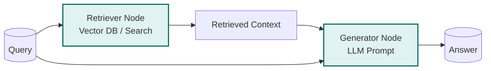

# Example: rag

*This documentation is automatically generated from the source code.*

# Example: rag.rs

**Purpose:**
Implements a real-world Retrieval-Augmented Generation (RAG) pipeline using rig for both retrieval and generation.


## Implementation Architecture



**How it works:**
- The retriever agent uses an LLM to synthesize or retrieve context for a user query.
- The generator agent uses an LLM to generate an answer based on the context.
- The flow and all prompts/results are displayed to the user.

**How to adapt:**
- Replace the retrieval/generation logic with your own (e.g., use a real search API for retrieval).
- Use this pattern for any RAG use case: question answering, summarization, etc.

**Example:**
```rust
let rag = Rag::new(retriever, generator);
let result = rag.call(store).await;
```