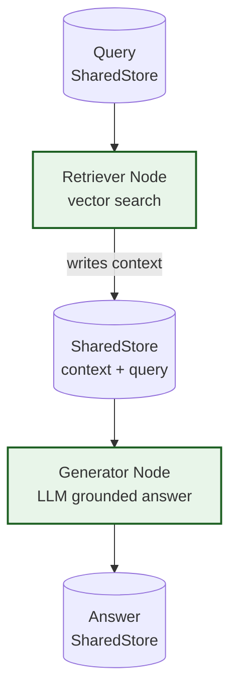

# Example: rag

*This documentation is generated from the source code.*

# Example: rag.rs

**Purpose:**
Demonstrates a Retrieval-Augmented Generation (RAG) pipeline — retrieve relevant context, then generate a grounded response — using AgentFlow's `Rag` pattern.

**How it works:**
1. **Retriever node** — Searches a document store (mock or Qdrant with `--features rag`) for context relevant to the query. Writes retrieved chunks to `context` in the store.
2. **Generator node** — LLM receives the original query plus retrieved context and produces the final answer.
3. `Rag::new(retriever, generator)` wires the two nodes together; `rag.call(store)` runs them in sequence.

**How to adapt:**
- Swap the mock retriever for a real Qdrant vector store by enabling `--features rag`.
- Add a re-ranking node between retriever and generator for improved relevance.
- Combine with `MapReduce` to run RAG over a batch of queries.

**Requires:** `OPENAI_API_KEY`
**Run with:** `cargo run --example rag`

---

## Implementation Architecture

