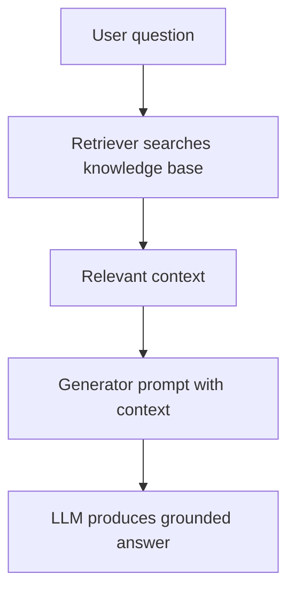

# Retrieval-Augmented Generation

## What this example is for

Implements a real-world Retrieval-Augmented Generation (RAG) pipeline using rig for both retrieval and generation.

**Primary AgentFlow pattern:** `Rag`  
**Why you would use it:** retrieve context before generating a response.

## How the example works

1. The retriever agent uses an LLM to synthesize or retrieve context for a user query.
2. The generator agent uses an LLM to generate an answer based on the context.
3. The flow and all prompts/results are displayed to the user.

## Execution diagram



## Key implementation details

- The example source is `examples/rag.rs`.
- It uses AgentFlow primitives to move data through a store, flow, or higher-level pattern wrapper.
- The implementation is meant to be adapted by swapping in your own prompts, tool handlers, retrieval logic, or business rules.
- When an LLM provider is used, the example relies on `rig` and environment-provided credentials.

## Build your own with this pattern

Use the same pattern in your own project like this:

```rust
let rag = Rag::new(retriever_node, generator_node);
let mut query = HashMap::new();
query.insert("query".into(), Value::String("How do retries work?".into()));
let answer = rag.run(query).await?;
```

### Customization ideas

- Replace the retrieval/generation logic with your own (e.g., use a real search API for retrieval).
- Use this pattern for any RAG use case: question answering, summarization, etc.

## How to run

```bash
cargo run --features="rag" --example rag
```

## Requirements and notes

Requires the `rag` feature plus provider/vector-store configuration for real deployments.
